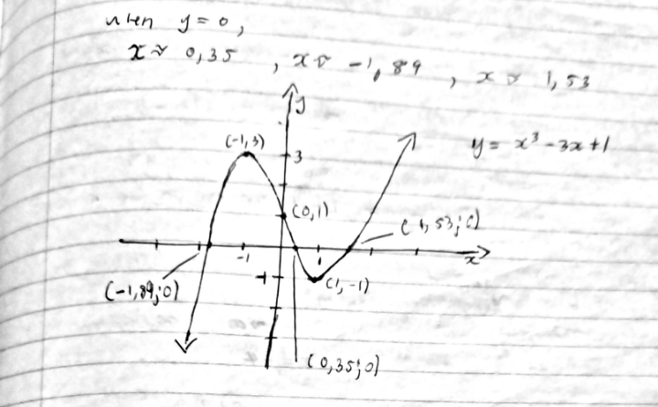
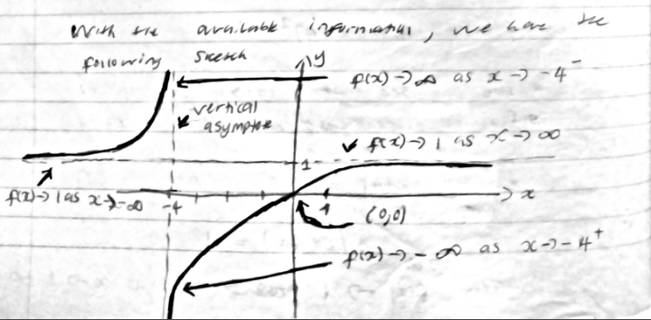
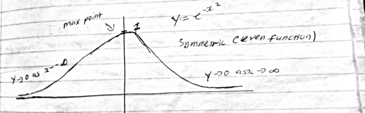
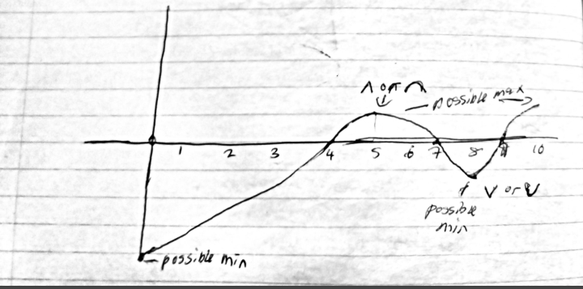
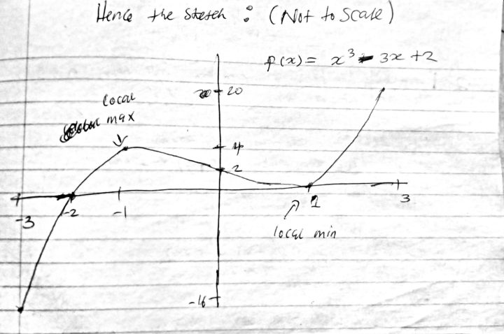

### Problem Set 3: Applications of Differentiation

---

### Exercise 2A-1

**Question:**

Find the linearization of $\sqrt{a+bx}$ at 0, by using (2), and also by using the basic approximation formulas. (Here $a$ and $b$ are constants; assume $a > 0$. Do not confuse this $a$ with the one in (2), which has the value 0.)

### Solution

We know that at $x \approx 0$, $f(x) \approx f(0) + f'(0)x$.

$$f(x) = \sqrt{a+bx} = (a+bx)^{1/2}$$

$$f(0) = \sqrt{a}$$

$$f'(x) = \frac{1}{2}(a+bx)^{-1/2} \cdot b \quad \text{(by chain rule)}$$

$$f'(0) = \frac{b}{2\sqrt{a}}$$

Thus, $f(x) = \sqrt{a+bx} \approx \sqrt{a} + \frac{bx}{2\sqrt{a}}$.

Using $(1+x)^r \approx 1 + rx$ at $x \approx 0$ (1):

$$\sqrt{a+bx} = \sqrt{a\left(1 + \frac{bx}{a}\right)}$$

$$\sqrt{a+bx} = \sqrt{a}\left(1 + \frac{bx}{a}\right)^{1/2}$$

Using (1), $r = 1/2$:

$$\sqrt{a+bx} \approx \sqrt{a}\left(1 + \frac{bx}{2a}\right)$$

$$\sqrt{a+bx} \approx \sqrt{a} + \frac{bx}{2\sqrt{a}}$$

$\blacksquare$

---

### Exercise 2A-3

**Question:**

Find the linearization at 0 of $\frac{(1+x)^{3/2}}{1+2x}$ by using the basic approximation formulas, and also by using (2).

### Solution

Using $f(x) \approx f(0) + f'(0)x$ at $x \approx 0$:

$$f(0) = 1$$

$$f'(x) = \frac{\frac{3}{2}(1+x)^{1/2}(1+2x) - 2(1+x)^{3/2}}{(1+2x)^2} \quad \text{(by chain and quotient rule)}$$

$$f'(0) = \frac{3/2 - 2}{1} = -\frac{1}{2}$$

Thus, $\frac{(1+x)^{3/2}}{1+2x} \approx 1 - \frac{1}{2}x$ at $x \approx 0$.

Using $(1+x)^r \approx 1 + rx$:

$$\frac{(1+x)^{3/2}}{1+2x} = (1+x)^{3/2}(1+2x)^{-1} \approx \left(1 + \frac{3}{2}x\right)(1 - 2x)$$

$$\approx 1 - 2x + \frac{3}{2}x - 3x^2 \quad \text{(we drop anything non-linear)}$$

$$\approx 1 - \frac{1}{2}x$$

$\blacksquare$

---

### Exercise 2A-6

**Question:**

Find a quadratic approximation to $\tan \theta$, for $\theta \approx 0$.

### Solution

Using $f(x) \approx f(0) + f'(0)x + \frac{f''(0)}{2}x^2$ at $x \approx 0$:

$$f(0) = \tan(0) = 0$$

$$f'(\theta) = (\tan \theta)' = \sec^2 \theta$$

$$f'(0) = \sec^2(0) = 1$$

$$f''(\theta) = (\tan \theta)'' = (\sec^2 \theta)' = \left(\frac{1}{\cos^2 \theta}\right)'$$

By the quotient rule:

$$f''(\theta) = \frac{2\cos\theta\sin\theta}{\cos^4\theta}$$

$$f''(0) = 0$$

Thus $\tan \theta \approx \theta$ at $\theta \approx 0$.

Alternatively, using $\sin x \approx x$ and $\cos x \approx 1 - \frac{1}{2}x^2$ at $x \approx 0$:

$$\tan \theta \approx \frac{\theta}{1 - \frac{1}{2}\theta^2}$$

Using $(1+a)^r \approx 1 + rx$ for $x \approx 0$:

$$\frac{1}{1 - \frac{1}{2}\theta^2} \approx 1 + \frac{1}{2}\theta^2$$

Thus:

$$\tan \theta \approx \theta\left(1 + \frac{1}{2}\theta^2\right) \approx \theta + \frac{1}{3}\theta^3$$

Dropping terms above quadratic:

$$\tan \theta \approx \theta$$

$\blacksquare$

---

### Exercise 2A-11

**Question:**

For an ideal gas at constant temperature, the variables $p$ (pressure) and $v$ (volume) are related by the equation $pv^k = C$, where $k$ and $C$ are constants. If the volume is changed slightly from $v_0$ to $v_0 + \Delta v$, what quadratic approximation expressing $p$ in terms of $\Delta v$ would you use? (Find the approximation valid for $\Delta v \approx 0$.)

### Solution

From $pv^k = C$, we have $p = C v^{-k}$ or $p(v) = C v^{-k}$.

Taking derivatives:

$$p'(v) = -Ck v^{-k-1}$$

$$p''(v) = -Ck(-k-1)v^{-k-2} = Ck(k+1)v^{-k-2}$$

Using $f(x) \approx f(x_0) + f'(x_0)(x - x_0) + \frac{f''(x_0)}{2}(x - x_0)^2$:

$$p(v_0) = Cv_0^{-k}$$

$$p'(v_0) = -Ckv_0^{-k-1}$$

$$p''(v_0) = Ck(k+1)v_0^{-k-2}$$

Substituting into the Taylor expansion:

$$p \approx Cv_0^{-k} - Ckv_0^{-k-1}\Delta v + \frac{Ck(k+1)v_0^{-k-2}}{2}(\Delta v)^2$$

$$p \approx Cv_0^{-k}\left(1 - kv_0^{-1}\Delta v + \frac{k(k+1)v_0^{-2}}{2}(\Delta v)^2\right)$$

$\blacksquare$

---

### Exercise 2A-12

**Question:**

Give the indicated type of approximation at the point indicated.

a) $\frac{e^x}{1-x}$ (quadratic, $x \approx 0$)

d) $\ln(\cos x)$ (quadratic, $x \approx 0$)

e) $x \ln x$ (quadratic, $x \approx 1$) (Hint: put $x = 1+h$.)

### Solution

**a) $\frac{e^x}{1-x}$ (quadratic, $x \approx 0$)**

Using $e^x \approx 1 + x + \frac{1}{2}x^2$ at $x \approx 0$ and $(1-x)^{-1} \approx 1 + x + x^2$:

$$\frac{e^x}{1-x} \approx \left(1 + x + \frac{1}{2}x^2\right)(1 + x + x^2)$$

Expanding and keeping terms up to quadratic:

$$\approx 1 + x + x^2 + x + x^2 + \frac{1}{2}x^2$$

$$\approx 1 + 2x + \frac{5}{2}x^2$$

$\blacksquare$

**d) $\ln(\cos x)$ (quadratic, $x \approx 0$)**

Using $\cos x \approx 1 - \frac{1}{2}x^2$ at $x \approx 0$:

$$\ln(\cos x) \approx \ln\left(1 - \frac{1}{2}x^2\right)$$

Let $u = -\frac{1}{2}x^2$. Using $\ln(1+u) \approx u - \frac{1}{2}u^2$ and dropping terms above quadratic:

$$\ln(\cos x) \approx -\frac{1}{2}x^2$$

$\blacksquare$

**e) $x \ln x$ (quadratic, $x \approx 1$)**

Let $x = 1+h$.

Using $\ln(1+h) \approx h - \frac{1}{2}h^2$ at $h \approx 0$:

$$(1+h)\ln(1+h) \approx (1+h)\left(h - \frac{1}{2}h^2\right)$$

Expanding and keeping terms up to quadratic:

$$\approx h - \frac{1}{2}h^2 + h^2 = h + \frac{1}{2}h^2$$

Substituting back $h = x - 1$:

$$x \ln x \approx (x-1) + \frac{1}{2}(x-1)^2$$

$\blacksquare$

---

### Exercise 2B-1a

**Question:**

Sketch the graph of the following. Find the intervals on which it is increasing and decreasing and decide how many solutions there are to $y=0$.

a) $y = x^3 - 3x + 1$

### Solution

Taking the derivative:

$$y' = 3x^2 - 3 = 3(x^2 - 1)$$

Thus:

$$y' = \begin{cases} > 0, & x < -1 \text{ or } x > 1 \\ = 0, & x = \pm 1 \\ < 0, & -1 < x < 1 \end{cases}$$

Evaluating at critical points:

$$f(-1) = -1 + 3 + 1 = 3$$
$$f(1) = 1 - 3 + 1 = -1$$

The function has a local maximum at $(-1, 3)$ and a local minimum at $(1, -1)$.

As $x \to \infty$, $f(x) \to \infty$ and as $x \to -\infty$, $f(x) \to -\infty$.

Since $f$ is continuous and $f(-1) = 3 > 0$ while $f(1) = -1 < 0$, and the function approaches $-\infty$ for $x < -1$ and $+\infty$ for $x > 1$, there are exactly three real roots.

#### Curve Sketch of $y = x^3 - 3x + 1$ : 

  

A cubic curve that rises from the third quadrant, reaches a local maximum at $(-1, 3)$, descends through the y-axis at $(0, 1)$ to a local minimum at $(1, -1)$, then rises into the first quadrant. The curve crosses the x-axis at three points.

$\blacksquare$

---

### Exercise 2B-1e

**Question:**

Sketch the graph of the following.

e) $y = \frac{x}{x+4}$

### Solution

Let $f(x) = \frac{x}{x+4}$.

Computing the derivative:

$$f'(x) = \frac{(x+4) - x}{(x+4)^2} = \frac{4}{(x+4)^2}$$

Since $f'(x) > 0$ for all $x \neq -4$, the function is increasing on each connected domain.

The function has a vertical asymptote at $x = -4$ and the limiting behavior is:

$$\lim_{x \to \infty} \frac{x}{x+4} = 1 \quad \text{and} \quad \lim_{x \to -\infty} \frac{x}{x+4} = 1$$

So $y = 1$ is a horizontal asymptote.

At the discontinuity:

$$\lim_{x \to -4^+} \frac{x}{x+4} = -\infty$$
$$\lim_{x \to -4^-} \frac{x}{x+4} = +\infty$$

Computing the second derivative:

$$f''(x) = \frac{-8}{(x+4)^3}$$

The function is concave up for $x < -4$ and concave down for $x > -4$.

**Title:** Curve Sketch of $y = \frac{x}{x+4}$

#### Curve Sketch of $y = \frac{x}{x+4}$ : 

  

A rational function with a vertical asymptote at $x = -4$ and a horizontal asymptote at $y = 1$. The left branch approaches $y=1$ from above as $x \to -\infty$ and approaches $+\infty$ as $x \to -4^-$. The right branch comes from $-\infty$ as $x \to -4^+$, passes through the origin $(0,0)$, and approaches $y=1$ from below as $x \to \infty$.

$\blacksquare$

---

### Exercise 2B-1h

**Question:**

Sketch the graph of the following.

h) $y = e^{-x^2}$

### Solution

Let $f(x) = e^{-x^2}$.

The function is positive for all $x \in \mathbb{R}$.

Computing the derivative:

$$f'(x) = -2xe^{-x^2}$$

Setting $f'(x) = 0$: $x = 0$ is the only critical point.

Evaluating the limits:

$$\lim_{x \to \pm\infty} e^{-x^2} = 0$$

The function has a global maximum at $(0, 1)$.

Computing the second derivative:

$$f''(x) = -2e^{-x^2} + (-2x)(-2x)e^{-x^2} = -2e^{-x^2}(1 - 2x^2)$$

So $f''(x) < 0$ for all $x \in \mathbb{R}$, meaning the function is concave down everywhere.

The function is even (symmetric about the y-axis).

**Title:** Curve Sketch of $y = e^{-x^2}$

#### Curve Sketch of $y = e^{-x^2}$ : 

  

 A bell-shaped curve symmetric about the y-axis with a global maximum at $(0,1)$. The curve approaches the x-axis asymptotically as $x \to \pm\infty$ and is concave down everywhere.

$\blacksquare$

---

### Exercise 2B-4

**Question:**

Suppose that $f$ is a continuous function on $0 \le x \le 10$. Sketch the graph from the following description: $f$ is zero at 4, 7, and 9. $f'(x) > 0$ on $0 < x < 5$ and $8 < x < 10$ and $f'(x) < 0$ on $5 < x < 8$. With the given information, can you say anything for certain about the maximum value, the minimum value of $f$? Can you say anything about the place where the maximum is attained or the place where the minimum is attained?

### Solution

From the given information:

* The function rises on $(0, 5)$, falls on $(5, 8)$, and rises on $(8, 10)$.
* Local maximum at $x = 5$.
* Local minimum at $x = 8$.
* Zeros at $x = 4, 7, 9$.

Since $f(4) = 0$ and $f$ is rising through this point, $f(x) < 0$ for $x \in [0, 4)$ and $f(x) > 0$ for $x \in (4, 7)$.

Since $f(7) = 0$ and $f$ is falling through this point, $f(x) > 0$ for $x \in (4, 7)$ and $f(x) < 0$ for $x \in (7, 9)$.

Since $f(9) = 0$ and $f$ is rising through this point, $f(x) < 0$ for $x \in (7, 9)$ and $f(x) > 0$ for $x \in (9, 10)$.

**Statements we can make for certain:**

The global maximum value is strictly positive and occurs at $x = 5$ (the local maximum on the interior).

The global minimum value is strictly negative and occurs at either $x = 0$ or $x = 8$. Without more information, we cannot determine which.

#### Possible Sketch for Continuous Function : 

  

A continuous wave-like graph from $x=0$ to $x=10$. It starts negative, rises through the x-axis at $x=4$ to a local maximum around $x=5$, falls back through the x-axis at $x=7$ to a local minimum at $x=8$, then rises again through $x=9$ and ends positive at $x=10$.

$\blacksquare$

---

### Exercise 2B-6

**Question:**

a) Find a cubic polynomial with a local maximum at $x = -1$ and a local minimum at $x = 1$.

b) Draw the graph of the cubic on $-3 \le x \le 3$.

### Solution

**Part (a):**

For a local maximum at $x = -1$ and local minimum at $x = 1$, we need:

$$f'(-1) = 0 \quad \text{and} \quad f'(1) = 0$$

Let $f(x) = ax^3 + bx^2 + cx + d$.

Then $f'(x) = 3ax^2 + 2bx + c$.

From the conditions:

$$f'(-1) = 3a - 2b + c = 0 \quad \text{...(1)}$$
$$f'(1) = 3a + 2b + c = 0 \quad \text{...(2)}$$

Subtracting (1) from (2): $4b = 0 \implies b = 0$.

From (1): $3a + c = 0 \implies c = -3a$.

For $x = -1$ to be a local maximum and $x = 1$ to be a local minimum, we need $a > 0$.

Let $a = 1$ and $d = 2$:

$$f(x) = x^3 - 3x + 2$$

**Part (b):**

Computing key values:

$$f(-3) = -27 + 9 + 2 = -16$$
$$f(-1) = -1 + 3 + 2 = 4 \quad \text{(local maximum)}$$
$$f(0) = 2$$
$$f(1) = 1 - 3 + 2 = 0 \quad \text{(local minimum)}$$
$$f(3) = 27 - 9 + 2 = 20$$

Finding zeros: Setting $x^3 - 3x + 2 = 0$. We know $f(1) = 0$, so $(x-1)$ is a factor.

By polynomial division:

$$x^3 - 3x + 2 = (x-1)(x^2 + x - 2) = (x-1)(x-1)(x+2) = (x-1)^2(x+2)$$

The zeros are at $x = -2$ and $x = 1$ (double root).

#### Sketch of Cubic $f(x) = x^3 - 3x + 2$ : 

  

A cubic curve with a local maximum at $(-1, 4)$, passing through $y=2$ at $x=0$, with a local minimum at $(1, 0)$ (touching the x-axis), and crossing the x-axis at $x=-2$. The curve falls to $-16$ at $x=-3$ and rises to $20$ at $x=3$.

$\blacksquare$

---

### Exercise 2B-7

**Question:**

a) Prove that if $f(x)$ is increasing and it has a derivative at $a$, then $f'(a) \ge 0$.

b) If the conclusion of part (a) is changed to: $f'(a) > 0$, the statement becomes false. Indicate why the proof of part (a) fails to show that $f'(a) > 0$, and give a counterexample to the conclusion $f'(a) > 0$.

### Solution

**Part (a):**

**Claim:** If $f(x)$ is increasing on an interval containing $a$ and $f'(a)$ exists, then $f'(a) \ge 0$.

**Proof:**

Since $f$ is increasing, for all $x$ we have:

$$x > a \implies f(x) \ge f(a)$$
$$x < a \implies f(x) \le f(a)$$

Consider the right-hand derivative:

$$f'_+(a) = \lim_{x \to a^+} \frac{f(x) - f(a)}{x - a}$$

For $x > a$: both numerator $f(x) - f(a) \ge 0$ and denominator $x - a > 0$, so the ratio is non-negative.

Thus $f'_+(a) \ge 0$.

Similarly, for the left-hand derivative:

$$f'_-(a) = \lim_{x \to a^-} \frac{f(x) - f(a)}{x - a}$$

For $x < a$: both numerator $f(x) - f(a) \le 0$ and denominator $x - a < 0$, so the ratio is non-negative.

Thus $f'_-(a) \ge 0$.

Since $f'(a)$ exists, $f'_+(a) = f'_-(a) = f'(a)$.

Therefore, $f'(a) \ge 0$. $\blacksquare$

**Part (b):**

The proof fails to show $f'(a) > 0$ because the numerator $f(x) - f(a)$ can be zero even when $f$ is increasing. The condition $x > a$ and $f$ increasing only guarantees $f(x) \ge f(a)$, not $f(x) > f(a)$.

**Counterexample:** Let $f(x) = x^3$.

For any $x_1 > x_0$, we have $f(x_1) = x_1^3 > x_0^3 = f(x_0)$, so $f$ is strictly increasing.

However, $f'(x) = 3x^2$, so $f'(0) = 0$.

Thus $f$ is increasing with a derivative at $0$, yet $f'(0) = 0 \not> 0$. $\blacksquare$