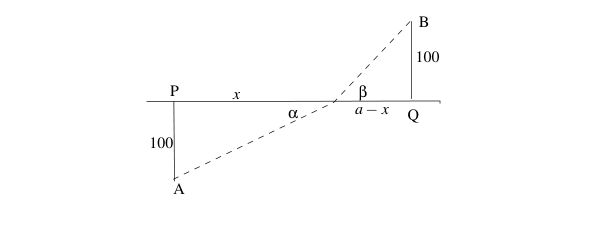

# 18.01 Calculus Problem Set 4: Optimization, Related Rates and Newton's Method

## 2C. Max-min Problems

### Problem 2C-1

**Question:**

Cut four identical squares out of the corners of a 12 by 12 inch piece of cardboard and fold the sides so as to make a box without a top. Find the size of the corner square that maximizes the volume of the box.

### Solution

Let the length of the side of the cut-out square be $x$.

Since after cutting, the base dimension of the square is $12 - 2x$, the volume function of the folded box is:

$$V(x) = x(12 - 2x)^2 \quad \text{such that} \quad 0 \le x \le 6$$

Computing the derivative $V'(x)$ by the product rule and chain rule:

$$V'(x) = (12 - 2x)^2 + x \cdot 2(12 - 2x) \cdot (-2)$$

Expanding the expression:

$$V'(x) = 144 - 48x + 4x^2 - 4x(12 - 2x)$$
$$V'(x) = 144 - 48x + 4x^2 - 48x + 8x^2$$

Simplifying yields:

$$V'(x) = 12x^2 - 96x + 144 = 12(x^2 - 8x + 12)$$

When $V'(x) = 0$:

$$12(x - 2)(x - 6) = 0 \implies x = 2 \text{ or } x = 6$$

Evaluating at critical points and boundaries:

$$V(0) = 0$$
$$V(2) = 2(8)^2 = 128$$
$$V(6) = 6(0)^2 = 0$$

Since $V(2) = 128$ is the maximum value, $V(x)$ is maximized when $x = 2$ inches.

$\blacksquare$

---

### Problem 2C-2

**Question:**

You are asked to design a rectangular barnyard enclosing 20,000 square feet with fencing on three sides and the wall of a long barn on the fourth. Find the shortest length of fence needed.

### Solution

Let the dimensions be $x$ and $y$, with Area $A = 20,000$ ft².

Since the area is fixed, we have:

$$xy = A \implies x = \frac{A}{y} \quad \text{...(1)}$$

Let the total length of fence be $L$, where three sides are fenced:

$$L = x + 2y \quad \text{...(2)}$$

where $0 < x, y$ since lengths are positive.

Substituting (1) into (2):

$$L(y) = \frac{A}{y} + 2y \quad \text{such that} \quad 0 < y$$

Computing the derivative $L'(y)$:

$$L'(y) = -\frac{A}{y^2} + 2$$

When $L'(y) = 0$:

$$2 = \frac{A}{y^2} \implies y = \sqrt{\frac{A}{2}}$$

Evaluating limits:

$$\lim_{y \to 0^+} L(y) = \infty \quad \text{and} \quad \lim_{y \to \infty} L(y) = \infty$$

Since $L(y) \to \infty$ at both extremes and $y = \sqrt{A/2}$ is a critical point, this is a minimum.

Substituting $A = 20,000$:

$$y = \sqrt{10,000} = 100 \text{ ft}$$

From (1):

$$x = \frac{20,000}{100} = 200 \text{ ft}$$

Thus the minimum length of fence is:

$$L = 200 + 2(100) = 400 \text{ ft}$$

$\blacksquare$

---

### Problem 2C-4

**Question:**

The U.S. Postal Service accepts boxes whose length plus girth equals at most 108 inches. What are the dimensions of the box of largest volume that is accepted? What is its volume (in cubic feet)? ("Length" is the longest of the three dimensions and "girth" is the sum of the lengths of the four sides of the face perpendicular to the length.)

### Solution

Let the face perpendicular to the length be a rectangle with dimensions $x$ and $y$.

The cross-sectional area is $A = xy$.

The girth is $G = 2x + 2y$ (perimeter of the cross-section).

For a fixed girth $G$, the area function is:

$$A(x) = x\left(\frac{G - 2x}{2}\right) = \frac{Gx - 2x^2}{2}$$

Computing $A'(x)$:

$$A'(x) = \frac{G - 4x}{2}$$

When $A'(x) = 0$, we get $x = \frac{G}{4}$.

Since $\lim_{x \to 0^+} A(x) = 0$ and $\lim_{x \to G/2} A(x) = 0$, the critical point $x = G/4$ is a maximum.

From $G = 2x + 2y$ with $x = G/4$:

$$G = 2\left(\frac{G}{4}\right) + 2y \implies y = \frac{G}{4}$$

Thus $x = y$, so the cross-section is a square.

Now let the length be $L$ and the square side be $x$. The volume is:

$$V = L \cdot x^2$$

The constraint is:

$$L + 4x = 108$$

Thus $L = 108 - 4x$, and:

$$V(x) = (108 - 4x)x^2 = 108x^2 - 4x^3$$

Computing the derivative:

$$V'(x) = 216x - 12x^2 = 12x(18 - x)$$

When $V'(x) = 0$:

$$x = 0 \quad \text{or} \quad x = 18$$

Since $V(0) = 0$ and $V(18)$ is positive, $x = 18$ inches is the maximum.

From the constraint:

$$L = 108 - 4(18) = 36 \text{ inches}$$

The volume is:

$$V = 36 \cdot 18^2 = 36 \cdot 324 = 11,664 \text{ in}^3$$

Converting to cubic feet:

$$V = \frac{11,664}{1728} = 6.75 \text{ ft}^3$$

$\blacksquare$

---
### Problem 2C-10

**Question:**

A swimmer is on the beach at a point A. The closest point on the straight shoreline to A is called P. There is a platform in the water at B, and the nearest point on the shoreline to B is called Q. Suppose that the distance from A to P is 100 meters, the distance from B to Q is 100 meters and the distance from P to Q is $a$ meters. Finally suppose that the swimmer can run at 5 meters per second on the beach and swim at 2 meters per second in the water. Show that the path the swimmer should take to get to the platform in the least time has the property that the ratio of the sines of the angles the path makes with the shoreline is the reciprocal of the ratio of the speeds in the two media.

### Solution

Let $x$ be the distance along the shore from P to the point where the swimmer enters the water.

Distance on land:

$$D_{\text{land}} = \sqrt{100^2 + x^2}$$

Distance in water:

$$D_{\text{water}} = \sqrt{100^2 + (a - x)^2}$$

The running speed is 5 m/s and swimming speed is 2 m/s.

The total time function is:

$$T(x) = \frac{\sqrt{100^2 + x^2}}{5} + \frac{\sqrt{100^2 + (a - x)^2}}{2}$$

Computing $T'(x)$:

$$T'(x) = \frac{x}{5\sqrt{100^2 + x^2}} - \frac{a - x}{2\sqrt{100^2 + (a - x)^2}}$$

When $T'(x) = 0$ at the optimal point:

$$\frac{x}{5\sqrt{100^2 + x^2}} = \frac{a - x}{2\sqrt{100^2 + (a - x)^2}}$$

Let $\alpha$ be the angle the land path makes with the shoreline and $\beta$ be the angle the water path makes with the shoreline.

From the geometry:

$$\sin\alpha = \frac{x}{\sqrt{100^2 + x^2}} \quad \text{and} \quad \sin\beta = \frac{a - x}{\sqrt{100^2 + (a - x)^2}}$$

Substituting into the optimality condition:

$$\frac{\sin\alpha}{5} = \frac{\sin\beta}{2}$$

Therefore:

$$\frac{\sin\alpha}{\sin\beta} = \frac{5}{2} = \frac{v_{\text{land}}}{v_{\text{water}}}$$

This shows that at the optimal path, the ratio of sines equals the reciprocal of the ratio of speeds (or equivalently, the ratio of sines equals the ratio of speeds).

$\blacksquare$

---

## 2E. Related Rates

### Problem 2E-2

**Question:**

A beacon light 4 miles offshore (measured perpendicularly from a straight shoreline) is rotating at 3 revolutions per minute. How fast is the spot of light on the shoreline moving when the beam makes an angle of 60° with the shoreline?

### Solution

The distance from beacon to shoreline is $D = 4$ miles.

The angular velocity is:

$$\frac{d\theta}{dt} = 3 \text{ rev/min} = 3 \cdot 2\pi \text{ rad/min} = 6\pi \text{ rad/min}$$

Let $\alpha$ be the angle between the beam and the shoreline, and $x$ be the distance along the shore from the perpendicular point.

From trigonometry:

$$\tan\alpha = \frac{4}{x}$$

Taking the derivative with respect to $t$:

$$\sec^2\alpha \frac{d\alpha}{dt} = -\frac{4}{x^2} \frac{dx}{dt}$$

Solving for $\frac{dx}{dt}$:

$$\frac{dx}{dt} = -\frac{x^2}{4} \sec^2\alpha \frac{d\alpha}{dt}$$

When the beam makes an angle of 60° with the shoreline, $\alpha = 60°$:

$$\tan(60°) = \sqrt{3} = \frac{4}{x} \implies x = \frac{4}{\sqrt{3}} = \frac{4\sqrt{3}}{3} \text{ miles}$$

At $\alpha = 60°$:

$$\sec(60°) = 2$$

And $\frac{d\alpha}{dt} = 6\pi$ rad/min.

Substituting:

$$\frac{dx}{dt} = -\frac{\left(\frac{4\sqrt{3}}{3}\right)^2}{4} \cdot 4 \cdot 6\pi = -\frac{16/3}{4} \cdot 4 \cdot 6\pi = -16\pi \text{ miles/min}$$

The speed (magnitude) is $16\pi$ miles/min.

$\blacksquare$

---

### Problem 2E-3

**Question:**

Two boats are travelling at 30 miles/hr, the first going north and the second going east. The second crosses the path of the first 10 minutes after the first one was there. At what rate is their distance increasing when the second has gone 10 miles beyond the crossing point?

### Solution

Let north be the positive $y$-direction and east be the positive $x$-direction.

Both boats travel at $v = 30$ miles/hr.

The position of the first boat (traveling north) is:

$$y(t) = vt = 30t$$

The second boat crosses 10 minutes = 1/6 hour after the first, so:

$$x(t) = v\left(t - \frac{1}{6}\right) = 30t - 5$$

for $t \ge 1/6$.

The distance between the boats is:

$$D(t) = \sqrt{(30t)^2 + (30t - 5)^2}$$

Taking the derivative:

$$\frac{dD}{dt} = \frac{1}{2\sqrt{(30t)^2 + (30t - 5)^2}} \cdot [2(30t)(30) + 2(30t - 5)(30)]$$

$$= \frac{30[30t + (30t - 5)]}{\sqrt{(30t)^2 + (30t - 5)^2}} = \frac{30(60t - 5)}{\sqrt{(30t)^2 + (30t - 5)^2}}$$

When the second boat has gone 10 miles beyond the crossing point:

$$30\left(t - \frac{1}{6}\right) = 10 \implies t - \frac{1}{6} = \frac{1}{3} \implies t = \frac{1}{2}$$

At $t = 1/2$:

$$y = 30 \cdot \frac{1}{2} = 15 \text{ miles}$$
$$x = 30 \cdot \frac{1}{2} - 5 = 10 \text{ miles}$$
$$D = \sqrt{15^2 + 10^2} = \sqrt{325} = 5\sqrt{13} \text{ miles}$$

Substituting:

$$\frac{dD}{dt} = \frac{30(60 \cdot \frac{1}{2} - 5)}{5\sqrt{13}} = \frac{30(30 - 5)}{5\sqrt{13}} = \frac{30 \cdot 25}{5\sqrt{13}} = \frac{150}{\sqrt{13}} = \frac{150\sqrt{13}}{13} \text{ mph}$$

$\blacksquare$

---

### Problem 2E-5

**Question:**

A person walks away from a pulley pulling a rope slung over it. The rope is being held at a height 10 feet below the pulley. Suppose that the weight at the opposite end of the rope is rising at 4 feet per second. At what rate is the person walking when s/he is 20 feet from being directly under the pulley?

### Solution

Let $x$ be the horizontal distance from the point directly under the pulley.

Let $z$ be the length of rope from the person to the pulley (the hypotenuse).

Given: The weight rises at $\frac{dz}{dt} = 4$ ft/s.

By the Pythagorean theorem:

$$z^2 = x^2 + 10^2 \quad \text{...(1)}$$

Differentiating with respect to $t$:

$$2z\frac{dz}{dt} = 2x\frac{dx}{dt}$$

Solving for $\frac{dx}{dt}$:

$$\frac{dx}{dt} = \frac{z}{x}\frac{dz}{dt} \quad \text{...(2)}$$

When $x = 20$ ft, from (1):

$$z^2 = 20^2 + 10^2 = 400 + 100 = 500$$
$$z = 10\sqrt{5} \text{ ft}$$

Substituting into (2):

$$\frac{dx}{dt} = \frac{10\sqrt{5}}{20} \cdot 4 = \frac{\sqrt{5}}{2} \cdot 4 = 2\sqrt{5} \text{ ft/s}$$

$\blacksquare$

---

### Problem 2E-7

**Question:**

A trough is filled with water at a rate of 1 cubic meter per second. The trough has a trapezoidal cross section with the lower base of length half a meter and one meter sides opening outwards at an angle of 45° from the base. The length of the trough is 4 meters. What is the rate at which the water level $h$ is rising when $h$ is one half meter?

### Solution

Consider the trapezoidal cross-section. The lower base has length $b_0 = 0.5$ m.

At height $h$, the sides extend outward at 45° on each side.

The horizontal extension on each side is $h \tan(45°) = h$.

Thus the width at height $h$ is:

$$b(h) = 0.5 + 2h$$

The area of the trapezoidal cross-section at height $h$ is:

$$A(h) = \frac{b_0 + b(h)}{2} \cdot h = \frac{0.5 + (0.5 + 2h)}{2} \cdot h = \frac{1 + 2h}{2} \cdot h = \frac{h + 2h^2}{2}$$

The volume of water in the trough at height $h$ is:

$$V(h) = A(h) \cdot L = \frac{h + 2h^2}{2} \cdot 4 = 2h + 4h^2$$

Taking the derivative with respect to $t$:

$$\frac{dV}{dt} = 2\frac{dh}{dt} + 8h\frac{dh}{dt} = (2 + 8h)\frac{dh}{dt}$$

Given $\frac{dV}{dt} = 1$ m³/s:

$$1 = (2 + 8h)\frac{dh}{dt}$$

$$\frac{dh}{dt} = \frac{1}{2 + 8h}$$

When $h = 0.5$ m:

$$\frac{dh}{dt} = \frac{1}{2 + 8(0.5)} = \frac{1}{2 + 4} = \frac{1}{6} \text{ m/s}$$

$\blacksquare$

---

## 2F. Locating Zeros; Newton's Method

### Problem 2F-1

**Question:**

a) Graph the function $y = \cos x - x$. Show using $y'$ that there is exactly one root to the equation $\cos x = x$, and give upper and lower bounds on the root.

b) Use Newton's method to find the root to 3 decimal places.

### Solution

**Part (a):**

**Claim:** There is exactly one root to $\cos x = x$.

**Proof:**

Let $f(x) = \cos x - x$. Computing the derivative:

$$f'(x) = -\sin x - 1$$

Since $-1 \le \sin x \le 1$, we have:

$$f'(x) = -\sin x - 1 \le 0 \text{ for all } x$$

This means $f(x)$ is monotonically decreasing everywhere.

Evaluating at key points:

$$f(0) = \cos(0) - 0 = 1 > 0$$
$$f\left(\frac{\pi}{2}\right) = \cos\left(\frac{\pi}{2}\right) - \frac{\pi}{2} = 0 - \frac{\pi}{2} \approx -1.57 < 0$$

Since $f$ is continuous and decreasing, and changes sign between $x = 0$ and $x = \pi/2$, there is exactly one root in the interval $(0, \pi/2)$.

Thus the bounds are: $0 < x < \frac{\pi}{2} \approx 1.571$.

$\blacksquare$

**Part (b):**

**Newton-Raphson Iteration:** 

$$x_{n+1} = x_n - \frac{f(x_n)}{f'(x_n)} = x_n - \frac{\cos x_n - x_n}{-\sin x_n - 1}$$

Starting with initial guess $x_0 = 0.75$:

**Iteration 1:**

$$f(0.75) = \cos(0.75) - 0.75 \approx 0.7316 - 0.75 = -0.0184$$
$$f'(0.75) = -\sin(0.75) - 1 \approx -0.6816 - 1 = -1.6816$$
$$x_1 = 0.75 - \frac{-0.0184}{-1.6816} \approx 0.75 - 0.01095 \approx 0.7391$$

**Iteration 2:**

$$f(0.7391) \approx \cos(0.7391) - 0.7391 \approx 0.7391 - 0.7391 \approx 0.0000$$

The iterations have converged.

Therefore, the root is approximately $x \approx 0.739$ to three decimal places.

$\blacksquare$