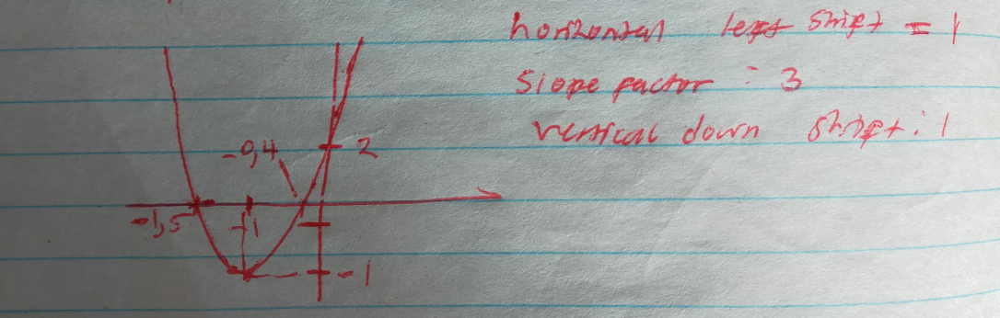
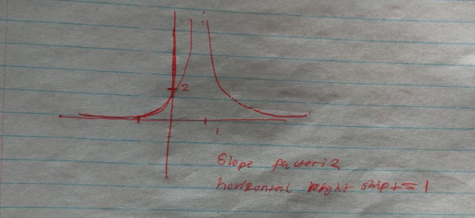

## 1A-1 & 1A-2 Graphing by Translation and Change of Scale

**Problem 1A-1 b)**  
By completing the square, use translation and change of scale to sketch  
$$ y = 3x^2 + 6x + 2. $$

**Solution**

Factoring out the coefficient of $x^2$:  
$$ y = 3\bigl(x^2 + 2x + \tfrac{2}{3}\bigr). $$

Completing the square inside the parentheses:  
$x^2 + 2x = (x+1)^2 - 1$, so  
$$ x^2 + 2x + \tfrac{2}{3} = (x+1)^2 - 1 + \tfrac{2}{3} = (x+1)^2 - \tfrac{1}{3}. $$

Substituting back:  
$$ y = 3\Bigl((x+1)^2 - \tfrac{1}{3}\Bigr) = 3(x+1)^2 - 1. $$

*Interpretation for the sketch*  
- horizontal left shift by $1$  
- vertical stretch by factor $3$  
- vertical down shift by $1$

◼

**Problem 1A-2 b)**  
Sketch, using translation and change of scale,  
$$ y = \frac{2}{(x-1)^2}. $$

**Solution**

Writing the function as  
$$ y = 2 \cdot \frac{1}{(x-1)^2}. $$

*Interpretation*  
- vertical stretch by factor $2$  
- horizontal right shift by $1$  

◼

---

## 1A-3 Even and Odd Functions

**Problem 1A-3 a)**  
Identify whether the function is even, odd, or neither:  
$$ f(x)=\frac{x^3+3x}{1-x^4}. $$

**Solution**

Evaluating $f(-x)$:  
$$ f(-x) = \frac{(-x)^3 + 3(-x)}{1 - (-x)^4} = \frac{-x^3 - 3x}{1 - x^4} = \frac{-(x^3+3x)}{1-x^4} = -f(x). $$  
Thus $f(-x) = -f(x)$; therefore $f$ is odd.  

◼

**Problem 1A-3 e)**  
Identify whether the function is even, odd, or neither:  
$$ f(x)=J_0(x^2), $$  
where $J_0$ is a function you have not previously encountered.

**Solution**

The argument of $J_0$ is $x^2$, and $(-x)^2 = x^2$. Hence  
$$ f(-x) = J_0((-x)^2) = J_0(x^2) = f(x). $$  
Thus $f$ is even.  

◼

---

## 1A-6 & 1A-7 Trigonometric Functions

**Problem 1A-6 b)**  
Express $\sin x - \cos x$ in the form $A\sin(x+c)$.

**Solution**

General form: $a\sin x + b\cos x$ with $a=1,\; b=-1$.  
Computing the amplitude:  
$$ A = \sqrt{a^2+b^2} = \sqrt{1^2+(-1)^2} = \sqrt{2}. $$  
The phase shift $c$ satisfies $\tan c = \frac{b}{a} = -1$. Taking the appropriate quadrant gives  
$$ c = -\frac{\pi}{4}\,\text{rad}. $$  
Therefore  
$$ \sin x - \cos x = \sqrt{2}\sin\!\Bigl(x-\frac{\pi}{4}\Bigr). $$  

◼

**Problem 1A-7 b)**  
Find the period, amplitude, and phase angle, and use these to sketch  
$$ y = -4\cos\!\Bigl(x+\frac{\pi}{2}\Bigr). $$

**Solution**

- Amplitude: $4$ (the minus sign indicates a reflection across the horizontal axis).  
- Period: $2\pi$ (unchanged from the standard cosine).  
- Phase shift: left horizontal shift by $\frac{\pi}{2}$.  

◼

---

## 1B-1 Velocity and Rates of Change

**Problem 1B-1 a) & b)**  
A test tube falls from a tower 400 feet high, dropping $16t^2$ feet in $t$ seconds.  
(a) Find the average speed in the first two seconds.  
(b) Find the average speed in the last two seconds of the fall.

**Solution**

The distance fallen is $16t^2 = \frac12 a t^2$, so $a = 32\ \text{ft/s}^2$. Taking downward as negative, the position function (with $x_0=400$) is  
$$ x(t) = 400 - 16t^2. $$

**(a)** Average speed over $0 \le t \le 2$:  
$$ \frac{x(2)-x(0)}{2} = \frac{(400-16\cdot4) - 400}{2} = \frac{-64}{2} = -32\ \text{ft/s}. $$

**(b)** Total time to reach the ground ($x=0$):  
$$ -16t^2 = -400 \;\Rightarrow\; t^2 = 25 \;\Rightarrow\; t = 5\ \text{s}. $$  
Average speed over the last two seconds ($t=3$ to $t=5$):  
$$ \frac{x(5)-x(3)}{2} = \frac{0 - (400-16\cdot9)}{2} = \frac{-256}{2} = -128\ \text{ft/s}. $$  

◼

---

## 1C-1 Definition of Derivative (Disk Area)

**Problem 1C-1 a)**  
Use the difference‑quotient definition to calculate the rate of change of the area of a disk with respect to its radius.

**Solution**

Area: $A(r) = \pi r^2$.  
$$ A'(r) = \lim_{\Delta r\to 0} \frac{\pi(r+\Delta r)^2 - \pi r^2}{\Delta r}
      = \lim_{\Delta r\to 0} \frac{\pi r^2 + 2\pi r\Delta r + \pi(\Delta r)^2 - \pi r^2}{\Delta r}. $$  
Cancel $\pi r^2$ and factor $\Delta r$:  
$$ A'(r) = \lim_{\Delta r\to 0} \frac{\Delta r\,(2\pi r + \pi\Delta r)}{\Delta r}
      = \lim_{\Delta r\to 0} (2\pi r + \pi\Delta r). $$  
As $\Delta r \to 0$, $\pi\Delta r \to 0$; thus  
$$ A'(r) = 2\pi r. $$  

◼

---

## 1C-2 Definition of Derivative for a Product

**Problem 1C-2**  
Let $f(x) = (x-a)\,g(x)$. Using the definition of the derivative, show that $f'(a) = g(a)$, assuming $g$ is continuous.

**Solution**

By definition,  
$$ f'(a) = \lim_{\Delta x\to 0} \frac{f(a+\Delta x) - f(a)}{\Delta x}. $$  
Evaluate the terms:  
$f(a) = (a-a)g(a) = 0$,  
$f(a+\Delta x) = (a+\Delta x - a)\,g(a+\Delta x) = \Delta x \cdot g(a+\Delta x)$.  
Substitute:  
$$ f'(a) = \lim_{\Delta x\to 0} \frac{\Delta x\cdot g(a+\Delta x)}{\Delta x}
      = \lim_{\Delta x\to 0} g(a+\Delta x). $$  
Because $g$ is continuous, $\displaystyle \lim_{\Delta x\to 0} g(a+\Delta x) = g(a)$. Hence  
$$ f'(a) = g(a). $$  

◼

---

## 1C-3 & 1C-4 First Principles & Tangents for Polynomials

**Problem 1C-3 b)**  
Calculate the derivative of $f(x) = 2x^2 + 5x + 4$ directly from the definition.  
**Problem 1C-3 e)** For the same function, find the points where the slope is $+1$, $-1$, and $0$.  
**Problem 1C-4 b)** Write the equation of the tangent line to the graph at $x=a$.

**Solution**

*Derivative from first principles*  
$$ f'(x) = \lim_{\Delta x\to 0} \frac{f(x+\Delta x)-f(x)}{\Delta x}. $$  
Inserting the function and expand $(x+\Delta x)^2 = x^2 + 2x\Delta x + (\Delta x)^2$:  
$$ \begin{aligned}
f(x+\Delta x) - f(x) &= \bigl[2(x^2+2x\Delta x+(\Delta x)^2) + 5x+5\Delta x + 4\bigr] - \bigl[2x^2+5x+4\bigr] \\
&= 4x\Delta x + 2(\Delta x)^2 + 5\Delta x.
\end{aligned} $$  
Factoring $\Delta x$:  
$$ f'(x) = \lim_{\Delta x\to 0} \frac{\Delta x(4x + 2\Delta x + 5)}{\Delta x}
      = \lim_{\Delta x\to 0} (4x + 2\Delta x + 5) = 4x + 5. $$  

*Points with prescribed slopes*  
- Slope $=0$: $4x+5=0 \;\Rightarrow\; x = -\frac{5}{4}$.  
- Slope $=1$: $4x+5=1 \;\Rightarrow\; x = -1$.  
- Slope $=-1$: $4x+5=-1 \;\Rightarrow\; x = -\frac{3}{2}$.

*Tangent line at $x=a$*  
$$ f(a) = 2a^2+5a+4, \qquad f'(a) = 4a+5. $$  
Point‑slope form:  
$$ \begin{aligned}
y - (2a^2+5a+4) &= (4a+5)(x-a) \\
y &= 2a^2+5a+4 + 4ax - 4a^2 + 5x - 5a \\
y &= (4a+5)x + (4 - 2a^2).
\end{aligned} $$  

◼

---

## 1C-3 & 1C-4 First Principles & Tangents for Rational Functions

**Problem 1C-3 a)**  
Calculate the derivative of $f(x) = \dfrac{1}{2x+1}$ directly from the definition.  
**Problem 1C-3 e)** Find the points where the slope is $-1$.  
**Problem 1C-4 a)** Write the equation of the tangent line at $x=1$.

**Solution**

*Derivative from the definition*  
$$ f'(x) = \lim_{\Delta x\to 0} \frac{ \frac{1}{2(x+\Delta x)+1} - \frac{1}{2x+1} }{\Delta x}. $$  
Combining the fractions in the numerator:  
$$ \frac{1}{2x+2\Delta x+1} - \frac{1}{2x+1}
= \frac{(2x+1) - (2x+2\Delta x+1)}{(2x+2\Delta x+1)(2x+1)}
= \frac{-2\Delta x}{(2x+2\Delta x+1)(2x+1)}. $$  
Dividing by $\Delta x$ gives  
$$ \frac{-2}{(2x+2\Delta x+1)(2x+1)}. $$  
Now let $\Delta x \to 0$:  
$$ f'(x) = \frac{-2}{(2x+1)^2}. $$  

*Points where the slope is $-1$*  
Set  
$$ \frac{-2}{(2x+1)^2} = -1 \;\Longrightarrow\; (2x+1)^2 = 2. $$  
Thus $2x+1 = \pm\sqrt{2}$, yielding  
$$ x = \frac{-1 \pm \sqrt{2}}{2}. $$  

*Tangent line at $x=1$*  
$$ f(1) = \frac{1}{3}, \qquad f'(1) = \frac{-2}{(2\cdot1+1)^2} = -\frac{2}{9}. $$  
$$ y - \frac13 = -\frac{2}{9}(x-1)
\;\Longrightarrow\;
y = -\frac{2}{9}x + \frac{2}{9} + \frac{3}{9} = \frac{-2x+5}{9}. $$  

◼

---

## 1C-5 Tangent Lines Through the Origin

**Problem 1C-5**  
Find all tangent lines through the origin to the graph of $y = 1 + (x-1)^2$.

**Solution**

A line through the origin has equation $y = mx$; its slope is $m = y/x$ (for $x\neq 0$). The slope must also equal $f'(x) = 2(x-1)$. Equating:  
$$ 2(x-1) = \frac{1+(x-1)^2}{x}. $$  
Multiplying by $x$ and expand:  
$$ 2x(x-1) = 1 + (x^2 - 2x + 1) \;\Longrightarrow\; 2x^2 - 2x = x^2 - 2x + 2. $$  
Cancelling $-2x$ from both sides: $2x^2 = x^2 + 2$, so $x^2 = 2$ and $x = \pm\sqrt{2}$.

Finding the corresponding $y$‑coordinates:  
- $x = \sqrt{2}$: $y = 1 + (\sqrt{2}-1)^2 = 4 - 2\sqrt{2}$.  
- $x = -\sqrt{2}$: $y = 1 + (-\sqrt{2}-1)^2 = 4 + 2\sqrt{2}$.

Computing slopes:  
- $f'(\sqrt{2}) = 2\sqrt{2} - 2$  
- $f'(-\sqrt{2}) = -2 - 2\sqrt{2}$.

*Tangent line equations*  
- Through $(\sqrt{2},\,4-2\sqrt{2})$: $y = (2\sqrt{2}-2)x$.  
- Through $(-\sqrt{2},\,4+2\sqrt{2})$: $y = (-2-2\sqrt{2})x$.  

◼

---

## 1D-1 Evaluating Limits

**Problem 1D-1 a), d), f), g)**  
Calculate the following limits if they exist.  
(a) $\displaystyle\lim_{x\to 0}\frac{4}{x-1}$  
(d) $\displaystyle\lim_{x\to 2^+}\frac{4x^2}{2-x}$  
(f) $\displaystyle\lim_{x\to\infty}\frac{4x^2}{x-2}$  
(g) $\displaystyle\lim_{x\to\infty}\left(\frac{4x^2}{x-2} - 4x\right)$

**Solution**

**(a)**  
Direct substitution:  
$$ \lim_{x\to 0}\frac{4}{x-1} = \frac{4}{-1} = -4. $$  

**(d)**  
As $x\to 2^+$, the denominator $2-x$ approaches $0$ from the negative side (tiny negative), while the numerator approaches $16$. Hence the fraction tends to $-\infty$:  
$$ \lim_{x\to 2^+}\frac{4x^2}{2-x} = -\infty. $$  

**(f)**  
Dividing numerator and denominator by $x$:  
$$ \frac{4x^2}{x-2} = \frac{4x}{1 - 2/x}. $$  
As $x\to\infty$, $4x\to\infty$ and $1-2/x\to 1$; therefore the limit is $+\infty$.  

**(g)**  
Combining into a single fraction:  
$$ \frac{4x^2}{x-2} - 4x = \frac{4x^2 - 4x(x-2)}{x-2} = \frac{4x^2 - 4x^2 + 8x}{x-2} = \frac{8x}{x-2}. $$  
Dividing numerator and denominator by $x$: $\frac{8}{1-2/x}$. As $x\to\infty$, $2/x\to 0$, so  
$$ \lim_{x\to\infty}\left(\frac{4x^2}{x-2} - 4x\right) = 8. $$  

◼

---

## 1D-3 Points of Discontinuity

**Problem 1D-3 a) & c)**  
Identify and classify the points of discontinuity.  
(a) $f(x)=\dfrac{x-2}{x^2-4}$  
(c) $f(x)=\dfrac{x^4}{x^3}$

**Solution**

**(a)** Factoring the denominator: $x^2-4 = (x-2)(x+2)$. For $x\neq 2$ we can simplify to $f(x)=\frac{1}{x+2}$.  
- At $x=-2$: the simplified function $\frac{1}{x+2}$ has left‑hand limit $-\infty$ and right‑hand limit $+\infty$; this is an **infinite discontinuity**.  
- At $x=2$: the original expression is undefined, but $\lim_{x\to 2}f(x) = \frac{1}{4}$ exists; this is a **removable discontinuity**.  

**(c)** For $x\neq 0$, $f(x)=x$.  
$$ \lim_{x\to 0^-} f(x) = 0,\quad \lim_{x\to 0^+} f(x) = 0. $$  
The two‑sided limit exists, but $f(0)$ is undefined. Hence there is a **removable discontinuity** at $x=0$.  

◼

---

## 1D-8 Continuous but Not Differentiable

**Problem 1D-8 a)**  
Find values of $a$ and $b$ such that the function is continuous but not differentiable:  
$$ f(x) = \begin{cases}
ax + b, & x > 0,\\
\sin 2x, & x \le 0.
\end{cases} $$

**Solution**

*Continuity at $x=0$:*  
$$ \lim_{x\to 0^+} f(x) = a\cdot0 + b = b,\qquad
\lim_{x\to 0^-} f(x) = \sin 0 = 0. $$  
Setting them equal gives $b = 0$.

*Differentiability at $x=0$:*  
Derivatives from each side:  
- for $x>0$: $f'(x) = a$,  
- for $x<0$: $f'(x) = 2\cos 2x$.  

Right‑hand derivative at $0$: $a$.  
Left‑hand derivative at $0$: $\lim_{x\to 0^-} 2\cos 2x = 2$.  
For differentiability we would need $a = 2$.  

Thus, to have continuity but **not** differentiability, we must have $b = 0$ and $a \neq 2$.  

◼

---

## 1E-4 Differentiability of a Piecewise Function

**Problem 1E-4 b)**  
Find all $a, b$ for which the function is differentiable:  
$$ f(x) = \begin{cases}
ax^2 + bx + 4, & x \le 1,\\
5x^5 + 3x^4 + 7x^2 + 8x + 4, & x > 1.
\end{cases} $$

**Solution**

*Continuity at $x=1$:*  
Left limit: $a(1)^2 + b(1) + 4 = a + b + 4$.  
Right limit: $5 + 3 + 7 + 8 + 4 = 27$.  
Equate:  
$$ a + b + 4 = 27 \;\Longrightarrow\; a + b = 23. \tag{1} $$

*Differentiability at $x=1$:*  
Computing the derivatives:  
- $x \le 1$: $f'(x) = 2ax + b$, so left derivative at $1$ is $2a + b$.  
- $x > 1$: $f'(x) = 25x^4 + 12x^3 + 14x + 8$, so right derivative at $1$ is $25+12+14+8 = 59$.  
Set them equal:  
$$ 2a + b = 59. \tag{2} $$

Subtract (1) from (2): $(2a+b) - (a+b) = 59 - 23$ gives $a = 36$.  
Then from (1), $b = 23 - 36 = -13$.  
Thus the function is differentiable only when $a = 36$ and $b = -13$.  

◼

---

## 1E-1, 1E-2, 1E-3, 1E-5 Differentiation Formulas

**Problem 1E-1 c)**  
Find the derivative: $\displaystyle \frac{d}{dx}\!\left(\frac{x}{2} + \pi^3\right)$.

**Solution**  
$$ \frac{d}{dx}\!\left(\frac12 x + \pi^3\right) = \frac12, $$  
because $\pi^3$ is a constant and its derivative is $0$.  

◼

**Problem 1E-2 b)**  
Find an antiderivative of $f'(x) = x^6 + 5x^5 + 4x^3$.

**Solution**  
Integrate term by term:  
$$ f(x) = \frac{x^7}{7} + \frac{5x^6}{6} + x^4 + C. $$  

◼

**Problem 1E-3)**  
Find the points $(x,y)$ on the graph of $y = x^3 + x^2 - x + 2$ where the tangent line is horizontal.

**Solution**  
Horizontal tangents occur where $y' = 0$.  
$$ y' = 3x^2 + 2x - 1. $$  
Set $y'=0$:  
$$ 3x^2 + 2x - 1 = (3x-1)(x+1) = 0 \;\Longrightarrow\; x = \frac13 \;\text{or}\; x = -1. $$  
Find the corresponding $y$:  
- $x = \frac13$: $y = \frac1{27} + \frac19 - \frac13 + 2 = \frac{49}{27}$.  
- $x = -1$: $y = -1 + 1 + 1 + 2 = 3$.  

The points are $\bigl(\frac13, \frac{49}{27}\bigr)$ and $(-1,3)$.  

◼

**Problem 1E-5 a)**  
Find the derivative of $\displaystyle \frac{x}{1+x}$.

**Solution**  
Quotient rule:  
$$ \frac{(1)(1+x) - x(1)}{(1+x)^2} = \frac{1}{(1+x)^2}. $$  

◼

**Problem 1E-5 c)**  
Find the derivative of $\displaystyle \frac{x+2}{x^2-1}$.

**Solution**  
Quotient rule:  
$$ \frac{(x^2-1)(1) - (x+2)(2x)}{(x^2-1)^2}
= \frac{x^2 - 1 - 2x^2 - 4x}{(x^2-1)^2}
= \frac{-x^2 - 4x - 1}{(x^2-1)^2}. $$  

◼

---

## 1J-1 & 1J-2 Trigonometric Derivatives and Limits

**Problem 1J-1 e)**  
Calculate the derivative: $\displaystyle \frac{d}{dx}\!\left(\frac{\sin x}{x}\right)$.

**Solution**  
Quotient rule:  
$$ \frac{x\cos x - \sin x}{x^2}. $$  

◼

**Problem 1J-2**  
Evaluate the limit by relating it to a derivative value:  
$$ \lim_{x\to \pi/2} \frac{\cos x}{x - \pi/2}. $$

**Solution**  
Recall the definition of the derivative: $f'(c) = \lim_{x\to c} \frac{f(x)-f(c)}{x-c}$.  
Take $f(x) = \cos x$, $c = \pi/2$. Then $f(c) = \cos(\pi/2) = 0$. Thus  
$$ \lim_{x\to \pi/2} \frac{\cos x}{x - \pi/2} = \lim_{x\to \pi/2} \frac{\cos x - \cos(\pi/2)}{x - \pi/2} = f'(\pi/2). $$  
Since $f'(x) = -\sin x$, we obtain $f'(\pi/2) = -\sin(\pi/2) = -1$. Hence the limit is $-1$.  

◼

---

## 1F-1 Chain Rule Applications

**Problem 1F-1 a) & b)**  
Find the derivatives.  
(a) $(x^2+2)^2$ by two methods.  
(b) $(x^2+2)^{100}$.

**Solution**

**(a) Method 1 (expand first):**  
$(x^2+2)^2 = x^4 + 4x^2 + 4$.  
$$ \frac{d}{dx}(x^4+4x^2+4) = 4x^3 + 8x. $$

**Method 2 (chain rule):**  
Let $u = x^2+2$, so $u' = 2x$. Then  
$$ \frac{d}{dx}(u^2) = 2u\cdot u' = 2(x^2+2)(2x) = 4x(x^2+2) = 4x^3 + 8x. $$  

**(b)** Use the chain rule directly:  
$$ \frac{d}{dx}\bigl((x^2+2)^{100}\bigr) = 100(x^2+2)^{99}\cdot 2x = 200x(x^2+2)^{99}. $$  

◼

---

## 1F-2 Chain Rule and Product Rule

**Problem 1F-2**  
Find the derivative of $x^{10}(x^2+1)^{10}$.

**Solution**

Let $y = x^{10}(x^2+1)^{10}$. By the product rule,  
$$ y' = \frac{d}{dx}(x^{10})\cdot (x^2+1)^{10} + x^{10}\cdot \frac{d}{dx}\bigl((x^2+1)^{10}\bigr). $$  
The derivative of $(x^2+1)^{10}$ (chain rule) is $10(x^2+1)^9\cdot 2x = 20x(x^2+1)^9$.  
Substituting:  
$$ y' = 10x^9(x^2+1)^{10} + x^{10}\cdot 20x(x^2+1)^9
    = 10x^9(x^2+1)^9\bigl[(x^2+1) + 2x^2\bigr]
    = 10x^9(x^2+1)^9(3x^2+1). $$  

◼

---

## 1F-7 Implicit & Chain Rule on Physics Formulas

**Problem 1F-7 b) & c)**  
(b) For $m = \dfrac{m_0}{\sqrt{1 - v^2/c^2}}$, find $dm/dv$.  
(c) For $F = \dfrac{mg}{(1+r^2)^{3/2}}$, find $dF/dr$.

**Solution**

**(b)** Rewrite with a fractional exponent: $m = m_0(1 - v^2/c^2)^{-1/2}$.  
Using the chain rule (constants $m_0, c^2$):  
$$ \frac{dm}{dv} = m_0\!\left(-\frac12\right)(1 - v^2/c^2)^{-3/2}\!\left(-\frac{2v}{c^2}\right)
            = \frac{m_0 v}{c^2}\,(1 - v^2/c^2)^{-3/2}
            = \frac{v m_0}{c^2(1 - v^2/c^2)^{3/2}}. $$  

**(c)** Write $F = mg(1+r^2)^{-3/2}$.  
Chain rule:  
$$ \frac{dF}{dr} = mg\!\left(-\frac32\right)(1+r^2)^{-5/2}\cdot 2r
            = -3mgr\,(1+r^2)^{-5/2}
            = \frac{-3mgr}{(1+r^2)^{5/2}}. $$  

◼

---

## 1G-1 Higher Derivatives

**Problem 1G-1 c)**  
Calculate $y''$ for $y = \dfrac{x}{x+5}$.

**Solution**

First derivative (quotient rule):  
$$ y' = \frac{1\cdot(x+5) - x\cdot1}{(x+5)^2} = \frac{5}{(x+5)^2}. $$  
Differentiating again (rewrite as $5(x+5)^{-2}$):  
$$ y'' = 5\cdot(-2)(x+5)^{-3}\cdot 1 = -\frac{10}{(x+5)^3}. $$  

◼

---

## 1G-5 Successive Derivatives Using the Product Rule

**Problem 1G-5 a)**  
Let $y = u(x)v(x)$. Find $y'$, $y''$, and $y'''$.

**Solution**  
$$ \begin{aligned}
y'   &= u'v + uv',\\[2pt]
y''  &= (u''v + u'v') + (u'v' + uv'') = u''v + 2u'v' + uv'',\\[2pt]
y''' &= (u'''v + u''v') + 2(u''v' + u'v'') + (u'v'' + uv''')\\
     &= u'''v + 3u''v' + 3u'v'' + uv'''.
\end{aligned} $$  

◼

---

## 1F-6 Derivatives of Even and Odd Functions

**Problem 1F-6**  
Show that the derivative of an even function is odd, and the derivative of an odd function is even.

**Solution**

*Case 1: $f$ is even* ($f(-x) = f(x)$).  
Differentiate both sides with respect to $x$. On the left use the chain rule:  
$$ \frac{d}{dx}f(-x) = -f'(-x). $$  
The right side differentiates to $f'(x)$. Hence $-f'(-x) = f'(x)$, or $f'(-x) = -f'(x)$. Thus $f'$ is odd.

*Case 2: $f$ is odd* ($f(-x) = -f(x)$).  
Differentiating:  
$$ \frac{d}{dx}f(-x) = -f'(-x), \qquad \frac{d}{dx}[-f(x)] = -f'(x). $$  
Therefore $-f'(-x) = -f'(x)$, which simplifies to $f'(-x) = f'(x)$. Thus $f'$ is even.  

◼