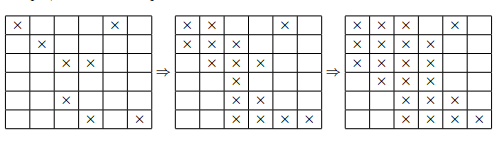

# Problem Set 2

## Problem 1

Define a 3-chain to be a (not necessarily contiguous) subsequence of three integers, which is either monotonically increasing or monotonically decreasing. We will show here that any sequence of five distinct integers will contain a 3-chain. Write the sequence as $a_1, a_2, a_3, a_4, a_5$. Note that a monotonically increasing sequence is one in which each term is greater than or equal to the previous term. Similarly, a monotonically decreasing sequence is one in which each term is less than or equal to the previous term. Lastly, a subsequence is a sequence derived from the original sequence by deleting some elements without changing the location of the remaining elements.

#### a) Assume that $a_1 < a_2$. Show that if there is no 3-chain in our sequence, then $a_3$ must be less than $a_1$.

**Proof:**

We are given $a_1 < a_2$. 

If there is no 3-chain, then we must have $a_3 < a_1$. Assume for contradiction that $a_1 < a_3$.

**Case 1:** $a_2 < a_3$.  

Then $a_1 < a_2 < a_3$ is a 3-chain. #

**Case 2:** $a_3 < a_2$.  

Then $a_1 < a_3 < a_2$.

Now consider $a_4$.

i) If $a_2 < a_4$, then $a_1 < a_2 < a_4$ is a 3-chain. #

ii) If $a_4 < a_1$, then $a_4 < a_3 < a_2$, i.e., $a_2 > a_3 > a_4$, is a 3-chain. #

iii) If $a_1 < a_3 < a_4 < a_2$, then $a_1 < a_3 < a_4$ is a 3-chain. #

iv) If $a_1 < a_4 < a_3 < a_2$, then $a_4 < a_3 < a_2$, i.e., $a_2 > a_3 > a_4$, is a 3-chain. #

For all cases when $a_1 < a_3$ there is a 3-chain, $\therefore$ it must be the case that $a_3 < a_1$. $\blacksquare$

#### b) Using the previous part, show that if $a_1 < a_2$ and there is no 3-chain in our sequence, then $a_3 < a_4 < a_2$.

**Proof:**

Assume $a_1 < a_2$ and no 3-chain. We must show $a_3 < a_4 < a_2$.  

From (a) we know $a_3 < a_1 < a_2$.

Consider $a_4$.

**Case 1:** $a_2 < a_4$.  

Then $a_3 < a_1 < a_2 < a_4$ contains the 3-chain $a_1 < a_2 < a_4$. #

**Case 2:** $a_4 < a_3$.  

Then $a_4 < a_3 < a_1 < a_2$ contains the 3-chain $a_1 > a_3 > a_4$. #

$\therefore$ It must be the case that $a_3 < a_4 < a_2$. $\blacksquare$

#### c) Assuming $a_1 < a_2$ and $a_3 < a_4 < a_2$, any value of $a_5$ must result in a 3-chain.

**Proof:**

Consider the possible positions for $a_5$:

* **Case 1 ($a_5 < a_1$):** $a_2 > a_1 > a_5$ forms a 3-chain.

* **Case 2 ($a_2 < a_5$):** $a_1 < a_2 < a_5$ forms a 3-chain.

To avoid these, we must have $a_1 < a_5 < a_2$. We evaluate $a_5$ against $a_4$:

* **Case 3a ($a_5 < a_4$):** $a_2 > a_4 > a_5$ forms a 3-chain.

* **Case 3b ($a_4 < a_5$):** $a_3 < a_4 < a_5$ forms a 3-chain.

Since all possible positions for $a_5$ yield a 3-chain, the proposition holds. $\blacksquare$

#### d) Prove by contradiction that any sequence of five distinct integers must contain a 3-chain.

**Proof:**
Assume no 3-chain exists in the sequence. By parts (a), (b), and (c), the starting condition $a_1 < a_2$ strictly forces a 3-chain. Therefore, to avoid a 3-chain, we must have $a_2 < a_1$.

By exact structural symmetry, the condition $a_2 < a_1$ identically forces a mirrored 3-chain. Both foundational branches fail.

Hence, any sequence of five distinct integers contains a 3-chain. $\blacksquare$

## Problem 2

Prove by either the Well Ordering Principle or induction that for all nonnegative integers $n$:

$$\sum_{i=0}^{n} i^3 = \left(\frac{n(n+1)}{2}\right)^2$$

**Proof:**

Proof by the Well Ordering Principle.

Let $P(n)$ be the proposition that

$$\sum_{i=0}^{n} i^3 = \left(\frac{n(n+1)}{2}\right)^2.$$

Let $C$ be the set of all nonnegative integers that do not satisfy $P(n)$:

$C = \{ x : P(x) \text{ is false} \}$.

Assume $C$ is nonempty, i.e. $|C| \neq 0$.

Let $m$ be the smallest element in $C$, which by the Well Ordering Principle must exist. We also know $0 \le m$.

Base case $P(0)$:

$$0 = \left(\frac{0(0+1)}{2}\right)^2 = 0$$
holds.

$\therefore 0 \notin C$ since $P(0)$.

Consider the integer $m-1$, which satisfies $0 \le m-1 < m$.

Evaluating $P(n)$ at $n = m-1$, we obtain:

$$\sum_{i=0}^{m-1} i^3 = \left(\frac{(m-1)((m-1)+1)}{2}\right)^2 = \left(\frac{m^2-m}{2}\right)^2.$$

We know

$$\sum_{i=0}^{m} i^3 = \left(\frac{m^2-m}{2}\right)^2 + m^3 \implies \neg P(m)$$

Simplifying the right-hand side of the equality:

$$\left(\frac{m^2 - m}{2}\right)^2 + m^3$$
$$= \left(\frac{m^2 - m}{2}\right)\left(\frac{m^2 - m}{2}\right) + m^3$$
$$= \frac{m^4 - m^3 - m^3 + m^2}{2^2} + \frac{2^2 m^3}{2^2}$$
$$= \frac{m^4 - 2m^3 + m^2 + 4m^3}{2^2}$$
$$= \frac{m^4 + 2m^3 + m^2}{2^2}$$
$$= \frac{m^2(m+1)^2}{2^2} = \left(\frac{m(m+1)}{2}\right)^2.$$

$\therefore P(m)$. 

However, the assumption $m \in C$ requires $\neg P(m)$. 

$$P(m) \land \neg P(m) \equiv \bot$$

$\therefore$ our assumption that $|C| \neq 0$ was wrong.

$\therefore \forall m \in \mathbb{Z}^+ \cup \{0\}, P(m)$. $\blacksquare$

---

## Problem 3

The following problem is fairly tough until you hear a certain one-word clue. The solution is elegant but is slightly tricky, so don’t hesitate to ask for hints!

During 6.042, the students are sitting in an $n \times n$ grid. A sudden outbreak of beaver flu (a rare variant of bird flu that lasts forever; symptoms include yearning for problem sets and craving for ice cream study sessions) causes some students to get infected. Here is an example where $n = 6$ and infected students are marked $\times$.

Now the infection begins to spread every minute (in discrete time-steps). Two students are considered *adjacent* if they share an edge (i.e., front, back, left or right, but NOT diagonal); thus, each student is adjacent to 2, 3 or 4 others. A student is infected in the next time step if either

* the student was previously infected (since beaver flu lasts forever), or
* the student is adjacent to *at least two* already-infected students.

In this example, over the next few time-steps, all the students in class become infected.

**Theorem.** *If fewer than $n$ students in class are initially infected, the whole class will never be completely infected.*

Prove this theorem.

**Proof:**

Let $S_t$ represent the set of infected cells at time step $t$.

Each square (student) is a $1 \times 1$ square.

Let $p$ be the perimeter of a single student.

Let $p'$ be the total perimeter of the infected region.

Define $M(S_t)$ to be the geometric function that maps $S_t$ to the total perimeter $p'$.

Let $k$ be the number of initially infected students, where $k < n$.

**Base case:**

$0 \le |S_0| = k < n$.

$M(S_0) \le 4k$ since each student has perimeter $4$.

Since $k \le n-1$,

$\therefore M(S_0) \le 4n - 4 < 4n$.

**Invariant:**

According to the rules of infection, the transition $S_t \to S_{t+1}$ guarantees that

$M(S_{t+1}) \le M(S_t)$.

*Proof of the invariant:*

Assume a single cell becomes infected at time $t+1$.

By the infection rules, this cell must share $E$ edges with the currently infected set $S_t$, where $E \ge 2$.

Define $\Delta M = M(S_{t+1}) - M(S_t)$.

Case 1: $E=2$.

Adding the new cell $i$ such that $S_{t+1} = S_t \cup \{i\}$, the two shared edges become internal, and the $2$ remaining edges of $i$ are added to the perimeter.

$\Delta M = -2 \text{ edges} + 2 \text{ edges} = 0$.

Case 2: $E=3$.

Cell $i$ has $3$ edges shared with $S_t$. Adding $i$ internalizes those $3$ edges and adds the single remaining edge.

$\Delta M = -3 \text{ edges} + 1 \text{ edge} = -2$.

Case 3: $E=4$.

Cell $i$ shares all its edges with $S_t$. Adding $i$ internalizes all $4$ edges and adds none.

$\Delta M = -4$.

$$\therefore \Delta M = 
\begin{cases} 
      0, & E=2 \\
      -2, & E=3 \\
      -4, & E=4 
\end{cases}$$

for any newly infected cell with $2 \le E \le 4$ shared edges.

Thus property 1 holds: $\Delta M \le 0$ for all cells $i$ that have infected edges $E \ge 2$.

Assume at time step $t$ the invariant holds with $M(S_t) = p$.

Then $M(S_{t+1}) = p + \Delta M$, and since $\Delta M \le 0$,

$M(S_{t+1}) \le M(S_t)$. This proves the invariant.

Now let $M(S_{\text{full}})$ be the perimeter of the entire $n \times n$ grid (class).

$\therefore M(S_{\text{full}}) = 4n$.

By the base case, $M(S_0) \le 4n - 4 < M(S_{\text{full}})$.

And by the invariant, $\forall t, M(S_{t+1}) \le M(S_t) \le M(S_0) \le 4n - 4 < M(S_{\text{full}})$.

This shows that the full perimeter $M(S_{\text{full}})$ can never be reached if $M(S_0) < M(S_{\text{full}})$, completing the proof. $\blacksquare$

---

## Problem 4

Find the flaw in the following *bogus* proof that $a^n = 1$ for all nonnegative integers $n$, whenever $a$ is a nonzero real number.

*Proof.* The *bogus* proof is by induction on $n$, with hypothesis

$$P(n) ::= \forall k \le n.\ a^k = 1,$$

where $k$ is a nonnegative integer valued variable.

**Base Case:** $P(0)$ is equivalent to $a^0 = 1$, which is true by definition of $a^0$. (By convention, this holds even if $a = 0$.)

**Inductive Step:** By induction hypothesis, $a^k = 1$ for all $k \in \mathbb{N}$ such that $k \le n$. But then

$$a^{n+1} = \frac{a^n \cdot a^n}{a^{n-1}} = \frac{1 \cdot 1}{1} = 1,$$

which implies that $P(n+1)$ holds. It follows by induction that $P(n)$ holds for all $n \in \mathbb{N}$, and in particular, $a^n = 1$ holds for all $n \in \mathbb{N}$. $\square$

**Error in proof:**

Because $P(n)$ is restricted to $n \ge k \ge 0$, the assumption that $a^{n-1} = 1$ is an invalid operation during the transition from $P(0)$ to $P(1)$.

For $n=0$, $a^{n-1}$ is undefined. $\blacksquare$

---

## Problem 5

Let the sequence $G_0, G_1, G_2, \dots$ be defined recursively as follows:

$G_0 = 0$, $G_1 = 1$, and $G_n = 5G_{n-1} - 6G_{n-2}$, for every $n \in \mathbb{N}, n \ge 2$.

Prove that for all $n \in \mathbb{N}, G_n = 3^n - 2^n$.

**Proof:**

Let $G_0, G_1, G_2, \dots$ be defined recursively as

$G_0 = 0$, $G_1 = 1$, and $G_n = 5G_{n-1} - 6G_{n-2}$ for $n \in \mathbb{N}, n \ge 2$.

Proposition: $\forall n \in \mathbb{N}, G_n = 3^n - 2^n$.

We prove this by strong induction. Let $P(n)$ be the proposition $G_n = 3^n - 2^n$.

**Base case $n=0$:**

$G_0 = 3^0 - 2^0 = 1 - 1 = 0$, so $P(0)$ holds.

**Base case $n=1$:**

$G_1 = 3^1 - 2^1 = 3 - 2 = 1$, so $P(1)$ holds.

**Inductive step:**

Assume $P(k)$ holds for all $k \le n$, where $n \ge 1$.

We need to show $G_{n+1} = 3^{n+1} - 2^{n+1}$.

By the recurrence and the induction hypothesis,

$$G_{n+1} = 5G_n - 6G_{n-1} = 5(3^n - 2^n) - 6(3^{n-1} - 2^{n-1}).$$

Now simplify:

$G_{n+1} = 5 \cdot 3^n - 5 \cdot 2^n - 6 \cdot 3^{n-1} + 6 \cdot 2^{n-1}$

$= 5 \cdot 3^n - 6 \cdot 3^{n-1} - 5 \cdot 2^n + 6 \cdot 2^{n-1}$

$= 5 \cdot 3^n - 2 \cdot 3^n - 5 \cdot 2^n + 3 \cdot 2^n$

$= 3^n(5 - 2) - 2^n(5 - 3)$

$= 3^n \cdot 3 - 2^n \cdot 2$

$= 3^{n+1} - 2^{n+1}$.

$\therefore P(n) \implies P(n+1)$,

which completes the inductive step and the proof. $\blacksquare$

---

## Problem 6

In the 15-puzzle, there are 15 lettered tiles and a blank square arranged in a $4 \times 4$ grid. Any lettered tile adjacent to the blank square can be slid into the blank. For example, a sequence of two moves is illustrated below:

In the leftmost configuration shown above, the O and N tiles are out of order. Using only legal moves, is it possible to swap the N and the O, while leaving all the other tiles in their original position and the blank in the bottom right corner? In this problem, you will prove the answer is "no".

**Theorem.** *No sequence of moves transforms the board below on the left into the board below on the right.*

#### a)
We define the "order" of the tiles in a board to be the sequence of tiles on the board reading from the top row to the bottom row and from left to right within a row. For example, in the right board depicted in the above theorem, the order of the tiles is *A, B, C, D, E,* etc.
Can a row move change the order of the tiles? Prove your answer.

**Proof:**

Let $S$ be the sequence of the 15 lettered tiles read left-to-right, top-to-bottom.

The blank space is not included in $S$.

Define a row move to be a swap in position between a letter $L$ and the blank space, moving horizontally.

**Invariant 1:** A row move does not change the sequence $S$.

For a row move to be possible, there must exist a blank space horizontally adjacent to $L$.

Since a row move shifts one tile at a time horizontally, it is impossible for letter $L$ to jump over any other letter $L_0$.

Because the blank space is not part of $S$, the order of the letters in $S$ is unchanged after a row move.

This completes the proof of Invariant 1. $\blacksquare$

#### b)

How many pairs of tiles will have their relative order changed by a column move? More formally, for how many pairs of letters $L_1$ and $L_2$ will $L_1$ appear earlier in the order of the tiles than $L_2$ before the column move and later in the order after the column move? Prove your answer correct.

**Proof:**

**Invariant 2:** For an $N \times N$ board, a column move of a letter $L$ changes the order of $N-1$ tiles relative to $L$.

Suppose letter $L$ is at row $r$, column $c$. A column move swaps $L$ with the blank space at $(r-1, c)$ or $(r+1, c)$.

Note that the relative order of all other tiles among themselves remains unchanged.

Consider a column move downward: $(r, c) \rightarrow (r+1, c)$,

with $0 \leq r \leq N-1$.

* There are $(N-1) - c$ tiles after $(r,c)$ in row $r$.

* There are $c - 0$ tiles before $(r+1, c)$ in row $r+1$.

The total number of tiles between the old and new positions of $L$ in the sequence $S$ is

$T_{\text{sum}} = (N-1) - c + c = N - 1$.

Thus the move places $L$ ahead of $N-1$ letters that were previously before it in the order.

For $N=4$, exactly $3$ letters have their relative order with respect to $L$ changed.

By symmetry, the same holds for an upward move $(r, c) \rightarrow (r-1, c)$.

This completes the proof of the invariant. $\blacksquare$

#### c)

We define an *inversion* to be a pair of letters $L_1$ and $L_2$ for which $L_1$ precedes $L_2$ in the alphabet, but $L_1$ appears after $L_2$ in the order of the tiles. For example, consider the following configuration:

There are exactly four inversions in the above configuration: $E$ and $D$, $H$ and $G$, $H$ and $F$, and $G$ and $F$.

What effect does a row move have on the parity of the number of inversions? Prove your answer.

**Proof:**

**Invariant 3:** A row move has no effect on the parity of the number of inversions.

Consider any two letters $L_1$ and $L_2$ such that $L_1 < L_2$ alphabetically but $L_2$ appears before $L_1$ on the board. Their relative order in the sequence $S$ determines whether they form an inversion.
By Invariant 1, a row move does not change the sequence $S$.
It follows that a row move will not change the order of any pair of letters in $S$, so the set of inversions remains identical, and the parity of the number of inversions is unchanged.
This completes the proof. $\blacksquare$

#### d)
What effect does a column move have on the parity of the number of inversions? Prove your answer.

**Proof:**

First, observe a general rule: swapping two distinct letters $L_1$ and $L_2$ in the sequence $S$ changes the total number of inversions by exactly $\pm 1$. If they were previously an inversion pair, swapping them removes that inversion; if they were not an inversion pair, swapping them creates one.

**Lemma 1:** For a column move of $L$, consider the set of letters $L_k$ whose order relative to $L$ is changed. By Invariant 2, exactly three such letters exist on a $4 \times 4$ board. For each $L_i \in L_k$, swapping its relative order with $L$ changes the inversion count with respect to that pair by exactly $1$ (either increasing or decreasing the total inversion count by $1$ per pair).

Now consider the possible numbers of inversion pairs involving $L$ and the three affected letters before the column move.

Case 1: Inversion count among those three pairs $I_{\text{cnt}} = 3$ (odd).

All three inversions are removed, so $I_{\text{cnt}}' = 0$ (even).

Case 2: $I_{\text{cnt}} = 0$ (even).

All three pairs become inversions, so $I_{\text{cnt}}' = 3$ (odd).

Case 3: $I_{\text{cnt}} = 1$ (odd) or $2$ (even).

If $I_{\text{cnt}} = 1$, one inversion is removed and two are added, giving $I_{\text{cnt}}' = 2$ (even).

If $I_{\text{cnt}} = 2$, two inversions are removed and one is added, giving $I_{\text{cnt}}' = 1$ (odd).

In every case, the parity of the number of inversions among these three pairs flips. Since all other inversion pairs are unaffected, the total number of inversions changes parity.

**Invariant 4:** A column move flips the parity of the total number of inversions on a $4 \times 4$ board. $\blacksquare$

#### e)

The previous problem part implies that we must make an *odd* number of column moves in order to exchange just one pair of tiles (N and O, say). But this is problematic, because each column move also knocks the blank square up or down one row. So after an *odd* number of column moves, the blank can not possibly be back in the last row, where it belongs! Now we can bundle up all these observations and state an *invariant*, a property of the puzzle that never changes, no matter how you slide the tiles around.

**Lemma.** *In every configuration reachable from the position shown below, the parity of the number of inversions is different from the parity of the row containing the blank square.*

Prove this lemma.

**Proof:**

We prove the lemma by induction on the number of moves.

Let $r$ be the row index of the blank square (counting rows from $1$) and $I$ be the number of inversions.

Let $P_A(x)$ denote the parity of $x$ (even or odd).

**Base case:**

The initial configuration is $K_0$.

For $K_0$,

$r = 4$ (even), because the blank is in row $4$.

$I = 1$ (odd), since the only inversion is the pair $(O, N)$.

$P_A(r)$ is even, $P_A(I)$ is odd, so $P_A(I) \neq P_A(r)$. The base case holds.

**Inductive step:**

Assume that for an arbitrary reachable configuration $K$, $P_A(I_K) \neq P_A(r_K)$.

Consider a move that transforms configuration $K$ into $K'$.

Case 1: The move is a row move.

A row move keeps the blank in the same row, so $r_{K'} = r_K$.

By Invariant 3, a row move does not change the parity of inversions, so $P_A(I_{K'}) = P_A(I_K)$.

Therefore $P_A(I_{K'}) \neq P_A(r_{K'})$.

Case 2: The move is a column move.

A column move changes the row of the blank by $\pm 1$, so $P_A(r_{K'})$ flips.

By Invariant 4, a column move also flips the parity of inversions, so $P_A(I_{K'})$ flips.

Since both parities flip together, the inequality $P_A(I) \neq P_A(r)$ remains true.

This completes the inductive step, and the lemma follows. $\blacksquare$

#### f)

Prove the theorem that we originally set out to prove.

**Proof:**

**Theorem:** No sequence of moves transforms the given configuration on the left into the target configuration on the right.

Let the target configuration be $K_T$.

In $K_T$,

the inversion count $I_T = 0$ (all tiles are in alphabetical order).

The blank square is in row $4$, so $r_T = 4$.

Thus $P_A(I_T) = \text{even}$ and $P_A(r_T) = \text{even}$, so $P_A(I_T) = P_A(r_T)$.

Let $C$ be the set of all configurations reachable from the initial configuration $K_0$.

By the lemma proved in part (e), for every configuration $K_i \in C$, $P_A(I_i) \neq P_A(r_i)$.

Therefore $K_T \notin C$, since $P_A(I_T) = P_A(r_T)$.

Hence it is impossible to reach $K_T$ from $K_0$, which completes the proof of the theorem. $\blacksquare$

---

## Problem 7

There are two types of creature on planet Char, Z-lings and B-lings. Furthermore, every creature belongs to a particular generation. The creatures in each generation reproduce according to certain rules and then die off. The subsequent generation consists entirely of their offspring.

The creatures of Char pair with a mate in order to reproduce. First, as many Z-B pairs as possible are formed. The remaining creatures form Z-Z pairs or B-B pairs, depending on whether there is an excess of Z-lings or of B-lings. If there are an odd number of creatures, then one in the majority species dies without reproducing. The number and type of offspring is determined by the types of the parents:

* If both parents are Z-lings, then they have three Z-ling offspring.
* If both parents are B-lings, then they have two B-ling offspring and one Z-ling offspring.
* If there is one parent of each type, then they have one offspring of each type.

There are 200 Z-lings and 800 B-lings in the first generation. Use induction to prove that the number of Z-lings will always be at most twice the number of B-lings.

**Proof:**

Proposition: Given 200 Z-lings and 800 B-lings in the first generation, the number of Z-lings will always be at most twice the number of B-lings.

Assume an arbitrary state at generation $n$ has $Z_n$ Z-lings and $B_n$ B-lings.

We derive the transition functions for $Z_{n+1}$ and $B_{n+1}$.

**State A:** $Z_n \le B_n$, excess B-lings.

There are $Z_n$ Z-B pairs formed.

The number of B-lings remaining is $B'_n = B_n - Z_n$.

If $B'_n$ is even, i.e. $B'_n = 2k$, then $B'_n/2$ B-B pairs are formed.

Using the offspring rules:

$$
\begin{aligned}
Z_{n+1} &= Z_n + B'_n/2 = Z_n + (B_n - Z_n)/2 = (Z_n + B_n)/2, \\
B_{n+1} &= Z_n + 2(B'_n/2) = Z_n + B'_n = Z_n + (B_n - Z_n) = B_n.
\end{aligned}
$$

If $B'_n$ is odd, i.e. $B'_n = 2k+1$, then $(B'_n - 1)/2$ B-B pairs are formed.

$$
\begin{aligned}
Z_{n+1} &= Z_n + (B'_n - 1)/2 = Z_n + ((B_n - Z_n) - 1)/2 = (Z_n + B_n - 1)/2, \\
B_{n+1} &= Z_n + 2((B'_n - 1)/2) = Z_n + B'_n - 1 = Z_n + (B_n - Z_n) - 1 = B_n - 1.
\end{aligned}
$$

**State B:** $Z_n > B_n$, excess Z-lings.

There are $B_n$ Z-B pairs formed.

The number of Z-lings remaining is $Z'_n = Z_n - B_n$.

If $Z_n - B_n$ is even, there are $(Z_n - B_n)/2$       Z-Z pairs.

$$B_{n+1} = B_n$$

$$Z_{n+1} = B_n + 3(Z_n - B_n)/2 = (3Z_n - B_n)/2.$$

If $Z_n - B_n$ is odd, there are $(Z_n - B_n - 1)/2$       Z-Z pairs.

$$B_{n+1} = B_n$$

$$Z_{n+1} = B_n + 3(Z_n - B_n - 1)/2 = (3Z_n - B_n - 3)/2.$$

We now use a stronger hypothesis to make the induction work.

Let $P(n)$ be the proposition that for generation $n \ge 1$, the number of Z-lings is at most the number of B-lings, i.e.

$P(n): Z_n \le B_n$, for all $n \ge 1$.

Since the population is nonnegative ($B_n > 0$), $Z_n \le B_n$ immediately implies $Z_n \le 2B_n$, so proving $P(n)$ is sufficient to prove the theorem.

**Base case $P(1)$:** We are given the initial state $Z_0 = 200$, $B_0 = 800$. Since $B_0 - Z_0 = 600$ (even),

$$Z_1 = (Z_0 + B_0)/2 = (200 + 800)/2 = 500,$$

$$B_1 = B_0 = 800.$$

$500 \le 800$, so $P(1)$ holds.

**Inductive step:** Assume $P(n)$ for some arbitrary $n \ge 1$. We must show $P(n+1)$.  

By $P(n)$ we have $Z_n \le B_n$, so we are in State A.

**Case 1:** $B_n - Z_n$ is even.

$$Z_{n+1} = (Z_n + B_n)/2, \quad B_{n+1} = B_n.$$

From $Z_n \le B_n$, adding $B_n$ to both sides gives $Z_n + B_n \le 2B_n$.  

Dividing by $2$, $(Z_n + B_n)/2 \le B_n$, hence $Z_{n+1} \le B_{n+1}$.

**Case 2:** $B_n - Z_n$ is odd.

$$Z_{n+1} = (Z_n + B_n - 1)/2, \quad B_{n+1} = B_n - 1.$$

If $B_n - Z_n$ is odd, then $Z_n \neq B_n$, so by $P(n)$ we must have $Z_n \le B_n - 1$ (since populations are integers). 

Adding $B_n - 1$ to both sides gives $Z_n + B_n - 1 \le 2B_n - 2$.  

Dividing by $2$, $(Z_n + B_n - 1)/2 \le B_n - 1$, hence $Z_{n+1} \le B_{n+1}$.

In both cases $P(n) \implies P(n+1)$.  

Since $Z_{n+1} \le B_{n+1}$, we also have $Z_{n+1} \le 2B_{n+1}$.  

This completes the inductive step, and the theorem follows. $\blacksquare$
