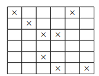
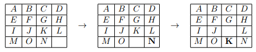
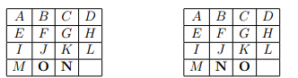
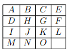
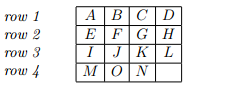

# Problem Set 2

## Problem 1

Define a 3-chain to be a (not necessarily contiguous) subsequence of three integers, which is either monotonically increasing or monotonically decreasing. We will show here that any sequence of five distinct integers will contain a 3-chain. Write the sequence as $a_1, a_2, a_3, a_4, a_5$. Note that a monotonically increasing sequence is one in which each term is greater than or equal to the previous term. Similarly, a monotonically decreasing sequence is one in which each term is less than or equal to the previous term. Lastly, a subsequence is a sequence derived from the original sequence by deleting some elements without changing the location of the remaining elements.

#### a)
Assume that $a_1 < a_2$. Show that if there is no 3-chain in our sequence, then $a_3$ must be less than $a_1$. (Hint: consider $a_4$!)

**Proof:**

$a_1 < a_2$
If no 3-chain then $a_3 < a_1$
Assume for contradiction that $a_1 < a_3$

Case 1: $a_2 < a_3$
$a_1 < a_2 < a_3$ is 3-chain #

Case 2: $a_3 < a_2$
$a_1 < a_3 < a_2$

Consider $a_4$.
i) if $a_2 < a_4$
then $a_1 < a_2 < a_4$ is 3-chain #
ii) if $a_4 < a_1$
then $a_4 < a_3 < a_2 \implies a_2 > a_3 > a_4$ is 3-chain #
iii) if $a_1 < a_3 < a_4 < a_2$
then $a_1 < a_3 < a_4$ is 3-chain #
iv) if $a_1 < a_4 < a_3 < a_2$
then $a_4 < a_3 < a_2 \implies a_2 > a_3 > a_4$ is 3-chain #

For all cases when $a_1 < a_3$ there is 3-chain,
$\therefore$ it must be the case that $a_3 < a_1$ .

#### b)
Using the previous part, show that if $a_1 < a_2$ and there is no 3-chain in our sequence, then $a_3 < a_4 < a_2$.

**Proof:**

$a_1 < a_2 \cap \text{no 3-chain} \implies a_3 < a_4 < a_2$
We know from (a) $a_3 < a_1 < a_2$

Consider $a_4$.
Case 1: $a_2 < a_4$
$\therefore a_3 < \underline{a_1 < a_2 < a_4}$ is 3-chain #

Case 2: $a_4 < a_3$
$\therefore \underline{a_4 < a_3 < a_1} < a_2$ is 3-chain #

$\therefore$ It must be the case that
$a_3 < a_4 < a_2$

#### c)
Assuming that $a_1 < a_2$ and $a_3 < a_4 < a_2$, show that any value of $a_5$ must result in a 3-chain.

**Proof:**

To cover all cases we will assume these cases
i) $a_2 < a_5$
ii) $a_5 < a_3$
iii) $a_3 < a_5 < a_2$

Case (i) $a_2 < a_5$ .
Then $a_1 < a_2 < a_5$ is 3-chain

Case (ii) $a_5 < a_3$
Then $a_5 < a_3 < a_2$ is 3-chain

By case (i) and (ii)
for there to be no 3-chain , it must be the
case that $a_3 < a_5 < a_2$

(case iii a) $a_4 < a_5$
$\therefore a_3 < a_4 < a_5$ is 3-chain #

b) $a_5 < a_4$
$a_5 < a_4 < a_2 \implies a_2 > a_4 > a_5$ is 3-chain #

#### d)
Using the previous parts, prove by contradiction that any sequence of five distinct integers must contain a 3-chain.

**Proof:**

Assume for contradiction that
There is a sequence of Five distinct integers
that contain no 3-chain.

from (a) it must be the case that for there
to be no 3-chain then
$a_1 < a_3$

we have $a_2 < a_1$ and $a_1 < a_3$
$\implies a_2 < a_1 < a_3$ .

by (b) it must the case that for there to be
no 3-chain then
$a_3 > a_4 > a_2$

$\therefore$ we must show , there is sequence of
$a_2 < a_1$ and $a_2 < a_4 < a_3$ where there
is no 3-chain.

Consider $a_5$.

Case (i) $a_5 < a_2$
$a_5 < a_2 < a_1$ is 3-chain #

Case (ii) $a_3 < a_5$
$a_2 < a_3 < a_5$ is 3-chain #

By case (i) and (ii) we know it must be
the case that
$a_2 < a_5 < a_3$ for there to be no 3-chain

Case iii a) $a_5 < a_4$
$a_5 < a_4 < a_3 \implies a_3 > a_4 > a_5$ is 3-chain #

Case iii b) $a_4 < a_5$
$a_2 < a_4 < a_5$ is 3-chain #

Since for all cases there is 3-chain,
this contradicts the assumption .

---

## Problem 2

Prove by either the Well Ordering Principle or induction that for all nonnegative integers, $n$:

$$\sum_{i=0}^{n} i^3 = \left(\frac{n(n+1)}{2}\right)^2$$

**Proof:**

That is
$1 + 8 + \dots + n^3 = \left(\frac{n(n+1)}{2}\right)^2$

Proof by well ordering principle.

Let $P(n)$ be the proposition that

$$\sum_{i=0}^{n} i^3 = \left(\frac{n(n+1)}{2}\right)^2$$

Let $C$ be the set of all non negative integers that
do not satisfies $P(n)$ such that
$C = \{ x : P(x) \text{ is false} \} .$

Assume $C$ is non empty such that
$|C| \neq 0 .$

Let $m$ be the smallest element in $C$,
which by well ordering we know it must exist.
we also know $0 \le m .$

Base case $P(0)$

$$0 = \left(\frac{0(0+1)}{2}\right)^2 = 0$$

holds
$\therefore 0 \notin C$ since $P(0)$

Consider an integer $m-1$ that we know
$0 \le m-1 < m .$

Applying $m-1$ to $P(n)$ we have

$$\sum_{i=0}^{m-1} i^3 = \left(\frac{(m-1)((m-1)+1)}{2}\right)^2$$

$$= \left(\frac{m^2-m}{2}\right)^2$$

We know

$$1 + \dots + (m-1)^3 + m^3 = \left(\frac{m^2-m}{2}\right)^2 + m^3 \quad \text{(must be false for } P(m) \text{)}$$

We have

$$\left(\frac{m^2 - m}{2}\right)^2 + m^3$$

$$= \left(\frac{m^2 - m}{2}\right)\left(\frac{m^2 - m}{2}\right) + m^3$$

$$= \left(\frac{m^2 - m}{2}\right)\left(\frac{m^2 - m}{2}\right) + \frac{2^2 m^3}{2^2}$$

$$= \frac{m^4 - m^3 - m^3 + m^2 + 2^2 m^3}{2^2}$$

$$= \frac{m^4 + 2m^3 + m^2}{2^2}$$

$$= \frac{m^2(m+1)^2}{2^2} = \left(\frac{m(m+1)}{2}\right)^2$$

This shows that $P(m)$ holds ,
which is contradicts the assumption that
$m \in C$ and $P(m)$ is false
$\therefore$ our assumption that $|C| \neq 0$ was
wrong
$\therefore \forall m \in \mathbb{Z}^+ \cup \{0\} , P(m) .$

---

## Problem 3

The following problem is fairly tough until you hear a certain one-word clue. The solution is elegant but is slightly tricky, so don’t hesitate to ask for hints!

During 6.042, the students are sitting in an $n \times n$ grid. A sudden outbreak of beaver flu (a rare variant of bird flu that lasts forever; symptoms include yearning for problem sets and craving for ice cream study sessions) causes some students to get infected. Here is an example where $n = 6$ and infected students are marked $\times$.

Now the infection begins to spread every minute (in discrete time-steps). Two students are considered *adjacent* if they share an edge (i.e., front, back, left or right, but NOT diagonal); thus, each student is adjacent to 2, 3 or 4 others. A student is infected in the next time step if either

* the student was previously infected (since beaver flu lasts forever), or
* the student is adjacent to *at least two* already-infected students.

In this example, over the next few time-steps, all the students in class become infected.

**Theorem.** *If fewer than $n$ students in class are initially infected, the whole class will never be completely infected.*

Prove this theorem.

**Proof:**

Let $S_t$ represent the set of infected cell at time step $t$
Each square (student) has is a $1 \times 1$ square
Let $p$ the perimeter of each student
Let $p'$ be the total perimeter of infected students.

Let $k$ be the number of initially infected students, where $k < n$.
Define $M(S_t)$ to be a geometric function that maps $S_t$ to $p'$

Base case
$0 \le |S_0| = k < n$
$M(S_0) \le 4k$ since each student has perimeter = 4
Since $k \le n-1$
$\therefore M(S_0) \le 4n - 4 < 4n$

Invariant
According to the rules of infection, the transition $S_t \to S_{t+1}$ guarantees that
$M(S_{t+1}) \le M(S_t)$.

Proof
Assume a single cell becomes infected at time $t+1$.
By the infection rules, this cell must share $E$ edges with the currently infected set $S_t$, where $E \ge 2$.

$\therefore \Delta M = M(S_{t+1}) - M(S_t)$

Case 1: $E=2$
$\therefore$ Adding new cell $i$ such that $S_{t+1} = S_t \cup \{i\}$, we can see that the two shared edges become part of the internal structure and 2 edges of $i$ that were not part of $S_t$ are added such that
$\Delta m = -2 \text{ edges} + 2 \text{ edges}$
$\therefore \Delta m = 0$

Case 2: $E=3$
Cell $i$ has 3 edges shared with $S_t$. It follows that adding $i$ to $S_t$ adds only a single edge and internalize 3.
Such that
$\Delta M = -3 \text{ edges} + 1 \text{ edge}$
$\therefore \Delta M = -2$

Case 3: $E=4$
Cell $i$ shares all its edges with $S_t$.
$\therefore$ adding $i$ to $S_t$ adds no edges and internalize 4
$\therefore \Delta M = -4$

$$\therefore \Delta M = 
\begin{cases} 
      0, & E=2 \\
      -2, & E=3 \\
      -4, & E=4 
\end{cases}$$

for all infected edges $2 \le E \le 4$ of cell $i$

$\therefore$ Property 1: $\Delta m \le 0$ for all cells $i$ that have infected edges $E \ge 2$.

Assume at time step $t$, Invariant holds
$M(S_t) = p$

It then follows that
$M(S_{t+1}) = p + \Delta m$
But $\Delta m \le 0$ by property 1

$\therefore M(S_{t+1}) \le M(S_t)$

Let $M(S_{\text{full}})$ be the perimeter of the entire $n \times n$ grid (class).
$\therefore M(S_{\text{full}}) = 4n$.

By the base case it follows that
$M(S_0) \le 4n - 4 < M(S_{\text{full}})$.

And by the invariant and the proof,
$\forall S_t, M(S_t) \ge M(S_{t+1})$

$\therefore M(S_{t+1}) \le M(S_t) \le M(S_0) \le 4n - 4 < M(S_{\text{full}})$

This shows that $M(S_{\text{full}})$ can never be reached if $M(S_0) < M(S_{\text{full}})$ and this completes the proof. $\blacksquare$

---

## Problem 4

Find the flaw in the following *bogus* proof that $a^n = 1$ for all nonnegative integers $n$, whenever $a$ is a nonzero real number.

*Proof.* The *bogus* proof is by induction on $n$, with hypothesis

$$P(n) ::= \forall k \le n.\ a^k = 1,$$

where $k$ is a nonnegative integer valued variable.

**Base Case:** $P(0)$ is equivalent to $a^0 = 1$, which is true by definition of $a^0$. (By convention, this holds even if $a = 0$.)

**Inductive Step:** By induction hypothesis, $a^k = 1$ for all $k \in \mathbb{N}$ such that $k \le n$. But then

$$a^{n+1} = \frac{a^n \cdot a^n}{a^{n-1}} = \frac{1 \cdot 1}{1} = 1,$$

which implies that $P(n+1)$ holds. It follows by induction that $P(n)$ holds for all $n \in \mathbb{N}$, and in particular, $a^n = 1$ holds for all $n \in \mathbb{N}$. $\square$

**Proof:**

Error in proof:

Because $P(n)$ is restricted to all $n \ge k \ge 0$, the assumption $a^{n-1} = 1$ is invalid operation during the transition $P(0)$ to $P(1)$.
For $n=0$, $a^{n-1}$ is unknown.

---

## Problem 5

Let the sequence $G_0, G_1, G_2, \dots$ be defined recursively as follows:
$G_0 = 0$, $G_1 = 1$, and $G_n = 5G_{n-1} - 6G_{n-2}$, for every $n \in \mathbb{N}, n \ge 2$.
Prove that for all $n \in \mathbb{N}, G_n = 3^n - 2^n$.

**Proof:**

Let $G_0, G_1, G_2$ be defined recursively as
$G_0 = 0$, $G_1 = 1$, $G_n = 5G_{n-1} - 6G_{n-2}$ for $n \in \mathbb{N}, n \ge 2$

Proposition: $\forall n \in \mathbb{N}, G_n = 3^n - 2^n$

By induction: let $P(n)$ be the proposition

Base case $n=0$.
$G_0 = 3^0 - 2^0 = 0$ $\therefore$ holds.

Assume $P(n)$ for all $n \ge 0$.
We need to show
$G_{n+1} = 3^{n+1} - 2^{n+1}$

By $P(n)$
$5(3^n - 2^n) - 6(3^{n-1} - 2^{n-1})$

$G_{n+1} = 5 \cdot 3^n - 5 \cdot 2^n - 6 \cdot 3^{n-1} + 6 \cdot 2^{n-1}$
$G_{n+1} = 5 \cdot 3^n - 6 \cdot 3^{n-1} - 5 \cdot 2^n + 6 \cdot 2^{n-1}$
$G_{n+1} = 5 \cdot 3^n - 2 \cdot 3^n - 5 \cdot 2^n + 3 \cdot 2^n$
$G_{n+1} = 3^n(5 - 2) - 2^n(5 - 3)$
$G_{n+1} = 3^{n+1} - 2^{n+1}$

$\therefore P(n) \implies P(n+1)$,
This completes the inductive step and the proof.

---

## Problem 6

In the 15-puzzle, there are 15 lettered tiles and a blank square arranged in a $4 \times 4$ grid. Any lettered tile adjacent to the blank square can be slid into the blank. For example, a sequence of two moves is illustrated below:

In the leftmost configuration shown above, the O and N tiles are out of order. Using only legal moves, is it possible to swap the N and the O, while leaving all the other tiles in their original position and the blank in the bottom right corner? In this problem, you will prove the answer is "no".

**Theorem.** *No sequence of moves transforms the board below on the left into the board below on the right.*

#### a)
We define the "order" of the tiles in a board to be the sequence of tiles on the board reading from the top row to the bottom row and from left to right within a row. For example, in the right board depicted in the above theorem, the order of the tiles is *A, B, C, D, E,* etc.
Can a row move change the order of the tiles? Prove your answer.

**Proof:**

a) Let $S$ be the sequence of the 15-lettered tiles read left-to-right, top-to-bottom.
A blank space $\notin S$.

Define a row move to be a swap in position between a letter $L$ and a blank space, horizontally.

Invariant 1: A row move does not change the sequence $S$.
For a row move to be possible, there must exist a blank space in the direction of the move.
And since a row move is one tile at a time horizontally, it is impossible for letter $L$ to jump over letter $L_0$.
Since blank space $\notin S$,
$S$ is unchanged after a row move.
This completes the proof of Invariant 1.

#### b)
How many pairs of tiles will have their relative order changed by a column move? More formally, for how many pairs of letters $L_1$ and $L_2$ will $L_1$ appear earlier in the order of the tiles than $L_2$ before the column move and later in the order after the column move? Prove your answer correct.

**Proof:**

Invariant 2: For a $N \times N$ board, a column move of letter $L$ changes the order of $N-1$ tiles relative to letter $L$.

Proof:
Given letter $L$ is on row $(r,c)$ then a column move swaps $L$ with a blank space on $(r-1, c)$ or $(r+1, c)$.
Notice that the original column stays unchanged.

Therefore by symmetry,
Consider a column move on $L$:
$(r, c) \rightarrow (r+1, c)$
under the constraint $0 \leq r \leq N-1$ for any $r$

* Notice that there are $(N-1) - c$ tiles after $(r,c)$ in row $r$
* There are $c - 0$ tiles before $(r+1, c)$ in row $r+1$

Let $T_{sum}$ be sum of tiles between $(r,c)$ and $(r+1, c)$.
$T_{sum} = (N-1) - c + (c - 0)$
$T_{sum} = N - 1$

It then follows that $(r,c) \rightarrow (r+1, c)$ moves $L$ ahead of $N-1$ letters that were previously ahead
Since $N=4$
$\therefore 3$ letters had their order relative to $L$ changed.
By symmetry this is true for $(r, c) \rightarrow (r-1, c)$.
This completes the proof of the invariant.

#### c)
We define an *inversion* to be a pair of letters $L_1$ and $L_2$ for which $L_1$ precedes $L_2$ in the alphabet, but $L_1$ appears after $L_2$ in the order of the tiles. For example, consider the following configuration:

There are exactly four inversions in the above configuration: $E$ and $D$, $H$ and $G$, $H$ and $F$, and $G$ and $F$.
What effect does a row move have on the parity of the number of inversions? Prove your answer.

**Proof:**

c) Invariant 3: A row move has no effect on the parity of the number of inversions.

Proof
Consider letters $L_1$ and $L_2$ such
$L_1 < L_2$ alphabetically but
$L_2 < L_1$ on the board.
Consider a sequence $S$ of the letters on the board such that
$L_1, L_2 \in S$ and $L_2 < L_1$.

By Invariant 1, a row move has no effect on $S$.
It follows that a row move wont change the order $L_2 < L_1$ in $S$.
This completes the proof.

Consider the inversion pair $(L_2, L_1)$
It then follows that swapping $L_2$ such that $L_1 < L_2$ on the board is guaranteed to remove this inversion
If however it was the case that $L_1 < L_2$ on the board, we now have inversion: $(L_2, L_1)$.
Therefore a general rule:
Swapping two letter $L_1$ and $L_2$ increase or decrease inversion by exactly 1.

#### d)
What effect does a column move have on the parity of the number of inversions? Prove your answer.

**Proof:**

And therefore follows lemma 1.

For a column move of $L$ and a set of letters $L_k$ who have their order relative to $L$ changed, by Invariant 2, for each letter $L_i \in L_k$, the inversion of $L_i$ relative to $L$ decrease or increase by 1.

We know that there are exactly 3 letters that get their relative order to $L$ changed, by Invariant 2.

Consider the following cases before a column move on $L$.

Case 1: Inversion count $I_{cnt} = 3$ (odd)
$\therefore$ all 3 letters get inversion decrease by 1.
$\therefore I_{cnt}' = 0$ (even)

Case 2: $I_{cnt} = 0$ (even)
Inversion increase for all 3
$I_{cnt}' = 3$ (odd)

Case 3: $I_{cnt} = 1$ (odd) or 2 (even)
if $I_{cnt} = 1$, 1 inversion removed, 2 added,
$I_{cnt}' = 2$ (even)
if $I_{cnt} = 2$, 2 inversions removed, 1 added,
$I_{cnt}' = 1$ (odd)

Invariant 4 theorem follows from these cases that:
Invariant 4: A column move inverts parity of the number of inversions for any $4 \times 4$ board.

#### e)
The previous problem part implies that we must make an *odd* number of column moves in order to exchange just one pair of tiles (N and O, say). But this is problematic, because each column move also knocks the blank square up or down one row. So after an *odd* number of column moves, the blank can not possibly be back in the last row, where it belongs! Now we can bundle up all these observations and state an *invariant*, a property of the puzzle that never changes, no matter how you slide the tiles around.

**Lemma.** *In every configuration reachable from the position shown below, the parity of the number of inversions is different from the parity of the row containing the blank square.*

Prove this lemma.

**Proof:**

Lemma: In every configuration reachable from the position shown below, the parity of the number of inversions is different from the parity of the row containing the blank square.

Proof by Induction
Let $r, I$ be the row index and inversion count respectively.
We start counting rows at 1.
Let $P_A$ be a function that returns parity of $r$ or $I$

Base case:
The base case is the intial given configuration
$K=0$.
For $K=0$,
$r = 4$ (even). blank is on row 4
$I = 1$ (odd). inversion is $(O, N)$ only.
Base case holds since $r$ is even and $I$ is odd.

By Induction assume that in a arbitrary reachable configuration $K$,
$P_A(I_K) \neq P_A(r_K)$

Consider a transition in configuration from
$K \rightarrow K+1$.

Case 1: $K \rightarrow K+1$ is a row move.
Assume without loss of generality that
$P_A(I_K) = 2k$ and $P_A(r_K) = 2k+1$
We defined a row move for a configuration $K$ to $K+1$ to be
$(r, c) \rightarrow (r, c \pm 1)$.
It follows that the row of the [blank] is unchanged.
By Invariant 3, parity of inversion is unchanged,
$\therefore$ after $K \rightarrow K+1$,
$P_A(I_{K+1}) \neq P_A(r_{K+1})$

Case 2: $K \rightarrow K+1$ is a column move.
Assume WLOG that $P_A(I_K) = 2k$ and $P_A(r_K) = 2k+1$.
By Invariant 4
after $K \rightarrow K+1$, $P_A(I_{K+1}) = 2k+1$.
We defined a column move to be from $K$ to $K+1$ to be
$(r, c) \rightarrow (r \pm 1, c)$.
if $r-1$ then $P_A(r_{K+1}) = 2k$.
if $r+1$ then $P_A(r_{K+1}) = 2(k+1)$.
$\therefore$ After $K \rightarrow K+1$,
$P_A(I_{K+1}) \neq P_A(r_{K+1})$.

This completes the inductive step and the proof of the lemma follows from the proof.

#### f)
Prove the theorem that we originally set out to prove.

**Proof:**

f) Theorem: No sequence of moves transforms the given configuration on the left to the target on the right.

Let target configuration be $K_T$.
For $K_T$,
Inversion count $I_T = 0$
Blank space row $r_T = 4$
Parity $P_A(I_T) = P_A(r_T)$.

Let $C$ be the infinite set of configurations reachable after initial given configuration $K_0$.

By the lemma we proved,
$\forall K_i \in C$,
$P_A(I_i) \neq P_A(r_i)$

This implies $K_T \notin C$, since $P_A(I_T) = P_A(r_T)$.
Therefore it is completely impossible to reach $K_T$ from $K_0$.
This completes the proof of the theorem.

---

## Problem 7

There are two types of creature on planet Char, Z-lings and B-lings. Furthermore, every creature belongs to a particular generation. The creatures in each generation reproduce according to certain rules and then die off. The subsequent generation consists entirely of their offspring.

The creatures of Char pair with a mate in order to reproduce. First, as many Z-B pairs as possible are formed. The remaining creatures form Z-Z pairs or B-B pairs, depending on whether there is an excess of Z-lings or of B-lings. If there are an odd number of creatures, then one in the majority species dies without reproducing. The number and type of offspring is determined by the types of the parents

* If both parents are Z-lings, then they have three Z-ling offspring.
* If both parents are B-lings, then they have two B-ling offspring and one Z-ling offspring.
* If there is one parent of each type, then they have one offspring of each type.

There are 200 Z-lings and 800 B-lings in the first generation. Use induction to prove that the number of Z-lings will always be at most twice the number of B-lings.

**Proof:**

Proposition : Given there are 200 Z-lings and 800 B-lings in the first generation, The number of Z-lings will always be atmost twice the number of B-lings.

Assume an arbitrary state at generation $n$ is $Z_n, B_n$.

Define the transition functions $Z_{n+1}$ and $B_{n+1}$.

State A: $Z_n \le B_n$, Excess B-lings

* there are $Z_n$, Z-B pairs formed.
* Notice that there are $B_n - Z_n$ B-lings left.

$$B'_n = B_n - Z_n \quad (1)$$

if $B'_n = 2k$, then are $B'_n/2$ BB pairs formed.
if $B'_n = 2k+1$, then are $(B'_n - 1)/2$ BB pairs formed.

Using offspring rules,

$$Z_{n+1} = Z_n + B'_n/2 \quad \text{if} \quad B'_n = 2k$$

by (1)

$$Z_{n+1} = Z_n + (B_n - Z_n)/2$$

$$\therefore Z_{n+1} = (Z_n + B_n)/2$$

if $B'_n = 2k+1$

$$\therefore Z_{n+1} = Z_n + (B'_n - 1)/2$$

by (1)

$$Z_{n+1} = Z_n + ((B_n - Z_n) - 1)/2$$

$$Z_{n+1} = \frac{2Z_n + B_n - Z_n - 1}{2}$$

$$Z_{n+1} = \frac{Z_n + B_n - 1}{2} \quad (4)$$

$$B_{n+1} = Z_n + 2(B'_n/2) \quad \text{if} \quad B'_n = 2k$$

$$B_{n+1} = Z_n + B'_n$$

by (1)

$$B_{n+1} = Z_n + B_n - Z_n$$

$$B_{n+1} = B_n \quad (5)$$

$$B_{n+1} = Z_n + 2((B'_n - 1)/2) \quad \text{if} \quad B'_n = 2k+1$$

$$\therefore B_{n+1} = Z_n + B'_n - 1$$

by (1)

$$B_{n+1} = Z_n + B_n - Z_n - 1$$

$$B_{n+1} = B_n - 1 \quad (6)$$

Therefore per State A.

* if $B_n - Z_n$ is even:

$$Z_{n+1} = (Z_n + B_n)/2$$

$$B_{n+1} = B_n$$

* if $B_n - Z_n$ is odd:

$$Z_{n+1} = (Z_n + B_n - 1)/2$$

$$B_{n+1} = B_n - 1$$

State B : $Z_n > B_n$, Excess Z-lings.
There are $B_n$ Z-B pairs formed.

* There are $Z'_n = Z_n - B_n$ Z-lings left,

$$Z'_n = Z_n - B_n \quad (1)$$

if $Z_n - B_n$ is even
There are $\frac{Z_n - B_n}{2}$ ZZ pairs.

$$3\left(\frac{Z_n - B_n}{2}\right) \text{ Z-ling offsprings, } 0 \text{ B-lings}$$

$$\therefore B_{n+1} = B_n$$

$$Z_{n+1} = B_n + \frac{3(Z_n - B_n)}{2}$$

$$Z_{n+1} = (3Z_n - B_n)/2$$

if $Z_n - B_n$ is odd,
There are $\frac{Z_n - B_n - 1}{2}$ ZZ pairs

$$B_{n+1} = B_n$$

$$Z_{n+1} = B_n + \frac{3(Z_n - B_n - 1)}{2}$$

$$Z_{n+1} = (3Z_n - B_n - 3)/2$$

Using a stronger hypothesis,
Let $P(n)$ be the proposition that for generation $n \ge 1$, the number of Z-lings is atmost the number of B-lings,
that is
$P(n) : Z_n \le B_n$, For all $n \ge 1$.

Note that since the population cannot be negative ($B_n > 0$) if $Z_n \le B_n$ is true, then $Z_n \le 2B_n$ is strictly implied.
Therefore proving $P(n)$ is sufficient to prove the theorem.

Base case, $P(1)$.

$$Z_1 = (200+800)/2 = 500$$

$$B_1 = 800. \text{ So}$$

$$500 \le 800 \quad \therefore P(1) \text{ holds }.$$

Assume $P(n)$ for some arbitrary integer $n \ge 1$.
We need to show $P(n) \Rightarrow P(n+1)$.
By $P(n)$ we know

$$Z_n \le B_n$$

By State A
Case 1 : $B_n - Z_n$ is even

$$\therefore Z_{n+1} = \frac{Z_n + B_n}{2}$$

$$B_{n+1} = B_n$$

Proof : by $P(n)$, $Z_n \le B_n$

Adding $B_n$ both sides

$$Z_n + B_n \le 2B_n$$

Dividing by 2

$$\frac{Z_n + B_n}{2} \le B_n \quad \therefore Z_{n+1} \le B_{n+1}$$

Case 2 : $B_n - Z_n$ is odd

$$Z_{n+1} = \frac{Z_n + B_n - 1}{2}$$

$$B_{n+1} = B_n - 1$$

Proof : if $B_n - Z_n$ is odd, then $Z_n$ cannot equal $B_n$
by $P(n)$,
$Z_n \le B_n$ then it must be the case that
$Z_n < B_n$

$$\therefore Z_n \le B_n - 1 \text{ since populations are whole integers}$$

Adding $B_n - 1$ both sides

$$Z_n + B_n - 1 \le 2B_n - 2$$

Dividing by 2

$$\frac{Z_n + B_n - 1}{2} \le B_n - 1$$

$$\therefore Z_{n+1} \le B_{n+1}$$

Therefore,

$$P(n) \Rightarrow P(n+1)$$

And since $Z_{n+1} \le B_{n+1}$ then $Z_{n+1} \le 2B_{n+1}$
This completes the inductive step and the proof follows from it.