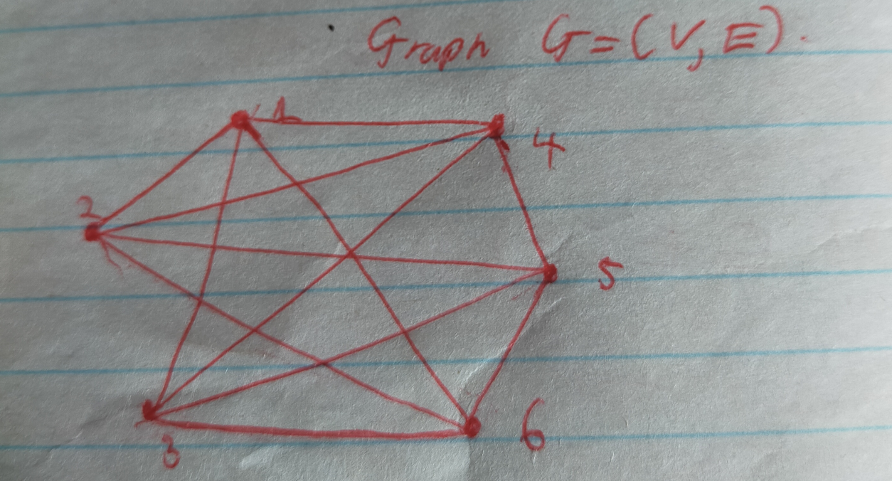

# Problem Set 5

## Problem 1

Recall that a tree is a connected acyclic graph.
In particular, a single vertex is a tree.
We define a *Splitting Binary Tree*, or *SBTree* for short, as either the lone vertex, or a tree with the following properties:

1. exactly one node of degree 2 (called the root).
2. every other node is of degree 3 or 1 (called internal nodes and leaves, respectively).

For the case of one single vertex , that vertex is considered to be a leaf.

**(a)** Show if an SBTree has more than one vertex, then the induced subgraph obtained by removing the unique root consists of two disconnected SBTrees.
You may assume that by removing the root you obtain two separate connected componenents, so all you need to prove is that those two components are SBTrees.

### Proof for 1(a)

1a) IF an SBTree has more than one vertex, then the induced subgraph obtained by removing the root consists of two disconnected SBTrees.

Proof:

Consider an SBTree $T$, removing its root and of course, its adjacent edges.
We know the resulting subgraphs $T_1$ and $T_2$ are connected components.

Case 1: single node in $T_1$. A single node, is by def an SBTree.

Case 2a: Without loss of generality, Assume $T_2$ has a single node.
It follows by def that $T_2$ is SB tree.

Case 2b: Without loss of generality, Assume one $T_1$ has more than 1 nodes.

If $T_1$ is SB tree then

Property 1: $T_1$ has exactly one node of degree 2 (the root).

We know by def, $T$ had node degree of either 3 or 1 on its non-root nodes.

We can also notice that $T_1$ had exactly one edge between node $u \in T_1$ and root node $r \in T$,

which implies exactly one node that connected to $r$ was removed.

We know that node $u$ previously had node degree of 3 or 1 but since we assumed $T_1$ has more than a single node, it can previously must have had exactly degree node of 3.

It then follows that removing edge $(u,r)$ leaves degree of 2. This proves property 1. This node is exactly 1 since its the only one that had its edge removed.

Property 2: Every other node is of degree 3 or 1.

That is, if node $v$ is not the root, then it has degree 3 or 1.

First notice that all non root nodes in $T_1$ have not been mutated, they are exactly what they were in $T$.

Since Property 2 was true for $T$, it is also true for all non root nodes in $T_1$.

This completes the proof. $\blacksquare$

---

**(b)** Prove that two SBTrees with the same number of leaves must also have the same total number of nodes.

### Proof for 1(b)

Proof:

Deriving conjecture:

Let $N(l)$ be that returns number of nodes for number of leaves input $l$.

By analyzing first terms we see that

$N(1) = 1$
$N(2) = 3$      
$N(3) = 5$      
$N(4) = 7$              

We can see that all $N(l)$ are odd, then

$N(l) = 2k+1$.

By analyzing pattern we see that

$N(l) = 2(l-1)+1$
$N(l) = 2l - 1$

Proposition: $\forall k$ leaves SB-Tree where $k>0$, $N(k) = 2k-1$ where $N(k)$ is number of nodes.

Let $P(k)$ be the proposition.

Proof by Strong Induction.

Base case: $P(1)$, $N(1) = 1$ holds.

Inductive hypothesis:

Assume that for some leaf count integer $K>0$, the statement $P(i)$ is true for all leaf counts $i$ such that $0 < i \le K$.

Let Consider a $K+1$ - leaf SBTree.
Let the tree be $T$.

Consider removing the root of $T$ such that $T_1, T_2 \subset T$ and by part (a) we know $T_1$ and $T_2$ are SBTrees.

Let the leaf counts of $T_1$ and $T_2$ be $L_1$ and $L_2$ respectively.

We notice that $L_1, L_2 \le K$,
and that $L_1$ and $L_2$ are represented by $i$, which implies $P(L_1)$ and $P(L_2)$.

Since removing the root does not change the leaf count,
then $K+1 = L_1 + L_2$.

It follows that

$N(K+1) = N(L_1) + N(L_2) + 1$

By $P(i) = (2L_1 - 1) + (2L_2 - 1) + 1$

$= 2(L_1 + L_2) - 1$

$N(K+1) = 2(K+1) - 1$

$\implies P(K+1)$

This completes the proof by Mathematical induction and (b) follows from it. $\blacksquare$

---

## Problem 2

In "Die Hard: The Afterlife", the ghosts of Bruce and Sam have been sent by the evil Simon on another mission to save midtown Manhattan.
They have been told that there is a bomb on a street corner that lies in Midtown Manhattan, which Simon defines as extending from 41st Street to 59th Street and from 3rd Avenue to 9th Avenue.
Additionally, the code that they need to defuse the bomb is on another street corner.
Simon, in a good mood, also tosses them two carrots:

* He will have a helicopter initially lower them to the street corner where the bomb is.
* He promises that the code is placed only on a corner of a numbered street and a numbered avenue, so they don't have to search Broadway.

The map of midtown Manhattan is an example of an $N \times M$ (undirected) grid. In particular, midtown Manhattan is a $19 \times 7$ grid.

Bruce and Sam need to check all $19 \cdot 7 = 133$ street corners for the code.
Once they are at a corner, they don't need any additional time to verify if the code is there.
Once they find the code and return to the bomb, they can disarm it in 2 minutes (even, or especially, as the timer ticks down to 0).
Also, they can run one block (in any of the four directions) in exactly 1 minute.
They are given 135 minutes total in which to find the code and disarm the bomb, which means that they need to return to the bomb, code in hand, in 133 minutes.

Sam realizes that the map of NYC is actually a graph, and that they need to use a cool new 6.042 concept:
A *Hamiltonian cycle* is a path that visits each vertex in a graph exactly once and ends at its starting point (so it is a cycle).
A graph is *Hamiltonian* if it has a Hamiltonian cycle.

Hamiltonian graphs are really useful because you can visit each node and return to the starting point by taking only $n$ steps, where $n$ is the number of nodes - if a graph is not Hamiltonian, you would need at least $n+1$ steps to visit each of the $n$ nodes and return to the starting point.

In general, we don't know how to efficiently determine whether a general graph is Hamiltonian or not.
However, Sam is very excited because he thinks that he can show that Midtown Manhattan is Hamiltonian.
If it is, Bruce and Sam can save the day! Will they make it?

**(a)** Show that they cannot do it - that is, more generally, show that if both $N$ and $M$ are odd, then the $N \times M$ grid is *not* Hamiltonian.

### Proof for 2(a)

Claim 1: Any $N \times M$ 2-dimensional undirected grid is bipartite.

Proof: Indeed, since every grid unit is a cycle of exactly 4 nodes, which means even nodes count for all cycles $\implies$ bipartite $\implies$ 2-colourable.

Let grid units be nodes of the $N \times M$ grid where both $N \times M$ are odd.

By parity rules we know the node count $S$ has property $S \equiv 1 \pmod 2$.

Consider two colouring each node by Claim 1. We can notice that colour will be alternating between nodes.

Let the start node be $n_0$ and end node be $n_k$.

It follows from the alternating pattern that if $S \equiv 1 \pmod 2$ and $n_0$ is color $C_1$ then $n_k$ is color $C_1$.

It follows that we cannot take a step from $n_k$ to $n_0$, that is there must be another node $n_i$ such that our path from $n_k$ to $n_0$ is $n_0 - n_i - n_k \implies n+1$ steps.

This completes the proof. $\blacksquare$

---

**(b)** Suppose Simon defined Midtown in the more standard way as extending from 40th Street to 59th Street and from 3rd Avenue to 9th Avenue (that is suppose Midtown Manhattan was a $20 \times 7$ grid), and gave them another 7 minutes,

1. Show that if either $N$ is even and $M > 1$ or $M$ is even and $N > 1$, then the $N \times M$ grid is Hamiltonian.
2. Explain why your proof breaks down when $N$ and $M$ are odd.
3. Would they survive? Does it depend on where the bomb is placed?

### Proof for 2(b)

**Part 1:**

Assume without loss of generality that the grid has $N$ rows and $M$ columns where $N$ is even and $M > 1$.

Let the start node be (0,0).

Lets reserve column 0 strictly for the return path to (0,0).

The first step is (1,0).

The subgrid bounded by columns $x \in [1, M-1]$ is transversed row by row.

For any row $r$ where $0 \le r < N$:

Invariant 1a: if $r \equiv 0 \pmod 2$, the horizontal sweep moves left to right. It starts at $(1, r)$ and ends at $(M-1, r)$.

Invariant 1b: if $r \equiv 1 \pmod 2$ the horizontal sweep moves right to left. It starts at $(M-1, r)$ and ends at $(1, r)$.

Terminating state:

The transveral reaches final row where $r = N-1$.

Because $N \equiv 0 \pmod 2$ then $N-1 \equiv 1 \pmod 2$.

By the invariants, the horizontal sweep on row N-1 must end at coordinates (1, N-1).

Because column 0 was strictly reserved, the node at (0, N-1) is unvisited. A valid edge exists between (1, N-1) and (0, N-1).

Finally the path transverses $(0, N-1) \rightarrow (0, N-2) \rightarrow \dots \rightarrow (0, 1) \rightarrow (0, 0)$.

We have formally constructed a hamiltonian cycle for $N \times M$ grid and the proof follows from it. $\blacksquare$

**Part 2:**

b) Why proof breaks when N and M are odd ?

If N is odd $\implies$ final row index $r = N-1$ has parity $r \equiv 0 \pmod 2$.

By the established Invariant, the start node is (1, N-1) and ends at (M-1, N-1).

But geometrically, this edge does not exist.

Proof: In a grid graph, an edge exists between node $(x_1, y_1)$ and $(x_2, y_2)$ iff their manhattan distance is exactly 1.

The distance between (M-1, N-1) and (0, N-1) is M-1.

Because M is odd and $M > 1$, $M-1 \ge 2$. Therefore no edge exists, and the cycle cannot be closed.

Therefore if Both $M \times N$ are odd, we cannot construct a valid Hamiltonian cycle and this completes the proof. $\blacksquare$

**Part 3:**

Yes they would survive and it does not depend on where the bomb is placed since position of bomb does not alter parity of M and N.

Therefore if Simon Keeps his promise of dropping them where bomb is, they can surely make n steps cycle.

There are $20 \times 7 = 140$ mins from node to node

There is 2 mins to diffuse bomb

$T_{taken} = 142 \text{ mins}$

Simon gave $135 \text{ min} + 7 \text{ min} = 142 \text{ mins}$

$T_{given} = T_{taken}$

This completes the proof. $\blacksquare$

---

## Problem 3

An $n$-node graph is said to be *tangled* if there is an edge leaving every set of $\lceil n/3 \rceil$ or fewer vertices. As a special case, the graph consisting of a single node is considered tangled.
(Recall that the notation $\lceil x \rceil$ refers to the smallest integer greater than or equal to $x$.)

### (a) Find the error in the proof of the following claim.

**Claim.** Every non-empty, tangled graph is connected.

*Proof.* The proof is by strong induction on the number of vertices in the graph.

Let $P(n)$ be the proposition that if an $n$-node graph is tangled, then it is connected.

In the base case, $P(1)$ is true because the graph consisting of a single node is defined to be tangled and is trivially connected.

In the inductive step, for $n \ge 1$ assume $P(1), \dots, P(n)$ to prove $P(n+1)$. 

That is, we want to prove that if an $(n+1)$-node graph is tangled, then it is connected.

Let $G$ be a tangled, $(n+1)$-node graph.

Arbitrarily partition $G$ into two pieces so that the first piece contains exactly $\lceil n/3 \rceil$ vertices, and the second piece contains all remaining vertices.

Note that since $n \ge 1$, the graph $G$ has a least two vertices, and so both pieces contain at least one vertex. By induction, each of these two pieces is connected.

Since the graph $G$ is tangled, there is an edge leaving the first piece, joining it to the second piece.

Therefore, the entire graph is connected.

This shows that $P(1), \dots, P(n)$ imply $P(n+1)$, and the claim is proved by strong induction.

**Error in Proof:**

$P(n)$ is the proposition tangled $\Rightarrow$ connected.

The proof writer claims:

"By induction each of these two pieces is connected".

For that to be true he must first show they are tangled, which he/she did not prove. $\blacksquare$

---

### (b) Draw a tangled graph that is not connected.

For a graph to be disconnected it must atleast two disconnected components $C_1$ and $C_2$.

We also need $|C| > \lceil n/3 \rceil$.

$\therefore |C_1| = 3$, $|C_2| = 3$

$n=6$

$\therefore V = \{a,b,c,d,e,f\}$

$E = \{(a,b), (b,c), (d,e), (e,f)\}$ $\blacksquare$

---

### (c) An $n$-node graph is said to be *mangled* if there is an edge leaving every set of $\lceil n/2 \rceil$ or fewer vertices.
Again, as a special case, the graph consisting of a single node is considered mangled.
Prove the following claim. 

**Claim.** Every non-empty, mangled graph is connected.

**Proof:**

Lemma 1:

For a graph $G$ to be mangled but not connected, there should exist isolated connected components of $G$, that are disjoint in $G$, such that 
$|C| > \lceil n/2 \rceil$ for all connected components $C$.

Proof:

Consider an abitrary connected component $C$ such that $|C| \le \lceil n/2 \rceil$.

This By def a connected isolated component has no edges leaving it.

Then since $|C| \le \lceil n/2 \rceil$, we can select it for mangled test and it will fail.

Consider isolated components of $G$ defined to be $C_1$ and $C_2$.

Since $\lceil n/2 \rceil \ge n/2$,

By lemma 1, $|C_1| > n/2$ and $|C_2| > n/2$. (1)

Because $C_1$ and $C_2$ are disjoint components of $G$, it should be the case that

$|C_1| + |C_2| \le |G|$.

Since $|G| = n$, but $|C_1| + |C_2| > n$ by (1)

This contradicts the assumption that $G$ is mangled but not connected.

This completes the proof. $\blacksquare$

---

## Problem 4

### (a) Suppose that $G$ is a simple, connected graph on $n$ nodes. Show that $G$ has exactly $n - 1$ edges iff $G$ is a tree.

Theorem: Suppose that $G$ is a simple, connected graph on $n$ nodes. $G$ has exactly $n-1$ edges iff $G$ is a tree.

Proof

Case 1: Proof that $G$ is a tree if it has exactly $n-1$ edges.

By Induction.

Let $P(n)$ be the proposition that $G$ is a tree $\Rightarrow$ it has exactly $n-1$ edges where $G$ is a simple connected $n$-node graph.

Base case $P(1)$ holds.

Assume $P(n)$. Consider an abitrary $(n+1)$-node graph $T$, that we know is a tree.

Consider removing a leaf node $u$ that we know by def exactly one node adjacent to it, that is $deg(u)=1$.

Claim: The resulting graph $T'$ is still a tree.

Proof

Assume it is not a tree. Since $T$ was connected, $T'$ should also be connected since we only removed a node of $deg(1)$.

Since $T'$ is connected and not a tree, $\exists$ a cycle $C$ in $T'$.

If $C \subseteq T'$ then $C \subseteq T$, which is a contradiction.

Therefore $T'$ is a tree.

By the inductive hypothesis, we know $T'$ has $n-1$ edges.

Consider adding back $u$ to $T'$ such that $T' \cup \{u\} = T$.

Since $deg(u)=1$, $T$ has exactly $n$ edges.

We have shown that $P(n) \Rightarrow P(n+1)$.

This completes the proof. $\blacksquare$

Case 2 Proof that "$G$ has exactly $n-1$ edges $\Rightarrow$ $G$ is a tree where $G$ is a simple connected graph on $n$-nodes".

Lemma 1: Given a simple connected graph $G$ with $n$ nodes and exactly $n-1$ edges, There must exist atleast one node $u$ such that $deg(u)=1$.

Assume for contradiction purposes that for all $v \in G$, $deg(v) \ge 2$.

By the hand Sum of degree is 

$$
\sum_{v \in G} deg(v) \ge 2n
$$

By the handshaking lemma 

$$
\sum_{v \in G} deg(v) = 2|E|
$$

We already know by def of $G$ that $|E| = n-1$

This means that 

$$
2(n-1) \ge 2n \Rightarrow 2n - 2 \ge 2n \Rightarrow -2 \ge 0
$$

This is a contradiction, Therefore there must exist atleast one node $u$ with $deg(u)=1$.

By Induction:

Let $P(n)$ be the proposition "Every connected graph on $n$ nodes with $n-1$ edges is a tree".

Base case $P(1)$ holds since a node is by def a tree.

$P(2)$. There are 2 nodes and a single edge. Therefore connected and no cycle. $P(2)$ holds.

Assume $P(n)$.

Consider $G$, an abitrary simple connected graph on $n+1$ nodes with $n$ edges.

By lemma 1, $G$ contains atleast one node $u$ such that $deg(u)=1$.

Let $G' = G - \{u\}$, that is removing node $u$ and ofcourse its edge.

That is, for some nodes $X$ and $Y$ in $G'$, $\not\exists$ path $X-Y$ but $X-Y$ existed in $G$.

Since only $u$ and its single edge that connected it were removed, then path the used

$X - K - \dots - v - u - m - \dots - Y$

where the removed edge is $(u,v)$.

Since $u$ is not connected to any other node, the path therefore did like... where there is edge $(v,m)$.

$X - K - \dots - v - u - v - m - \dots - Y$

Therefore in $G'$ the path can use

$X - K - v - m - \dots - Y$

Which is a contradiction to the assumption that $X$ and $Y$ are disconnected.

Since $G'$ is connected and has $n$-nodes and $n-1$ edges,

By $P(n)$, $G'$ is a tree.

Consider adding back $u$ to $G'$ such that $G = G' \cup \{u\}$.

Since $deg(u)=1$ in $G$,

Then $u$ is by def a leaf and is guaranteed to not cause any cycle.

This completes the Inductive hypothesis and proves $P(n) \Rightarrow P(n+1)$.

We have shown that $\Rightarrow$ and $\Leftarrow$ and the proof is complete. $\blacksquare$

---

### (b) Prove by induction that any connected graph has a spanning tree.

**Proof:**

Let $P(n)$ be the proposition

"Any $n$-edge connected graph $G$, has a spanning tree $T$".

By Induction:

Base case $P(0)$ vacuously connected.
$G$ has no edges but is connected,
Then there is a single node vacuously connected and is a spanning tree.
holds.

$P(1)$. Single edge and connected implies 2 nodes.
The edge on those 2 nodes is automatically a spanning tree.

Assume $P(n)$.

Consider an abitrary $(n+1)$-edge graph $G$ such that $G$ is a connected graph.

Consider two cases which define the property of $G$.

Case 1 $G$ has no cycle.

By def $G$ is a tree.

Therefore the spanning tree $T$ is $G$.

Case 2: $G$ has a cycle.

We need to show $\exists T \subseteq G$ where $T$ is a spanning tree of $G$.

Let the cycle be $C$ where $C \subseteq G$.

Consider an abitrary edge $e \in C$.

Let $G' = G - \{e\}$.

Claim: $G'$ is connected.

Notice that since $e$ was removed from $C$, $C$ was broken to form a path $P = C - \{e\}$.

If an abitrary walk $W'$ used the edges

$X - \dots - u - v - \dots - Y$

where $X$ and $Y$ are an abitrary nodes in $G$ and $u$ and $v$ such that $e=(u,v)$

Then since removing $e$ formed a path $P$, $\exists$ another walk $W$ that can use

$X - \dots - P - \dots - Y$.

By a fundamental lemma we know,

if $\exists$ walk from $X$ to $Y$, $\exists$ path from $X$ to $Y$.

It then follows that $G'$ is connected.

By the fundamental definition of edge deletion,

$V(G - \{e\}) = V(G)$

then $V(G') = V(G)$

Because $T'$ is a spanning tree of $G'$

therefore $V(T') = V(G)$. (1)

Also notice that

$E(T') \subseteq E(G')$ and

$E(G') \subset E(G)$

Therefore

$E(T') \subseteq E(G)$ (2)

It follows that $T'$ is a spanning tree of $G$.

This completes the Inductive step and the proof follows from it. $\blacksquare$

---

## Problem 5

The adjacency matrix of a graph is given below 

$$
\begin{bmatrix}
0 & 1 & 1 & 1 & 0 & 1 \\
1 & 0 & 0 & 1 & 1 & 1 \\
1 & 0 & 0 & 1 & 1 & 1 \\
1 & 1 & 1 & 0 & 1 & 0 \\
0 & 1 & 1 & 1 & 0 & 1 \\
1 & 1 & 1 & 0 & 1 & 0
\end{bmatrix}
$$

### (a) Draw the graph defined by this adjacency matrix. Label the vertices of your graph $1, 2, \dots, 6$ so that vertex $i$ corresponds to row and column $i$ of the matrix.

a) Let the graph represented by the adjacency matrix be $G = (V,E)$

$V = \{1, 2, 3, 4, 5, 6\}$

$E = \{(1,2), (1,3), (1,4), (1,6), (2,1), (2,4), (2,5), (2,6), (3,1), (3,4), (3,5), (3,6), (4,1), (4,2), (4,3), (4,5), (5,2), (5,3), (5,4), (5,6), (6,1), (6,2), (6,3), (6,5)\}$

Removing duplicates, $E = \{(1,2), (1,3), (1,4), (1,6), (2,4), (2,5), (2,6), (3,4), (3,5), (3,6), (4,5), (5,6)\}$

---

### (b) In a graph, we define the distance between to vertices to be the length of the shortest path between them. We define the diameter of a graph to be the largest distance between any two nodes.
What is the diameter of this graph? Explain why.

Claim: if nodes $X$ and $Y$ in $G$, don't share an edge, they are possible contributors to diameter of $G$.

Proof: 

This follows directly from the fact that if nodes $u$ and $v$ share an edge, then $dist(u,v) = 1$, given dist returns edge count.

Since its guaranteed for $X$ and $Y$ that $dist(X,Y) > 1$ then $u$ and $v$ cant contribute to diameter.

Step 1 Let $E_{not}$ be Unordered node pairs that dont share an edge.

Unordered since $dist(X \rightarrow Y)$ is same as $dist(X \leftarrow Y)$.

$\therefore E_{not} = E^c$

$E_{not} = \{\{1,5\}, \{2,3\}, \{4,6\}\}$

Step 2 : Dist between all nodes pairs in $E_{not}$, smallest number of edges path.

Let shortest path be $dist(X,Y)$.

$\therefore Diameter = \max( dist(1,5), dist(2,3), dist(4,6) )$

$Diameter = \max( 2, 2, 2 )$

$Diameter = 2$

This is really the diameter since it takes the max distance from all edges $X$ and $Y$ that dont share an edge. $\blacksquare$

**(c) Find a cycle in this graph of maximum length and explain why it has maximum length**

Let a cycle of max length be $C_{max}$.

This cycle is the path 

$$
C_{max} = 1 - 2 - 4 - 3 - 5 - 6 - 7
$$

This is of max length since it touches all nodes in $G$, hence if any other cycle exist, it will be atmost $C_{max}$. $\blacksquare$

**(d) Give a coloring of the vertices that uses the minimum number of colors. Prove that this a minimum coloring.**

Recall the set of edge pairs,

$E_{not}$

Since those nodes dont share an edge, we can assign them a same color.

$\therefore \{1, 5\} \rightarrow C_1$

$\{2, 3\} \rightarrow C_2$

$\{4, 6\} \rightarrow C_3$

Proof this is minimum colouring

Assume for the purpose of contradiction that $G$ is two colourable.

This is the case iff $G$ has no odd-noded cycle.

But consider the cycle $1 - 2 - 4$ which is odd.

$\therefore G$ is not two colourable.

$\therefore \chi(G) = 3$ $\blacksquare$

---

## Problem 6

Let $G$ be a graph.
In this problem we show every vertex of odd degree is connected to at least one other vertex of odd degree in $G$.

**(a)** Let $v$ be an odd degree node.
Consider the longest walk starting at $v$ that does not repeat any edges (though it may omit some).
Let $w$ be the final node of that walk. Show that $w \neq v$.

**Proof:**

Let $G$ be a graph.

Let $v$ be an odd degree node.

Let $W_L$ be the longest walk starting at $v$ and does not repeat edges and ends at node $w$.

Assume for the purpose of contradiction that at end of $W_L$, $v = w$.

Claim 1:

For an arbitrary node $k \neq v, w$, $W_L$ use exactly $2$ edges incident to $k$.

This comes from the fact that $W_L$ "enters" $k$ then "leaves" $k$.
Thats exactly $2$ edges used. $\blacksquare$

Assume that $W_L$ passes through $k$, $0$ or more times.

Since $W_L$ is constrained to not repeat any edges, let $p$ be the number of passes on $k$, then number of edges used by $W_L$ on $k = 2p$, by claim 1.

$k_{used} = 2p$

Now note that for node $v$, $W_L$ use exactly $1$ edge incident to $v$ in the first step.

$\therefore$ if $W_L$ is to visit $v$ an arbitrary number of time

$v_{used} = 2p + 1$ where $1$ was caused by the first step.

By the assumption, the final node of $W_L$ is $v$, then end of $W_L$,

$v_{used} \equiv 0 \pmod 2$.

And since $deg(v) \equiv 1 \pmod 2$,

Then $\exists$ another edge $e$, incident to $v$, unused by $W_L$.

This contradicts the assumption that $W_L$ is the largest walk since, 

$\exists W'_L$ that can consume the unused edge $e$ such that,

$used(W'_L) > used(W_L)$.

Since $W_L$ is the largest walk, it must leave $v$, such that

$v \neq w$.

This contradicts the assumption that $v=w$,

and the proof follows from the contradiction $\blacksquare$

---

**(b)** Show that $w$ must also have odd degree.

**Proof:**

Since $w$ is the final node of $W_L$,

$w_{used} = 2p + 1$ by claim 1 from (a).

Assume $deg(w) \equiv 0 \pmod 2$.

Since $w_{used} = 2p + 1$,

Then $\exists$ unused edge $e$ such that 

$W_L$ can take it to stay consistent with assumption that $W_L$ is longest walk.

It then follows that for $W_L$ to be the longest walk and have $w$ as the final node, it must be true that $deg(w) \equiv 1 \pmod 2$,

That is, for $W_L$ to be valid, then

$w_{used} + w_{unused} = deg(w)$.

Since $w_{unused}$ must be $0$

$\therefore w_{used} = deg(w)$.

Since $w_{used} \equiv 1 \pmod 2$,

it should also be the case for $deg(w)$.

That is, for $W_L$ to be valid,

$deg(w) \equiv 1 \pmod 2$ $\blacksquare$

This completes the proof $\blacksquare$
