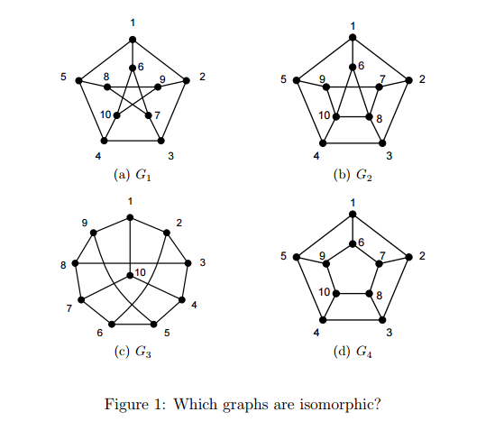

## Problem 1

> **Problem 1. [15 points]** Let $G = (V,E)$ be a graph. A matching in $G$ is a set $M \subset E$ such that no two edges in $M$ are incident on a common vertex.
> 
> Let $M_1, M_2$ be two matchings of $G$. Consider the new graph $G' = (V, M_1 \cup M_2)$ (i.e. on the same vertex set, whose edges consist of all the edges that appear in either $M_1$ or $M_2$). Show that $G'$ is bipartite.
> 
> *Helpful definition: A connected component is a subgraph of a graph consisting of some vertex and every node and edge that is connected to that vertex.*

**Solution:**

Let $M_1$ and $M_2$ be two matchings of $G$.

Consider $G' = (V, M_1 \cup M_2)$.

Proof that $G'$ is Bipartite

First note that the maximum degree of a node in the matching $M_1$ or $M_2$ is 1.
The $M_1 \cup M_2$ can have a maximum node degree of 2.

Now notice that the only possible structures $G'$ can take are paths and cycles (since degree is limited to 2).

If $M_1 \cup M_2$ forms a cycle, then it must be an even cycle (alternating between $M_1$ and $M_2$).
Assume starting at node $v_0$ that belongs to $M_1$, then the closing edge $E_{end}$ must belong to $M_2$ or we will break matching rules.
And this also shows if its a cycle then the number of edges can't be odd.

If $M_1 \cup M_2$ forms a path then it contains no cycles at all.

$\therefore$ It follows $G'$ is bipartite $\blacksquare$

---

## Problem 2 (a)

> **Problem 2. [20 points]** Let $G = (V, E)$ be a graph. Recall that the degree of a vertex $v \in V$, denoted $d_v$, is the number of vertices $w$ such that there is an edge between $v$ and $w$.
> 
> **(a) [10 pts]** Prove that 
> $$2|E| = \sum_{v \in V} d_v$$

**Solution:**

Proof that $2|E| = \sum_{v \in V} d_v$ where $d_v$ is the degree of a vertex $v$.

Lemma 1: Every edge contributes exactly 2 degrees to the total sum of degrees in the graph.

P.f: Consider adding an edge $e$ to a graph such that the edge gets connected to node $u$ and $v$ (which is the only way, an edge can be connected to exactly two nodes).
It follows that the degree of each node increases by $1 \Rightarrow$ total increase is $2 \blacksquare$

Let $|E|$ be $M$.
Let $P(M)$ be the proposition:
$\sum_{v \in V} d_v = 2M$ where $d_v$ is the degree of a node $v$.

By Mathematical induction:

Base case, $M=0$.
Since there are no edges then every node has degree 0. holds.

Inductive step:
Assume $P(M)$
Consider an $M+1$ number of edges graph.

By Lemma 1, sum of all degrees must increase by 2
$\therefore \sum_{v \in V} d_v + 2 = 2(M+1)$

By the inductive hypothesis
$2M + 2 = 2(M+1) \Rightarrow P(M+1)$

This completes the inductive step and proof by induction $\blacksquare$

---

## Problem 2 (b)

> **(b) [5 pts]** At a 6.042 ice cream study session (where the ice cream is plentiful and it helps you study too) 111 students showed up. During the session, some students shook hands with each other (everybody being happy and content with the ice-cream and all). Turns out that the University of Chicago did another spectacular study here, and counted that each student shook hands with exactly 17 other students. Can you debunk this too?

**Solution:**

b) Let the graph which characterize students shaking hands be 
$G = (V,E)$ where $|V| = 111$.

We can also note that the degree $d_v$ of each student is 17
$\therefore \sum_{v \in V} 17 = 17 \cdot 111 = 1887$

But from the proof from (a) we know
$\sum_{v \in V} d_v = 2|E|$, which is a contradiction since $1887 \equiv 1 \pmod 2$.

$\therefore$ The claim is false $\blacksquare$

---

## Problem 2 (c)

> **(c) [5 pts]** And on a more dull note, how many edges does $K_n$, the complete graph on $n$ vertices, have?

**Solution:**

c) By def, a complete graph contain every possible edge.

If there are $n$-nodes then each node $v \in V$ must have exactly a degree of 
$d_v = n-1$

Applying theorem:
$2|E| = \sum_{v \in V} d_v$
$2|E| = n \cdot (n-1)$
$|E| = \frac{n(n-1)}{2}$

$\therefore \frac{n(n-1)}{2} \blacksquare$

---

# Problem 3

**(a) Some properties of a simple graph, G, are described below. Which of these properties is preserved under isomorphism?**

1. **G has an even number of vertices.**
   - Preserved. Otherwise they are not isomorphic.
2. **None of the vertices of G is an even integer.**
   - This is labeling, not preserved.
3. **G has a vertex of degree 3.**
   - Preserved. Otherwise they are not isomorphic.
4. **G has exactly one vertex of degree 3.**
   - Preserved. There is no way of increasing degree without losing isomorphisms.

**(b) Determine which among the four graphs pictured in the Figures are isomorphic. If two of these graphs are isomorphic, describe an isomorphism between them. If they are not, give a property that is preserved under isomorphism such that one graph has the property, but the other does not. For at least one of the properties you choose, prove that it is indeed preserved under isomorphism (you only need prove one of them).**

### Filtering for isomorphism
* **Number of nodes:** are the same.
* **Number of edges:**
  - $G_1: 15$, $G_2: 16$, $G_3: 15$, $G_4: 15$
  - Eliminate $G_2$ because $|E|$ differs from others.
* **Degree sequence:**
  - $G_1: (3, 3, \dots, 3)_{10}$
  - $G_3: (3, 3, \dots, 3)_{10}$
  - $G_4: (3, 3, \dots, 3)_{10}$
* **Length of shortest cycle:**
  - $G_1: 5$, $G_3: 5$, $G_4: 4$
  - $G_4$ has shorter cycle than other, eliminate $G_4$.

**Isomorphism candidates** = $\{G_1, G_3\}$

### Base mapping
* **Base cycle:** Outer cycle of $G_1$. Rename vertices in their connectivity order to be: $\{v_1, v_2, v_3, v_4, v_5\}$
* **Corresponding cycle in $G_3$:** $\{w_1, w_2, w_3, w_4, w_{10}\}$

**Initial mapping:**
$f(v_1) = w_1, f(v_2) = w_2, f(v_3) = w_3, f(v_4) = w_4, f(v_5) = w_{10}$

**Forced adjacency:**
$f(v_8) = w_7, f(v_9) = w_6, f(v_{10}) = w_5$

**Remaining:**
$\{v_6, v_7\}$ and $\{w_8, w_9\}$
Because $v_6$ connects to $v_1$ and $v_{10}$ and we know $w_9$ connects to $w_1$ and $w_5$ and $f(v_1) = w_1$ and $f(v_{10}) = w_5 \implies f(v_6) = w_9$.
This leaves $f(v_7) = w_8$.

**Complete mapping is:**
$f(v_1) = w_1, f(v_2) = w_2, f(v_3) = w_3, f(v_4) = w_4, f(v_5) = w_{10}, f(v_6) = w_9, f(v_7) = w_8, f(v_8) = w_7, f(v_9) = w_6, f(v_{10}) = w_5$

---

# Problem 4

**(a) Give a counterexample to the False Claim when k = 2.**

**Properties of counterexample:**
* must not be bipartite
* must have max degree at most 2
* must have a node of degree 1

Let component 1 be $C_1 = (V_1, E_1)$:
$V_1 = \{1, 2, 3\}$
$E_1 = \{(1, 2), (2, 3), (1, 3)\}$
$C_1$ has max degree 2 and is not 2-colorable.
$deg(1) = 2, deg(2) = 2, deg(3) = 2$.

Let component 2 be $C_2 = (V_2, E_2)$:
$V_2 = \{a, b\}$
$E_2 = \{(a, b)\}$
$C_2$ has a node of degree 1: $deg(a) = 1, deg(b) = 1$.

Let $G$ be a union of $C_1$ and $C_2$ such that $G = (V, E)$ and
$V = \{1, 2, 3, a, b\}$
$E = \{(1, 2), (2, 3), (1, 3), (a, b)\}$
$G$ has $k = 2$ (max deg), and has a node of $deg < k$ (degree 1).
Because $C_1$, a component of $G$, is not 2-colorable, $G$ is not 2-colorable.
$\therefore$ the claim is invalid.

**(b) Identify the exact sentence where the proof goes wrong.**

**Sentence:**
"Removing $v$ reduces the degree of all vertices adjacent to $v$ by 1. So in $G_n$, each of these vertices has degree less than $k$."

**Reasoning:**
But assume $deg(v) = 0$. The claim that $G_n$ has a vertex of $deg < k$ breaks since $v$ was not connected at all.

---

# Problem 5

**Prove or disprove the following claim: for some $n \ge 3$ (n boys and n girls, for a total of 2n people), there exists a set of boys’ and girls’ preferences such that every dating arrangement is stable.**

Let $V_b$ be the set of nodes that represent boys.
Let $V_g$ be the set of nodes that represent girls.

An unstable matching happens if
$\exists b_1, b_2 \in V_b, g_1, g_2 \in V_g$ such that $(b_1, g_1)$ and $(b_2, g_2)$ are matched but $b_1$ prefers $g_2$ over $g_1$ and $g_2$ prefers $b_1$ over $b_2$.

Assume the claim is true $\implies$ every possible matching is stable.
Let girl $g_i$ be a top choice of boy $b_i$.
For $g_i$ and $b_i$ to be a couple and be stable, $g_i$ must prefer $b_i$ over other boys who prefer $g_i$.

Consider an arbitrary matching $M$ where $b_i$ and $g_i$ are not matched. Instead $b_i$ is matched with some other girl $g_k$ and $g_i$ is matched with some other boy $b_k$.
We know $b_i$ strictly prefers $g_i$ over his partner $g_k$.
For matching $M$ to remain stable $b_i$ must rank strictly lower than $b_k$ in $g_i$'s preference list.

But since $M$ can be any arbitrary matching, $b_k$ could be any other boy in the set. If $g_i$ must block a rogue couple with $b_i$, $b_i$ must rank lowest in $g_i$'s preference list such that:
$\nexists \text{ boy } b_k \text{ such that } (g_i, b_k) \text{ but } b_k < b_i \text{ in } g_i \text{ preference list. (1)}$

Now consider a scenario where two distinct boys $b_x$ and $b_y$ share the exact same top choice girl, $g_z$.
From (1) for a valid matching where both $b_x$ and $b_y$ are not connected to $g_z$ then both $b_x$ and $b_y$ must strictly rank lower than all the boys in $g_z$ preference list (rank is same).

But a strict preference list prohibits ties.
$\therefore g_z$ cannot rank $b_x$ and $b_y$ simultaneously at the absolute bottom.

**Limitation 1:** No two boys can share the same first-choice girl.
$\therefore$ Every girl must have is the top choice of exactly one boy.

**Limitation 2:** Since stability is symmetric, No two girls can share the same first choice boy.
$\therefore$ Every boy is the top choice of exactly one girl.

Consider $n=3$ and
$V_b = \{b_1, b_2, b_3\}$ and $V_g = \{g_1, g_2, g_3\}$

We must establish stable matching for all $3! = 6$ possible matchings at adhering to Lim 1 and Lim 2.

Without loss of generality, consider a valid set of first choices for the boys that satisfy Lim 1 and Lim 2 :
* $g_1$ rank $1^{st}$ on $b_1$
* $g_2$ rank $1^{st}$ on $b_2$
* $g_3$ rank $1^{st}$ on $b_3$

Using Lim 1 and 2:
* $b_1$ rank $3^{rd}$ on $g_1$
* $b_2$ rank $3^{rd}$ on $g_2$
* $b_3$ rank $3^{rd}$ on $g_3$

Let the girls first choice shift by 1:
* $b_2$ rank $1^{st}$ on $g_1$
* $b_3$ rank $1^{st}$ on $g_2$
* $b_1$ rank $1^{st}$ on $g_3$

Using Lim 1 and 2:
* $g_1$ rank $3^{rd}$ on $b_2$
* $g_2$ rank $3^{rd}$ on $b_3$
* $g_3$ rank $3^{rd}$ on $b_1$

### Preference Matrix

*(Note: Parentheses indicate the elements circled in the original handwritten notes)*

$$
\begin{array}{c|ccc}
g_1 & b_2 & (b_3) & b_1 \\
g_2 & b_3 & b_1 & b_2 \\
g_3 & b_1 & b_2 & b_3 
\end{array}
\hspace{2cm}
\begin{array}{c|ccc}
b_1 & g_1 & (g_2) & g_3 \\
b_2 & g_2 & g_3 & g_1 \\
b_3 & g_3 & (g_1) & g_2 
\end{array}
$$

Consider matching
$M = \{(b_1, g_1), (b_2, g_3), (b_3, g_2)\}$

Notice that the pair $(b_3, g_1)$ is a rogue couple because:
* $b_3$ prefers $g_1$ more than $g_2$
* $g_1$ prefers $b_3$ more than $b_1$

Which is a contradiction to the claim that every possible matching is stable
$\therefore$ The claim is false
This completes the proof. $\blacksquare$