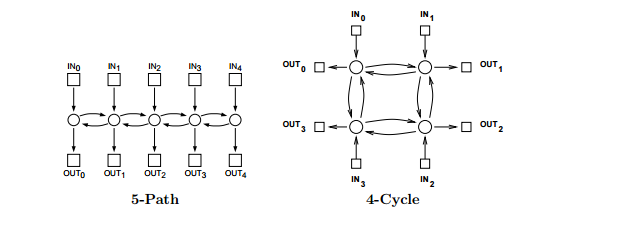
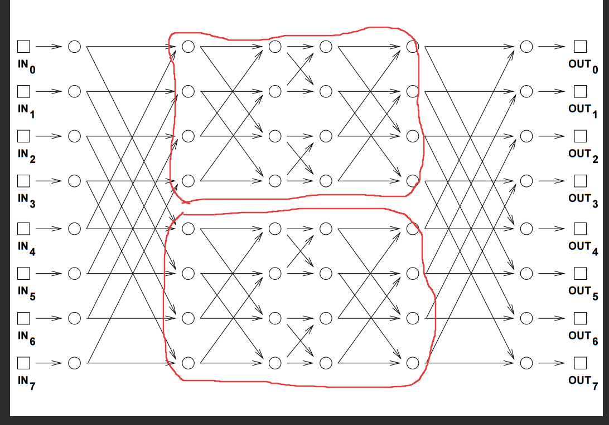
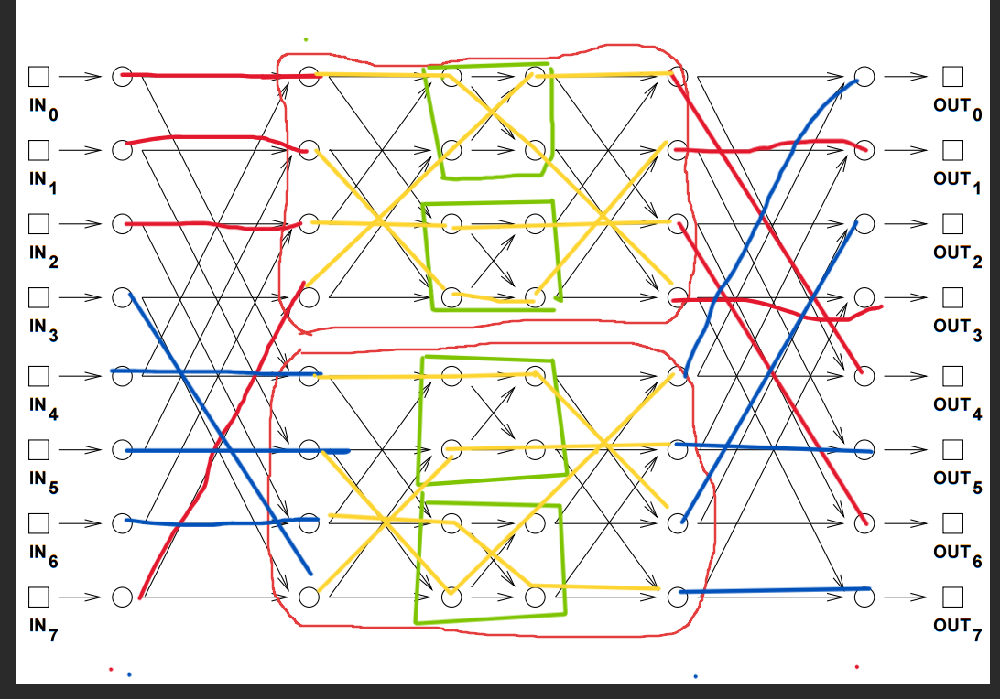

# Analysis of Two Networks

Two communication networks are shown below. Complete the table of properties and be prepared to justify your answers.

* **$N$**: number of inputs/outputs

* **Diameter**: number of edges on the shortest path between input and output that are farthest apart

* **Congestion**: how many packets are forced to go through the same switch

| Network | # switches | switch size | diameter | max congestion |
| :--- | :--- | :--- | :--- | :--- |
| 5-path | $N$ | 3x3 | $N+1$ | 5 |
| 4-cycle | $N$ | 3x3 | $N$ | 3 |

---

## Routing in a Beneš Network

**2. Now consider the following permutation routing problem:**

$$
\begin{aligned}
\pi(0) &= 3 & \pi(4) &= 2 \\
\pi(1) &= 1 & \pi(5) &= 0 \\
\pi(2) &= 6 & \pi(6) &= 7 \\
\pi(3) &= 5 & \pi(7) &= 4
\end{aligned}
$$

Subnetworks

Each packet must be routed through either the upper subnetwork or the lower subnetwork. Construct a graph with vertices 0, 1, ..., 7 and draw a dashed edge between each pair of packets that can not go through the same subnetwork because a collision would occur in the second column of switches.

$$E_{dashed} = \{(0,4), (1,5), (2,6), (3,7)\}$$

That is to say, packets connected by the dashed edges must not pass through the same subnetwork or a collision will occur. 

This follows from the observation that packets $u$ and $v$ connected by a dashed edge, if both must pass through the same subgraph $n$, must use the same switch $S_{ij}$ in the second-from-first column.

---

**3. Add a solid edge in your graph between each pair of packets that can not go through the same subnetwork because a collision would occur in the next-to-last column of switches.**

We know that packets will collide if they take the same subgraph if their destination ports force them to share a switch in the last column. 

These output ports as pairs are $\{(0,4), (1,5), (2,6), (3,7)\}$.

From the permutation:
* $\pi(0) = 3 \quad \pi(4) = 2$
* $\pi(1) = 1 \quad \pi(5) = 0$
* $\pi(2) = 6 \quad \pi(6) = 7$
* $\pi(3) = 5 \quad \pi(7) = 4$

$$\therefore E_{solid} = \{(5,7), (1,3), (4,2), (0,6)\}$$

where the connected nodes represent packets.

---

**4. Color (i.e., label) the vertices of your graph red and blue so that adjacent vertices get different colors. Why must this be possible, regardless of the permutation $\pi$?**

Let $G$ be the graph:
$$G = (V, E_{solid} \cup E_{dashed})$$

Therefore, we colour two edges such that adjacent edges get different colours. 

The set of red coloured nodes is:
$$C_{red} = \{0, 2, 1, 7\}$$

and the blue coloured nodes is:
$$C_{blue} = \{4, 6, 5, 3\}$$

### Proof that it must be possible regardless of permutation $\pi$

Let $G = (V, E_{dashed} \cup E_{solid})$.  

Assume for contradiction purposes that $\exists$ permutation $\pi$ such that $G$ is not 2-colourable.  

This is the case if there exists an odd cycle:

$$C_{odd} \in E_{dashed} \cup E_{solid}$$

Consider nodes $u,v$ that are adjacent to each other in $G$ and in $C_{odd}$.  

First notice that $u$ and $v$ are either adjacent in $E_{dashed}$ or $E_{solid}$ but not both.  

1. **(i)** If they are adjacent in both $E_{dashed}$ and $E_{solid}$, then $u$ and $v$ are not adjacent to any other nodes,
which contradicts the assumption that they are elements of $C_{odd}$.

1. **(ii)** So they are not adjacent in both.  

Now notice that if edge $e_1$ exists between $u$ and $v$, then edge $e_1$ must also exist between $u$ and $v$ and some arbitrary node $k$.

This follows from the realization that adjacency in $E_{dashed}$ or $E_{solid}$ is only two pairs, and since $u$ and $v$ are adjacent in only $E_{dashed}$ or $E_{solid}$, then they are not adjacent to any other node in $E_{dashed}$ or $E_{solid}$.  

Formally,  
$\forall$ node $u_i \in E_{dashed} \land \forall$ node $v_i \in E_{solid}$, $deg(u_i)$ and $deg(v_i)$ is exactly 2.  

It then follows that edges between nodes in $G$ must alternate between dashed and solid.  

It then follows that it is mathematically impossible for $C_{odd}$ to exist.  

Consider the starting node of $C_{odd}$ to be $n_0$ and the end node of $C_{odd}$ to be $n_k$.  

Then edges $(n_0, n_1)$ and $(n_k, n_0)$ must be different, which can happen iff $C_{odd}$ is not an odd cycle.  
$\implies$ 2-colourable.  

This contradicts the assumption and completes the proof $\blacksquare$.

Routing a Benes Network
