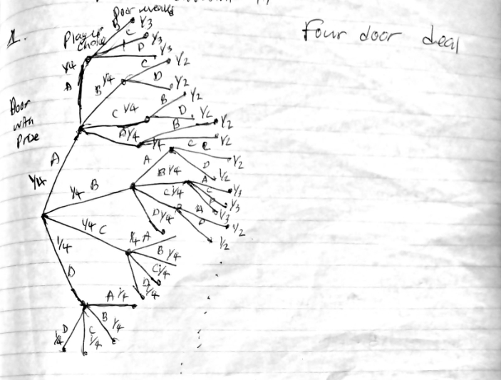
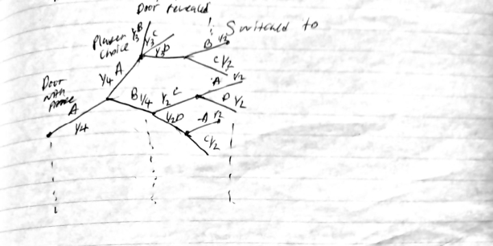
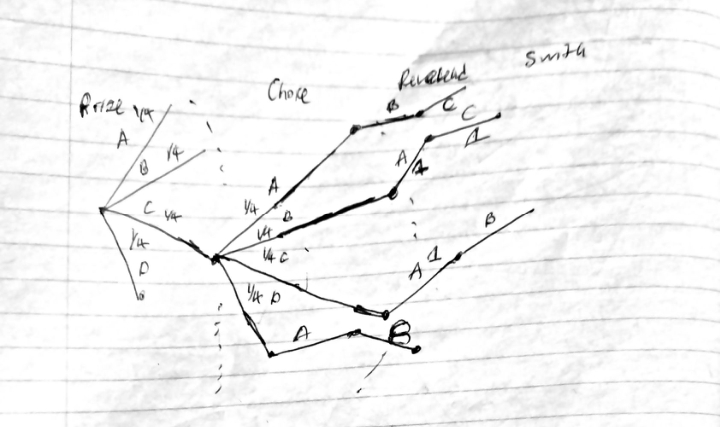
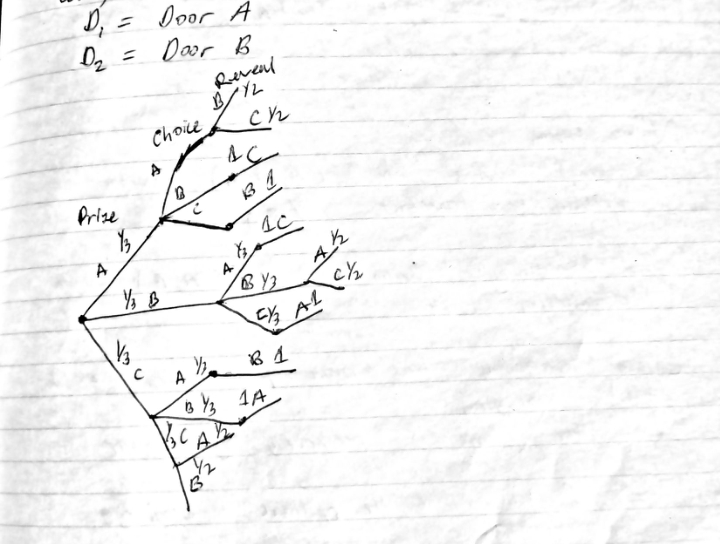

# Problems for Recitation 17

## 1. The Four-Door Deal

**Question:**

Suppose that *Let's Make a Deal* is played according to different rules. Now there are four doors, with a prize hidden behind one of them. The contestant is allowed to pick a door. The host must then reveal a different door that has no prize behind it. The contestant is allowed to stay with his or her original door or to pick one of the other two that are still closed. If the contestant chooses the door concealing the prize in this second stage, then he or she wins.

1. Contestant Stu, a sanitation engineer from Trenton, New Jersey, stays with his original door. What is the probability that he wins the prize?

### Solution 1.1

**Contestant Stu Sample Space:**

  

**Assumptions:**

* The prize is behind each door with probability $\frac{1}{4}$.
* The player picks a door with probability $\frac{1}{4}$.
* The host reveals a door with probability $\frac{1}{3}$ (if the player picked the door with the prize). If not, the host reveals a door with probability $\frac{1}{2}$.
* Contestant Stu stays with his original door.
* Assume that what the host reveals does not affect the player's choice.

Since Contestant Stu never switches, we only need to look at the branches where he chooses the correct door initially. The probability of a single winning path is:

$$\frac{1}{4} \cdot \frac{1}{4} = \frac{1}{16}$$

There are 4 branches in the tree where the player chooses the correct door. Therefore, the total probability of winning is:

$$P(\text{win}) = \frac{1}{16} \cdot 4 = \frac{1}{4}$$

$\blacksquare$

---

**Question:**

2. Contestant Zelda, an alien abduction researcher from Helena, Montana, switches to one of the remaining two doors with equal probability. What is the probability that she wins the prize?

### Solution 1.2

**Continuation—Contestant Zelda Sample Space:**

  

**Assumptions:**

* All switch decisions have a probability of $\frac{1}{2}$.

Notice that if the player switches, it is a guaranteed loss if they originally picked the correct door. There are $4$ such branches.

* At level 2 there are 4 branches.
* At level 3 there are 3 branches.
* At level 4 there are 2 branches.

The number of guaranteed losses is:

$$4 \cdot 3 \cdot 2 = 24$$

Notice that the remaining branches lead to wins (2 branches at level 3, and 2 at level 4):

$$12 \cdot 2 \cdot 2 = 48 \text{ winning outcomes}$$

The probability of traversing a single winning path is:

$$P(\text{winning path}) = \frac{1}{4} \cdot \frac{1}{4} \cdot \frac{1}{2} \cdot \frac{1}{2} = \frac{1}{64}$$

Since there are 24 winning outcomes (out of the relevant sample paths), the overall probability of winning is:

$$P(\text{win}) = 24 \cdot \frac{1}{64} = \frac{3}{8}$$

$\blacksquare$

---

## 2. Earliest Door

**Question:**

Let's consider another variation of the four-doors problem. Say the doors are labeled A, B, C, and D. Suppose that Carol always opens the *earliest* door possible (the door whose label is earliest in the alphabet) with the restriction that she can neither reveal the prize nor open the door that the player picked.

This gives contestant Mergatroid just a little more information. Suppose that Mergatroid always switches to the earliest door, excluding his initial pick and the one Carol opened. What is the probability that he wins the prize?

### Solution 2.1

**Contestant Mergatroid Sample Space:**

  

**Assumptions:**

* The prize is in each door with probability $\frac{1}{4}$.
* The player picks a door with probability $\frac{1}{4}$.
* The door is revealed with probability $1$.
* The player switches doors with probability $1$.

Since all choices that come after will have probability $1$, the probability of traversing a single winning path is:

$$P(\text{winning path}) = \frac{1}{4} \cdot \frac{1}{4} = \frac{1}{16}$$

Notice that $\frac{4}{16}$ of the branches are guaranteed losses (when the player initially picks the correct door and is forced to switch).

Of the remaining $\frac{12}{16}$ branches, $\frac{8}{16}$ lead to wins. Therefore, the probability of winning is:

$$P(\text{win}) = \frac{1}{16} \cdot 8 = \frac{1}{2}$$

$\blacksquare$

---

## 3. The 3 Doors Version Revisited

**Question 3.1:**

Suppose we are in the original game show with 3 doors. In our original analysis, we assumed Carol picked the door randomly. In this case, suppose Carol picks the smallest door, while still making sure of both i) it contains a goat and ii) it is not the contestant's first choice. The contestant follows the switching strategy. What is the probability the contestant wins?

### Solution 3.1

**Assumptions:**

* The prize is in a door with probability $\frac{1}{3}$.
* The player chooses a door with probability $\frac{1}{3}$.
* Carol always reveals the smallest door with probability $1$.
* The player switches with probability $1$.

The probability of traversing a single winning path is:

$$P(\text{winning path}) = \frac{1}{3} \cdot \frac{1}{3} = \frac{1}{9}$$

Notice there are 3 "player switch" branches that guarantee a loss. On the remaining 6 branches, the player wins. Therefore:

$$P(\text{win}) = \frac{1}{9} \cdot 6 = \frac{2}{3}$$

$\blacksquare$

---

**Question 3.2:**

This time, when Carol has a choice she chooses the smallest possible door with probability $p$ and the other remaining door with probability $1-p$. The contestant still follows the switching strategy. What is the probability the contestant wins, in terms of $p$?

### Solution 3.2

**Assumptions:**

* The prize is in a door with probability $\frac{1}{3}$.
* The player chooses a door with probability $\frac{1}{3}$.
* When Carol has a choice, she chooses the smallest door with probability $p$, and the other door with probability $1-p$.
* The player switches with probability $1$.

The losing paths occur when the player initially chooses the correct door, forcing Carol to make a choice. The probabilities of these losing paths are:

$$P(\text{lose path}) = \frac{1}{3} \cdot \frac{1}{3} \cdot (1-p) \quad \text{or} \quad \frac{1}{3} \cdot \frac{1}{3} \cdot p$$

Since there are 3 times a door is revealed with probability $p$ and 3 times with probability $1-p$, we calculate the total probability of losing:

$$P(\text{lose}) = 3 \cdot \frac{p}{9} + 3 \cdot \frac{1-p}{9}$$

$$P(\text{lose}) = \frac{p}{3} + \frac{1-p}{3} = \frac{1}{3}$$

Since probabilities must sum to $1$, the probability of winning is:

$$P(\text{win}) = 1 - \left( \frac{p}{3} + \frac{1-p}{3} \right) = \frac{2}{3}$$

$\blacksquare$

---

**Question 3.3:**

What if the contestant decides whether to switch or not on a case by case basis? That is, suppose the contestant makes a decision of whether to switch or to stay based on 1) Her original choice, and 2) Carol's choice of door. Suppose the doors are labelled A, B and C. Show "always switching" is optimal.

### Claim: "Always switching" is optimal

**Sample Space Based on Case-by-Case Observation Strategy:**

  

**Proof:**

Let the player's observation be the pair $(D_1, D_2)$, where:

* $D_1$ is the door the player initially picks.
* $D_2$ is the door Carol reveals.

Since the game is perfectly symmetrical, let us assume without loss of generality that the player initially picks Door A ($D_1 = A$) and Carol reveals Door B ($D_2 = B$).

Notice that only two underlying outcomes match the observation $(A, B)$:

* The prize is at A, player picks A, Carol reveals B: $(A, A, B)$
* The prize is at C, player picks A, Carol reveals B: $(C, A, B)$

We calculate the probability of each outcome occurring:

$$P(A, A, B) = \frac{1}{3} \cdot \frac{1}{3} \cdot \frac{1}{2} = \frac{1}{18}$$

$$P(C, A, B) = \frac{1}{3} \cdot \frac{1}{3} \cdot 1 = \frac{1}{9}$$

Notice that:

* The "Staying" strategy wins on the outcome $(A, A, B)$, which carries a probability weight of $\frac{1}{18}$.
* The "Switching" strategy wins on the outcome $(C, A, B)$, which carries a probability weight of $\frac{1}{9}$.

Since Switching has more probability weight ($\frac{1}{9} > \frac{1}{18}$) than Staying, and the game is perfectly symmetrical across all doors, "always switching" is the optimal strategy.

This completes the proof. $\blacksquare$