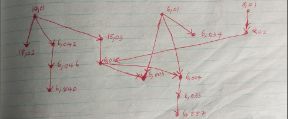

### **Problems for Recitation 11**

**1. Give a description of the equivalence classes associated with each of the following equivalence relations.**

**(a) Integers $x$ and $y$ are equivalent if $x \equiv y \pmod 3$.**

> **Solution:**
> Equivalence classes:
> 
> $$
> \{ \dots, -9, -6, -3, 0, 3, 6, 9, \dots \}
> $$
> $$
> \{ \dots, -8, -5, -2, 1, 4, 7, 10, \dots \}
> $$
> $$
> \{ \dots, -7, -4, -1, 2, 5, 8, 11, \dots \}
> $$

**(b) Real numbers $x$ and $y$ are equivalent if $\lceil x \rceil = \lceil y \rceil$, where $\lceil z \rceil$ denotes the smallest integer greater than or equal to $z$.**

> **Solution:**
> This equivalence is true for all $x, y$ that satisfy:
> 
> $$
> \forall x, y \text{ s.t. } n - 1 < x, y \leq n \text{ where } n \in \mathbb{Z} \text{ and unique.}
> $$
> 
> They form equivalence classes.

---

**2. Show that neither of the following relations is an equivalence relation by identifying a missing property (reflexivity, symmetry, or transitivity).**

**(a) The "divides" relation on the positive integers.**

> **Solution:**
> $a \mid b$ is not symmetric.
> 
> $a \mid b$ does not imply $b \mid a$.
> 
> $\therefore$ Not an equivalence relation.

**(b) The "implies" relation on propositional formulas.**

> **Solution:**
> $p \implies q$ is not symmetric, since
> 
> $p \implies q$ does not imply $q \implies p$.

---

**3. Here is prerequisite information for some MIT courses:**

* $18.01 \to 6.042$
* $18.01 \to 18.02$
* $18.01 \to 18.03$
* $6.046 \to 6.840$
* $8.01 \to 8.02$
* $6.01 \to 6.034$
* $6.042 \to 6.046$
* $18.03, 8.02 \to 6.02$
* $6.01, 6.02 \to 6.003$
* $6.01, 6.02 \to 6.004$
* $6.004 \to 6.033$
* $6.033 \to 6.857$

**(a) Draw a Hasse diagram for the corresponding partially-ordered set. (A *Hasse diagram* is a way of representing a poset $(A, \preceq)$ as a directed acyclic graph. The vertices are the element of $A$, and there is generally an edge $u \to v$ if $u \preceq v$. However, self-loops and edges implied by transitivity are omitted.) You'll need this diagram for all the subsequent problem parts, so be neat!**

> **Solution:**
> 

**(b) Identify a largest chain. (A *chain* in a poset $(S, \preceq)$ is a subset $C \subseteq S$ such that for all $x,y \in C$, either $x \preceq y$ or $y \preceq x$.)**

> **Solution:**
> Largest chains are:
> 
> $$
> 18.01 \preceq 18.03 \preceq 6.02 \preceq 6.004 \preceq 6.033 \preceq 6.857
> $$
> 
> and
> 
> $$
> 8.01 \preceq 8.02 \preceq 6.02 \preceq 6.004 \preceq 6.033 \preceq 6.857
> $$

**(c) Suppose that you want to take all the courses. What is the minimum number of terms required to graduate, if you can take as many courses as you want per term?**

> **Solution:**
> You can take a minimum of $6$ terms. Because the longest chain has a length of $6$, $6$ terms is the absolute minimum.

**(d) Identify a largest antichain. (An *antichain* in a poset $(S, \preceq)$ is a subset $A \subseteq S$ such that for all $x,y \in A$ with $x \neq y$, neither $x \preceq y$ nor $y \preceq x$.)**

> **Solution:**
> The longest antichains are $5$ elements. One of them is:
> 
> $$
> \{8.02, 6.034, 18.03, 6.042, 18.02\}
> $$

**(e) What is the maximum number of classes that you could possibly take at once?**

> **Solution:**
> You can take at most $5$ subject classes at once, from the antichain result above.
>
> These classes are not related to each other in the prerequisite chain.

**(f) Identify a topological sort of the classes. (A *topological sort* of a poset $(A, \preceq)$ is a total order of all the elements such that if $a_i \preceq a_j$ in the partial order, then $a_i$ precedes $a_j$ in the total order.)**

> **Solution:**
> Topological Sort:
> $18.01, 18.02, 6.01, 6.034, 8.01, 8.02, 18.03, 6.042, 6.046, 6.840, 6.02, 6.003, 6.004, 6.033, 6.857$

**(g) Suppose that you want to take all of the courses, but can handle only two per term. How many terms are required to graduate?**

> **Solution:**
> There are $15$ courses. If you were to take $2$ courses per term, you would need $\lceil 15/2 \rceil$ terms.
> 
> $\therefore 8 \text{ terms.}$

**(h) What if you could take three courses per term?**

> **Solution:**
> If we were to try to take $3$ courses per term, that would need only $5$ terms. But from (c), the absolute minimum is $6$ terms.
> 
> $\therefore 6 \text{ terms are required.}$

**(i) Stanford's computer science department offers $n$ courses, limits students to at most $k$ classes per term, and has its own complicated prerequisite structure. Describe two different lower bounds on the number of terms required to complete all the courses. One should be based on your answers to parts (b) and (c) and a second should be based on your answer to part (g).**

> **Solution:**
> Let the longest prerequisite chain on the $n$ courses be $m$.
> 
> It follows from (b) and (c) that $m$ terms is the lower bound.
> 
> From (g), given a limit of at most $k$ classes per term, we can use at least $\lceil n/k \rceil$ terms.
> 
> $$
> T = \begin{cases} 
> \text{at least } m, & \lceil n/k \rceil \leq m \\\\ 
> \text{at least } \lceil n/k \rceil, & m \leq \lceil n/k \rceil 
> \end{cases}
> $$
