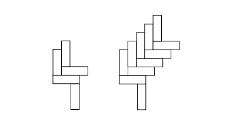

# Recitation 12: Sums

## 1. The L-tower problem

> **Question:**
> Observe the structures shown in Figure 1. One has 2 L-shapes, the other 5 L-shapes. Consider a tower with $k$ L-shapes. Assume that the blocks are all of size $x \times 1$ where $x > 1$. As the picture indicates, if $k$ is too small then the tower falls to the left. On the other hand, if $k$ is too large the tower would fall to the right. Will the tower be stable for some $k$? Prove there is at least one value of $k$ for which the L-tower is stable. Assume that a structure is stable if and only if its center of gravity is not hanging in the air horizontally. The L-tower is stable if and only if each of its subparts is stable.
> 
> *Hint:* Show the tower is stable if and only if $\frac{3x-3}{2} \le k \le \frac{3x-1}{2}$.

**Solution:**

Assume a vertical and horizontal block is $x \times 1$.

Let $L_0$ be the first bottom L-shape. 

   Let the x-axis range of the horizontal block of $L_0$ be $[-x, 0]$. (1)

Since the vertical block of $L_0$ starts at $-x$ then,

let the range of the vertical block of $L_0$ be $[-x, -x+1]$. (2)

It then follows that the center of mass of $L_0$,

$$X_{\text{com}} = \frac{-3x+1}{4}$$
using center of masses (COMs) of vertical and horizontal block. (3)

Since the base vertical block ends at $0$, let the range of Base be $[-1, 0]$. (4)

**Claim:** "If $k$ is too small then the tower falls to the left."

Let $k=1$ and $x=4$.

Then $X_{\text{com}} = -11/4$.

Since $-11/4 < -1 \implies X_{\text{com}}$ is strictly to the left of the edge of Base. 

It follows that the tower will truly fall to the left.

Let the center of mass of $k$ L-shapes be $X_{\text{com}}(k)$.

First notice that, as we stack the L-shapes, they are shifted to the right relative to $L_0$.

Then:

$L_1 : [-x+1, 1]$ horizontal

$L_2 : [-x+2, 2]$ horizontal

$\vdots$

$L_n : [-x+n, n]$ horizontal

Consequently, the CoM of each L-shape is also shifted right by 1 relative to the L below. 

let $C_0$ be the CoM of $L_0$.

Then:

$$C_1 = C_0 + 1$$
$$C_2 = C_0 + 2$$
$$\vdots$$
$$C_n = C_0 + n$$

Then,

$$X_{\text{com}}(k) = \frac{1}{k}(C_0 + C_0 + 1 + C_0 + 2 + \dots + C_0 + n)$$

Then,

$$X_{\text{com}}(k) = \frac{1}{k}\left(k \cdot C_0 + \sum_{i=1}^{k-1} i\right)$$

Using the summation formula, then:

$$X_{\text{com}}(k) = C_0 + \frac{k-1}{2}$$

From (3) Then:

$$X_{\text{com}}(k) = \frac{2k - 3x - 1}{4}$$

From (4) Then:

$$-1 \le \frac{2k - 3x - 1}{4} \le 0$$

Then:

$$-4 + 3x + 1 \le 2k$$

Then:

$$\frac{3x - 3}{2} \le k$$

Because "The L-tower is stable if each of its subparts is stable".

Then if $k$ becomes too large, the tower falls to the right. 

The pivot point for falling here however is the right edge of $L_0$. 

Then the top $k-1$ sitting on $L_0$ need to be stable.

Then,

$$X_{\text{com}}(\text{top } k-1) = \sum_{i=1}^{k-1} (C_0 + i)$$ *(Note: divided by $k-1$ in next step)*

Then,

$$X_{\text{com}}(\text{top } k-1) = \frac{(k-1)C_0 + \frac{k(k-1)}{2}}{k-1}$$

Then,

$$X_{\text{com}}(\text{top } k-1) = C_0 + \frac{k}{2}$$

For the top $k-1$ to be stable, $X_{\text{com}}(\text{top } k-1)$ must not exceed the right edge of $L_0$, which is $0$.

Then:

$$C_0 + k/2 \le 0$$

From (3):

$$\frac{-3x+1}{4} + \frac{2k}{4} \le 0 \implies -3x + 1 + 2k \le 0$$

Thus:

$$k \le \frac{3x-1}{2}$$

It then follows that our entire system to be stable... $\left[ \text{requires } \frac{3x-3}{2} \le k \le \frac{3x-1}{2} \right]$.

---

## 2. Double Sums

> **Question 2a:**
> Sometimes we have to evaluate sums of sums, otherwise known as *double summations*. Evaluate the summation. (Hint: $\sum(a + b) = \sum a + \sum b$.)
> $$\sum_{i=1}^n \sum_{j=1}^i j$$

**Solution:**

$$
\begin{aligned}
\sum_{i=1}^n \sum_{j=1}^i j &= \sum_{i=1}^n \frac{i(i+1)}{2} \\
&= \frac{1}{2} \sum_{i=1}^n (i^2 + i) \\
&= \frac{1}{2} \left[ \frac{n(n+1)(2n+1)}{6} + \frac{n(n+1)}{2} \right] \\
&= \frac{1}{2} \left[ \frac{n(n+1)(2n+1) + 3n(n+1)}{6} \right] \\
&= \frac{n(n+1)(2n+4)}{12} \\
&= \frac{n(n+1)(n+2)}{6}
\end{aligned}
$$

$$\therefore \sum_{i=1}^n \sum_{j=1}^i j = \frac{n(n+1)(n+2)}{6}$$

---

> **Question 2b (Part 1):**
> Unfortunately, not all summations are so docile. For the remainder of the problem we'll wrestle with the sum of the harmonic numbers:
> $$\sum_{k=1}^n H_k$$
> First, write it as a double summation.

**Solution:**

Because the $k$-th harmonic number is 
$$H_k = \sum_{j=1}^k \frac{1}{j}$$

Then,
$$\sum_{k=1}^n H_k = \sum_{k=1}^n \sum_{j=1}^k \frac{1}{j}$$

---

> **Question 2b (Part 2):**
> Now try to gain some intuition for exactly what you're up against by integrating the summation in its less threatening single-summation form. You may use $H_k \approx \ln k$.

**Solution:**

$H_k \approx \ln k$

Evaluating $\int_1^n \ln(x) \, dx$

Integrating by parts:

$$\int u \, dv = uv - \int v \, du$$

Let $u = \ln(x) \implies \frac{du}{dx} = \frac{1}{x} \implies du = \frac{1}{x} \, dx$

$dv = dx \implies v = x$

Then:

$$\int \ln(x) \, dx = x \ln(x) - \int x \cdot \frac{1}{x} \, dx$$

$$= x(\ln x - 1)$$

Using the Fundamental Theorem of Calculus:

$$\int_a^b f(x) \, dx = F(b) - F(a)$$

$$F(x) = x(\ln x - 1) \quad , \quad a = 1 \quad , \quad b = n$$

Then:

$$\int_1^n \ln(x) \, dx = n(\ln n - 1) - 1(\ln 1 - 1)$$

$$= n \ln(n) - n + 1$$

---

> **Question 2b (Part 3):**
> Finally, we'll look for an exact answer. If we think about the pairs $(k,j)$ over which we are summing, they form a triangle in the table below. Complete the remaining three rows to see the pattern. The summation above is summing each row and then adding the row sums. But we can tame this beast if, instead, we first sum the columns and then add the column sums. Use the table to rewrite the double summation. The inner summation should sum over $k$, and the outer summation should sum over $j$.

**Solution:**

| $j$ / $k$ | $1$ | $2$ | $3$ | $4$ | $\dots$ | $n$ |
| :--- | :--- | :--- | :--- | :--- | :--- | :--- |
| **$1$** | $1$ | | | | | |
| **$2$** | $1$ | $1/2$ | | | | |
| **$3$** | $1$ | $1/2$ | $1/3$ | | | |
| **$4$** | $1$ | $1/2$ | $1/3$ | $1/4$ | | |
| $\vdots$ | | | | | | |
| **$n$** | $1$ | $1/2$ | $1/3$ | $1/4$ | $\dots$ | $1/n$ |

From this table we can conclude that, the term $1/j$ appear $n-j+1$ times. (1)

We know that 

$$\sum_{k=1}^n H_k = \sum_{k=1}^n \sum_{j=1}^k \frac{1}{j}$$
is summing each row then adding the row sums.

However by summing columns then adding column sums then we get:

$$\sum_{k=1}^n H_k = \sum_{j=1}^n \sum_{k=j}^n \frac{1}{j}$$

This follows (1) Hence the above sum is summing the term $1/j$ , $n-j+1$ times.

---

> **Question 2b (Part 4):**
> Now simplify the summation to derive a closed form in terms of $n$ and $H_n$.

**Solution:**

It then follows that:

$$
\begin{aligned}
\sum_{k=1}^n H_k &= \sum_{j=1}^n \frac{1}{j} (n-j+1) \\
&= \sum_{j=1}^n \frac{n+1}{j} - \sum_{j=1}^n 1 \\
&= \sum_{j=1}^n \frac{n+1}{j} - n \\
&= (n+1) \sum_{j=1}^n \frac{1}{j} - n
\end{aligned}
$$

Because, 

$H_n = \sum_{j=1}^n \frac{1}{j}$

Then:

$$\sum_{k=1}^n H_k = (n+1)H_n - n$$