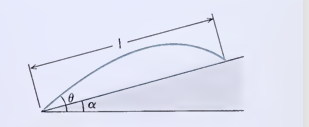
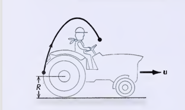

# Physics Problem Set 4 : Three Dimensional Kinematics

---

## Problem 1

**Question 37**

A gun standing on sloping ground (see Figure 4.25) fires up the slope. Show that the range of the gun (measured along the slope) is

$$l=\frac{2v_0^2\cos^2\theta}{g\cos\alpha}(\tan\theta-\tan\alpha)$$

where $\alpha$ is the angle of the slope and the other symbols have their usual meaning. For what value of $\theta$ is this range maximum?

*`Figure - Gun on Sloping Ground`*

  

`A schematic diagram of a gun standing on sloping ground with incline angle` $\alpha$, `firing a projectile up the slope at an angle` $\theta$ `relative to the horizontal.`

### Solution

Assuming the launch point is $(0,0)$, the initial velocity components are:

$$v_{0x}=v_0\cos\theta$$
$$v_{0y}=v_0\sin\theta$$

The parametric equations of motion are:

$$x(t)=(v_0\cos\theta)t$$
$$y(t)=(v_0\sin\theta)t-\frac{1}{2}gt^2$$

The equation for the line of the slope is given by $y=x\tan\alpha$.Substituting $x(t)$ into this equation gives the height of the slope at any given horizontal position:

$$L_{\text{slope},y}=(v_0\cos\theta)t\tan\alpha$$

Let the time of flight be $t_{\text{impact}}$. At this time, the projectile's height matches the slope's height, so $y(t)=L_{\text{slope},y}$:

$$(v_0\sin\theta)t-\frac{1}{2}gt^2=(v_0\cos\theta)t\tan\alpha$$

Dividing by $t$ (since $t>0$ for impact) and rearranging:

$$\frac{1}{2}gt=(v_0\sin\theta)-(v_0\cos\theta\tan\alpha)$$
$$t_{\text{impact}}=\frac{2}{g}(v_0\sin\theta-v_0\cos\theta\tan\alpha)$$

Now, note the trigonometric relationship for the range $L$ measured along the slope. From the right-angled triangle formed, we have:

$$\cos\alpha=\frac{x(t_{\text{impact}})}{L}$$
$$L=\frac{x(t_{\text{impact}})}{\cos\alpha}=\frac{(v_0\cos\theta)t_{\text{impact}}}{\cos\alpha}$$

Substitute $t_{\text{impact}}$ into the range equation:

$$L=\frac{v_0\cos\theta}{\cos\alpha}\left[\frac{2}{g}(v_0\sin\theta-v_0\cos\theta\tan\alpha)\right]$$
$$L=\frac{2v_0^2\cos\theta\sin\theta-2v_0^2\cos^2\theta\tan\alpha}{g\cos\alpha}$$

Factoring out $2v_0^2\cos^2\theta$ from the numerator:

$$L=\frac{2v_0^2\cos^2\theta}{g\cos\alpha}\left(\frac{\sin\theta}{\cos\theta}-\tan\alpha\right)$$
$$L=\frac{2v_0^2\cos^2\theta}{g\cos\alpha}(\tan\theta-\tan\alpha)$$

$\blacksquare$

**Part (b): Finding the value of $\theta$ where $L$ is at maximum**

To find the maximum range, we compute $\frac{dL}{d\theta}=0$. Let $L'=\frac{dL}{d\theta}$, where $v_0$, $g$, and $\alpha$ are constants.

From the derivation process, we know:

$$L=\frac{2v_0^2\cos\theta\sin\theta-2v_0^2\cos^2\theta\tan\alpha}{g\cos\alpha}$$

Using the product and chain rules:

$$\frac{d}{d\theta}(\cos\theta\sin\theta)=-\sin^2\theta+\cos^2\theta$$
$$\frac{d}{d\theta}(\cos^2\theta)=-2\cos\theta\sin\theta$$

Taking the derivative of $L$:

$$L'=\frac{2v_0^2(\cos^2\theta-\sin^2\theta)-2v_0^2\tan\alpha(-2\cos\theta\sin\theta)}{g\cos\alpha}$$

Using double angle identities ($\cos^2\theta-\sin^2\theta=\cos2\theta$ and $2\cos\theta\sin\theta=\sin2\theta$):

$$L'=\frac{2v_0^2}{g\cos\alpha}(\cos2\theta+\tan\alpha\sin2\theta)$$

Set $L'=0$:

$$\cos2\theta+\tan\alpha\sin2\theta=0$$
$$\cos2\theta+\frac{\sin\alpha}{\cos\alpha}\sin2\theta=0$$
$$\cos2\theta\cos\alpha+\sin\alpha\sin2\theta=0$$

Using the identity $\cos(A-B)=\cos A\cos B+\sin A\sin B$:

$$\cos(2\theta-\alpha)=0$$

Solving for $\theta$:

$$2\theta-\alpha=\frac{\pi}{2}$$
$$2\theta=\frac{\pi}{2}+\alpha$$
$$\theta=\frac{\pi}{4}+\frac{\alpha}{2}$$

Thus, the range is maximized when $\theta=\frac{\pi}{4}+\frac{\alpha}{2}$.

$\blacksquare$

---

## Problem 2

**Question 38**

When a tractor leaves a muddy field and drives on the highway, clumps of mud will sometimes come off the rear wheels and be launched into the air (see Figure 4.26). In terms of the speed $u$ of the tractor and the radius $R$ of the wheel, find the maximum height that a clump of dirt can reach. In your calculation be careful to take into account both the initial velocity of the clump and the initial height at which it comes off the wheel. Evaluate numerically for $u = 30$ km/h and $R = 0.80$ m. (Hint: Solve this problem in the reference frame of the tractor.)

*`Figure - Tractor Wheel`*

  

`An illustration of a tractor driving to the right on a road, with clumps of mud flying off the rear wheels into the air`.

### Solution

Using the reference frame of the tractor, the axle is stationary and the wheel is simply spinning. Let the origin be the center of the wheel. Let $\vec{r}_0$ be the position vector of an arbitrary point on the circumference where the mud leaves.

$$\vec{r}_0=R\cos\theta\hat{i}+R\sin\theta\hat{j}$$

In the reference frame of the ground, the axle has a constant speed $u$ forward. Hence, in the reference frame of the axle, the ground has velocity $-u$. To satisfy driving without slipping, the wheel must match the speed of the road, meaning the tangential speed is $|\vec{v}_0|=u$.

The tractor travels forward (to the right), hence for rolling without slipping, the tires must rotate clockwise. Taking the derivative of position $\frac{d\vec{r}}{dt}$ for a counter-clockwise vector gives:

$$\vec{v}_{\text{ccw}}=-R\sin\theta\frac{d\theta}{dt}\hat{i}+R\cos\theta\frac{d\theta}{dt}\hat{j}$$

Since the wheel rolls clockwise, the velocity vector $\vec{v}_0$ is the opposite:

$$\vec{v}_0=R\sin\theta\frac{d\theta}{dt}\hat{i}-R\cos\theta\frac{d\theta}{dt}\hat{j}$$

With $|\vec{v}_0|=R\frac{d\theta}{dt}=u$, the initial velocity components of the mud in the axle frame are:

$$v_{0x}=u\sin\theta$$
$$v_{0y}=-u\cos\theta$$

Mapping to kinematics, the position equations for the clump of mud are:

$$x(t)=(u\sin\theta)t$$
$$y(t)=(-u\cos\theta)t-\frac{1}{2}gt^2$$
$$v_y(t)=-u\cos\theta-gt$$

Let the maximum height reached by the clump relative to the axle be $H_y$. This occurs when $v_y=0$:

$$-u\cos\theta-gt=0\implies t=-\frac{u\cos\theta}{g}$$

Substitute $t$ into $y(t)$ to find $H_y$:

$$H_y=-u\cos\theta\left(-\frac{u\cos\theta}{g}\right)-\frac{1}{2}g\left(-\frac{u\cos\theta}{g}\right)^2$$
$$H_y=\frac{u^2\cos^2\theta}{g}-\frac{u^2\cos^2\theta}{2g}=\frac{u^2\cos^2\theta}{2g}$$

To find the height relative to the ground, we account for the initial launch height from the tire in the axle's frame ($y_0=R\sin\theta$) and add the radius $R$ to shift the origin from the axle to the ground:

$$H_{\text{ground}}(\theta)=R+R\sin\theta+\frac{u^2\cos^2\theta}{2g}$$

To find the absolute maximum height, compute $\frac{dH}{d\theta}=0$:

$$\frac{dH}{d\theta}=R\cos\theta-\frac{u^2}{g}\cos\theta\sin\theta=0$$
$$\cos\theta\left(R-\frac{u^2}{g}\sin\theta\right)=0$$

This yields two roots:

1. **First Root:** $\sin\theta=\frac{Rg}{u^2}$

   Substituting this into the height equation:

   $$H_{\max}=R+R\left(\frac{Rg}{u^2}\right)+\frac{u^2}{2g}\left[1-\left(\frac{Rg}{u^2}\right)^2\right]$$
   $$H_{\max}=R+\frac{R^2g}{u^2}+\frac{u^2}{2g}-\frac{R^2g}{2u^2}=R+\frac{u^2}{2g}+\frac{R^2g}{2u^2}$$

   *(Note: This root is only valid if $\frac{Rg}{u^2}\le1$, meaning $u\ge\sqrt{Rg}$.)*

2. **Second Root:** $\cos\theta=0\implies\theta=\frac{\pi}{2}$

   Substituting this into the height equation:

   $$H_{\max}=R+R\sin\left(\frac{\pi}{2}\right)+\frac{u^2\cos^2(\pi/2)}{2g}=2R$$

Thus, the general piece-wise solution for maximum height is:

$$H_{\max}=\begin{cases}2R & \text{for } u<\sqrt{Rg} \\ R+\frac{u^2}{2g}+\frac{R^2g}{2u^2} & \text{otherwise}\end{cases}$$

$\blacksquare$

**Numerical Computation:**

Given $u = 30$ km/h $\approx 8.33$ m/s, $R = 0.80$ m, and $g = 9.81$ m/s²:

Checking condition: $\sqrt{Rg}=\sqrt{0.80\times9.81}\approx2.8$ m/s. Since $8.33>2.8$, we use the second case.

$$H_{\max}=0.80+\frac{8.33^2}{2(9.81)}+\frac{0.80^2(9.81)}{2(8.33^2)}\approx4.4\text{ m}$$

$\blacksquare$

---

## Problem 3

**Question 40**

A ship is steaming at 30 km/h on a course parallel to a straight shore at a distance of 17,000 m. A gun emplaced on the shore (at sea level) fires a shot with a muzzle velocity of 700 m/s when the ship is at the point of closest approach. If the shot is to hit the ship, what must be the elevation angle of the gun? How far ahead of the ship must the gun be aimed? Give the answer to the latter question both in meters and in minutes of arc. Pretend that there is no air resistance.

### Solution

Define the origin $(0,0,0)$ at the gun's position. Let the y-axis be perpendicular to the shore and the x-axis be parallel to the shore (the direction of the ship).

Let the ship's initial position when the gun is fired ($t=0$) be $\vec{r}_{s0}=(0, 17000, 0)$.

The ship's velocity is $|\vec{v}_s|=30$ km/h $\approx\frac{25}{3}$ m/s. Thus, $\vec{v}_s=(\frac{25}{3}, 0, 0)$.

The bullet's muzzle velocity is $|\vec{v}_p|=700$ m/s.

Let the elevation angle be $\alpha$ and the azimuthal aiming angle from the y-axis be $\theta$. The velocity vector of the projectile is:

$$\vec{v}_p=\begin{bmatrix}|\vec{v}_p|\cos\alpha\sin\theta \\ |\vec{v}_p|\cos\alpha\cos\theta \\ |\vec{v}_p|\sin\alpha\end{bmatrix}$$

Using the method of successive approximations:

**Iteration 1: Assume the ship is stationary at its closest approach $(0, 17000, 0)$.**

Since it's on the y-axis, the initial aiming angle $\theta_0=0$.

The projectile equations are:

$$z=|\vec{v}_p|\sin\alpha_0 t_0-\frac{1}{2}gt_0^2$$
$$y=|\vec{v}_p|\cos\alpha_0 t_0$$

When the projectile hits the ship, $z=0$ (for $t_0>0$) and $y=17000$.

From the z-equation:

$$|\vec{v}_p|\sin\alpha_0 t_0-\frac{1}{2}gt_0^2=0\implies t_0=\frac{2|\vec{v}_p|\sin\alpha_0}{g}$$

A simpler substitution is finding $t_0$ from $y$:

$$t_0=\frac{17000}{|\vec{v}_p|\cos\alpha_0}$$

Substitute $t_0$ into the z-equation:

$$|\vec{v}_p|\sin\alpha_0\left(\frac{17000}{|\vec{v}_p|\cos\alpha_0}\right)-\frac{1}{2}g\left(\frac{17000}{|\vec{v}_p|\cos\alpha_0}\right)^2=0$$
$$17000\tan\alpha_0-\frac{1}{2}g\frac{17000^2}{|\vec{v}_p|^2\cos^2\alpha_0}=0$$

Using the identity $\frac{1}{\cos^2\alpha_0}=1+\tan^2\alpha_0$ and evaluating constants ($g=9.8$, $|\vec{v}_p|=700$):

$$\frac{1}{2}\cdot\frac{9.8\cdot17000^2}{700^2}=2890$$
$$17000\tan\alpha_0-2890(1+\tan^2\alpha_0)=0$$
$$-2890\tan^2\alpha_0+17000\tan\alpha_0-2890=0$$

Applying the quadratic formula for $\tan\alpha_0$:

$$\tan\alpha_0=\frac{-17000\pm\sqrt{17000^2-4(-2890)(-2890)}}{2(-2890)}=\frac{-17000\pm15987.23}{-5780}$$

This gives two possible roots:

$$\tan\alpha_{01}\approx0.1752\implies\alpha_{01}\approx0.1734\text{ rad } (9.937^\circ)$$
$$\tan\alpha_{02}\approx5.7071\implies\alpha_{02}\approx1.3973\text{ rad } (80.06^\circ)$$

We use $\alpha_{01}$ (flatter trajectory) to minimize flight time and atmospheric disturbance.

Substituting $\alpha_{01}$ back to find time of flight $t_0$:

$$17000=700\cos(0.1734)t_0\implies t_0\approx24.65\text{ s}$$

**Iteration 2: Assume new position for ship after $t_0$.**

The ship moves along the x-axis:

$$x_1=|\vec{v}_s|t_0=\frac{25}{3}\text{ m/s}\times24.65\text{ s}\approx205.417\text{ m}$$

The new ship position is $\vec{r}_{s1}=(205.417, 17000, 0)$.

The new distance $d_1$ from the gun to the ship is:

$$d_1=\sqrt{205.417^2+17000^2}\approx17001.24\text{ m}$$

Using trigonometry, the new aiming angle $\theta_1$ is:

$$\sin\theta_1=\frac{x_1}{d_1}=\frac{205.417}{17001.24}\implies\theta_1\approx0.012\text{ rad } (0.6924^\circ)$$

Finding the new elevation $\alpha_1$ using the standard range formula $R=\frac{|\vec{v}_p|^2\sin(2\alpha)}{g}$:

$$17001.24=\frac{700^2\sin(2\alpha_1)}{9.8}$$
$$\sin(2\alpha_1)=0.340024\implies\alpha_1\approx9.939^\circ$$

Because $d_1-d_0\approx1.2$ m, the required elevation effectively remains unchanged from $\approx9.94^\circ$. The successive approximation converges rapidly.

**Conclusion:**

The gun must be aimed $x_1=205.42$ m ahead of the ship.

In minutes of arc ($1^\circ=60'$):

$$0.6924^\circ\times60=41.54'$$

Thus, the gun must be elevated to $\approx9.94^\circ$ and aimed $41.54'$ ahead of the ship's current position.

$\blacksquare$

---

## Problem 4

**Question 64**

An AWACS aircraft is flying at high altitude in a wind of 150 km/h from due west. Relative to the air, the heading of the aircraft is due north and its speed is 750 km/h. A radar operator on the aircraft spots an unidentified target approaching from northeast; relative to the AWACS aircraft, the bearing of the target is 45° east of north, and its speed is 950 km/h. What is the speed of the unidentified target relative to the ground?

### Solution

Let the velocity of the wind relative to the ground be $\vec{v}_{W/G}$. (Wind from due west moves towards the east).

Let the velocity of the aircraft relative to the wind be $\vec{v}_{A/W}$.

Let the velocity of the target relative to the aircraft be $\vec{v}_{T/A}$.

From the addition rule for relative velocity:

$$\vec{v}_{X/Z}=\vec{v}_{X/Y}+\vec{v}_{Y/Z}$$

In order to solve for the velocity of the target relative to the ground ($\vec{v}_{T/G}$), we must first solve for the velocity of the aircraft relative to the ground ($\vec{v}_{A/G}$).

$$\vec{v}_{A/G}=\vec{v}_{A/W}+\vec{v}_{W/G}$$

Then, solving for $\vec{v}_{T/G}$:

$$\vec{v}_{T/G}=\vec{v}_{T/A}+\vec{v}_{A/G}=\vec{v}_{T/A}+\vec{v}_{A/W}+\vec{v}_{W/G}$$

Let East be the $+x$ direction and North be the $+y$ direction.

Breaking the vectors into components:

$$\vec{v}_{T/G(x)}=\vec{v}_{T/A(x)}+\vec{v}_{A/W(x)}+\vec{v}_{W/G(x)}$$
$$\vec{v}_{T/G(y)}=\vec{v}_{T/A(y)}+\vec{v}_{A/W(y)}+\vec{v}_{W/G(y)}$$

* Since $\vec{v}_{W/G}$ is towards the east:
  $\vec{v}_{W/G(x)}=150$ km/h, $\vec{v}_{W/G(y)}=0$ km/h

* Since $\vec{v}_{A/W}$ is towards the north:
  $\vec{v}_{A/W(x)}=0$ km/h, $\vec{v}_{A/W(y)}=750$ km/h

* The target is approaching from the northeast, meaning its velocity vector relative to the aircraft points southwest. Its speed is 950 km/h.
  $\vec{v}_{T/A(x)}=-950\cos(45^\circ)=-950\frac{\sqrt{2}}{2}$ km/h
  $\vec{v}_{T/A(y)}=-950\sin(45^\circ)=-950\frac{\sqrt{2}}{2}$ km/h

Substituting these components:

$$\vec{v}_{T/G(x)}=-950\frac{\sqrt{2}}{2}+0+150=150-475\sqrt{2}\text{ km/h}$$
$$\vec{v}_{T/G(y)}=-950\frac{\sqrt{2}}{2}+750+0=750-475\sqrt{2}\text{ km/h}$$

The final velocity vector of the target relative to the ground is:

$$\vec{v}_{T/G}=(150-475\sqrt{2})\hat{i}+(750-475\sqrt{2})\hat{j}$$

To find the speed ($S_{T/G}$), we take the magnitude of this vector:

$$S_{T/G}=|\vec{v}_{T/G}|=\sqrt{(150-475\sqrt{2})^2+(750-475\sqrt{2})^2}$$
$$S_{T/G}\approx527.586\text{ km/h}$$

The speed of the unidentified target relative to the ground is approximately 527.6 km/h.

$\blacksquare$