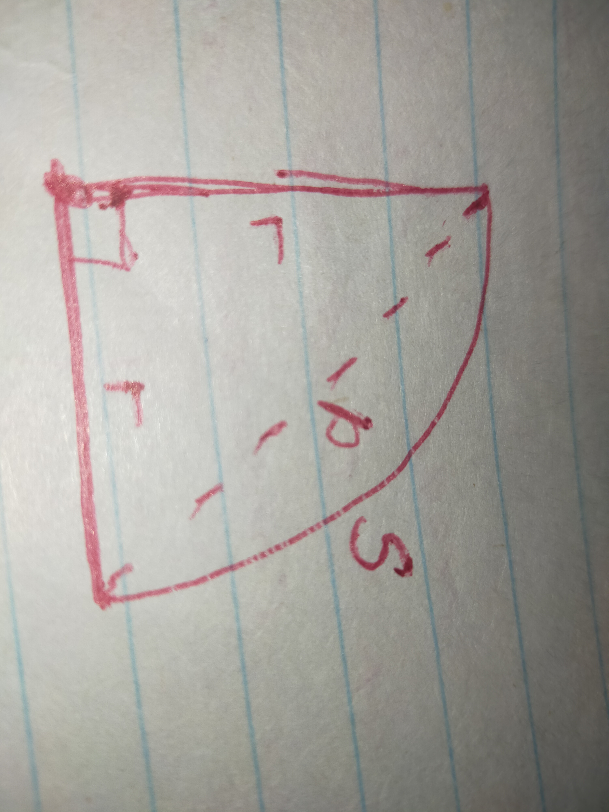
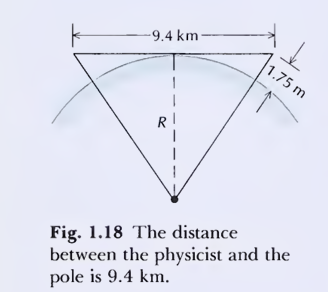
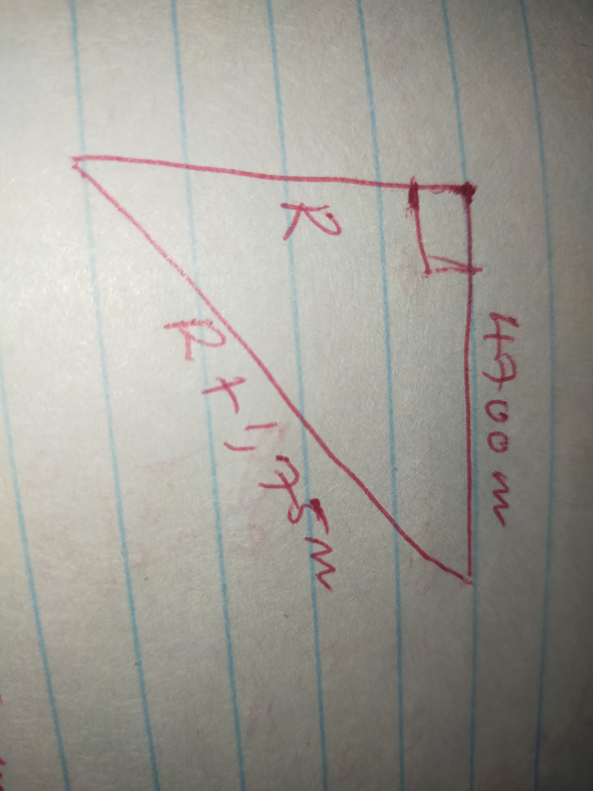

# Pset 1 : Ohanian physics CH 1 End

### Problem 1 (from 10)

> **\*10. The Earth is approximately a sphere of radius $6.37 \times 10^6 \text{ m}$. Calculate the distance from the pole to the equator, measured along the surface of the Earth. Calculate the distance from the pole to the equator, measured along a straight line passing through the Earth.**

**a)** From geometry we know 
$$S = r\theta$$

Let $S$ be the surface of the earth from the pole to the equator.
We know $r \approx 6.37 \times 10^6 \text{ m}$

$\theta = \frac{\pi}{2} \text{ rad}$

$$ \therefore S = \frac{\pi}{2} \cdot 6.37 \times 10^6 \text{ m} $$
$$ S \approx 1.00 \times 10^7 \text{ m} \blacksquare $$

**b)** Let $p$ be the distance from the pole to the equator measured along a straight line.

By pythagoras
$$p^2 = 2r^2$$

$$p = \pm \sqrt{2(6.37 \times 10^6 \text{ m})^2}$$

$$p = 9.00 \times 10^6 \text{ m} \blacksquare$$

---

### Problem 2 (from 12)

> **\*\*12. A physicist plants a vertical pole at the waterline on the shore of a calm lake. When she stands next to the pole, its top is at eye level, 175 cm above the waterline. She then rows across the lake and walks along the waterline on the opposite shore until she is so far away from the pole that her entire view of it is blocked by the curvature of the surface of the lake, that is, the entire pole is below the horizon (Figure 1.18). She finds that this happens when her distance from the pole is 9.4 km. From this information, deduce the radius of the Earth.**

Since the unknown sides of the big triangle are equal we can just solve for one of the right angled triangle.

By pythagoras we know

$$(R + 1.75\text{ m})^2 = R^2 + 4700^2 \text{ m}^2$$

$$R^2 + 3.5\text{ m} R + 3.0625\text{ m}^2 = R^2 + 4700^2 \text{ m}^2$$

$$R = \frac{4700^2 \text{ m}^2 - 3.0625\text{ m}^2}{3.5\text{ m}}$$

$$\therefore R = 6.3 \times 10^6 \text{ m}$$

Radius of earth $= 6.3 \times 10^6 \text{ m} \blacksquare$

---

### Problem 3 (from 16)

> **\*16. The navigator of a sailing ship seeks to determine his longitude by observing at what time (Greenwich Mean Time) the Sun reaches the zenith at his position (local noon). Suppose that the navigator's chronometer is in error and is late by 1 s compared to Greenwich Mean Time. What will be the consequent error of longitude (in minutes of arc)? What will be the error in position (in kilometers) if the ship is on the equator?**

We know the earth is $360^\circ$ and a day has 24 hrs

$\therefore 1\text{ h} = 15^\circ$ of earth's rotation

$3600\text{ s} = 15^\circ \text{ rotations}$

Lets call the man's longitudinal position $x^\circ$.

And the sun reaches the zenith at his positions at $t \text{ seconds}$

But his watch chronometer records the time to be $t+1 \text{ seconds}$.

According to his watch
$$x^\circ_{\text{error}} = \frac{t+1}{3600\text{ s}} \cdot 15^\circ$$

$$x^\circ_{\text{error}} = \frac{t+1}{240}^\circ$$

But correct location $x^\circ$ is

$$x^\circ = \frac{t}{3600\text{ s}} \cdot 15^\circ = \frac{t}{240}^\circ$$

Using absolute error
$$\Delta x = |x_{\text{true}} - x_{\text{measured}}|$$

$$\therefore \Delta x = \left| \frac{t^\circ}{240} - \frac{(t+1)^\circ}{240} \right|$$

$$\Delta x^\circ = \frac{1^\circ}{240}$$

$\therefore$ The consequent error of longitude in (minutes of arc)

$$= \frac{60'}{240} = 0.25' \blacksquare$$

**b) Error in position**

Equatorial circumference of earth is $\approx 40075 \text{ km}$

Dividing by $360^\circ$

$$\therefore 1^\circ \approx 111.32 \text{ km}$$

$$\therefore 60' \approx 111.32 \text{ km}$$

$$\therefore \frac{111.32 \text{ km}}{60'} \times 0.25'$$

Error in position $= 0.46 \text{ km} \blacksquare$

---

### Problem 4 (from 22c)

> **\*22. (a) How many molecules of water are there in one cup of water? A cup is about $250 \text{ cm}^3$.**
> **(b) How many molecules of water are there in the ocean? The total volume of the ocean is $1.3 \times 10^{18} \text{ m}^3$.**
> **(c) Suppose you pour a cup of water into the ocean, allow it to become thoroughly mixed, and then take a cup of water out of the ocean. On the average, how many of the molecules originally in the cup will again be in the cup?**

Assume a cup is about $250 \text{ cm}^3$ and total volume of the ocean is $1.3 \times 10^{18} \text{ m}^3$.

Molar mass of water $= 18.016 \text{ g/mol}$ 

where mol is moles of molecules $= \text{Mass}_{\text{molar}}$

$1 \text{ cm}^3$ of water $= 1 \text{ gram}$

$\therefore \text{Vol}_{\text{cup}} = 250 \text{ g}$

$\therefore$ There are 

$$ \frac{250 \text{ g}}{18.016 \text{ g/mol}} = 250 \text{ g} \cdot \frac{1 \text{ mol}}{18.016 \text{ g}}$$

$$ \approx 13.88 \text{ moles of molecules of water in cup.}$$

Using Avogadro's Number

No of molecules $= \text{moles} \times \text{Avogadro's No.}$

$$\text{Cup}_{\text{molecules}} = 6.02214 \times 10^{23} \times 13.88 \text{ moles}$$

$$\text{Cup}_{\text{molecules}} = 8.4 \times 10^{24} \text{ molecules.}$$

Determining molecules of water in ocean.

There are $10^6 \text{ cm}^3 \text{ in m}^3$

$$\therefore 1.3 \times 10^{18} \text{ m}^3 = 1.3 \times 10^{24} \text{ cm}^3$$

$$= 1.3 \times 10^{24} \text{ g}$$

Converting to mols of molecules

$$\text{Ocean}_{\text{moles}} \approx 7.22 \times 10^{22} \text{ mols}$$

Using $N_A = 6.02214 \times 10^{23}$

$$\therefore \text{Ocean}_{\text{molecules}} = 4.35 \times 10^{46} \text{ molecules}$$

Assuming thorough mixture, we have the following ratio:

$$
\text{Ratio} = \frac{8.4 \times 10^{24} \text{ molecules}}{(8.4 \times 10^{24} + 4.35 \times 10^{46}) \text{ molecules}}
$$

Cup with mixture has $250\text{g}$ mixture 

$$= 8.4 \times 10^{24} \text{ molecules}$$

$\therefore$ No of original cup molecules in mixture

$$= \frac{8.4 \times 10^{24}}{(8.4 \times 10^{24} + 4.35 \times 10^{46})} \times 8.4 \times 10^{24} \text{ molecules}$$

$$= 1.6 \times 10^3 \text{ molecules}$$

$\therefore$ on average there are $1.6 \times 10^3$ molecules from original cup in mixture $\blacksquare$

---

### Problem 5 (from 44)

> **\*44. For tall trees, the diameter at the base (or the diameter at any given point of the trunk, such as the midpoint) is roughly proportional to the 3/2 power of the length. The tallest sequoia in Sequoia National Park in California has a length of 81 m, a diameter of 7.6 m at the base, and a mass of 6100 metric tons. A petrified sequoia found in Nevada has a length of 90 m. Estimate its diameter at the base, and estimate the mass it had when it was still alive.**

Problem says

$$D_{\text{base}} \Rightarrow L_{\text{tree}}^{3/2} \quad \text{where } \Rightarrow \text{ means proportional}$$

Tallest sequoia has $L = 81\text{m}$ and $D_{\text{base}} = 7.6\text{m}$ and Mass $M = 6100 \text{ mtons}$.

$\text{Sequoia}_2$ has $L = 90\text{m}$

Assuming a tree is approximately a cylinder

$\text{Volume} = \pi r^2 h$

$r = 4.45 \text{ m}$

$h = 90 \text{ m}$

$$\therefore V = \pi (4.45 \text{ m})^2 \cdot 90$$

$$V \approx 5599.02 \text{ m}^3$$

We know $\text{mass (kg)} = \text{Volume (m}^3\text{)} \times \text{Density (kg/m}^3\text{)}$

Using $\text{Seq}_1$ to approximate density

$\text{Seq}_1$ mass $= 6100 \text{ metric tons} = 6.1 \times 10^6 \text{ kg}$

$\text{Volume } V = \pi \cdot (3.8 \text{ m})^2 \cdot 81 \text{ m}$

$$V \approx 3674.53 \text{ m}^3$$

$$\therefore \text{Density} = 1660.08 \text{ kg/m}^3$$

$$\therefore \text{Seq}_2 \text{ Mass} \approx 5599.02 \text{ m}^3 \cdot 1660.08 \text{ kg/m}^3$$

$$\text{Mass} \approx 9.3 \times 10^3 \text{ tons} \blacksquare$$