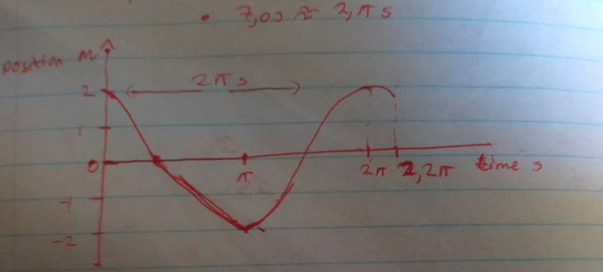
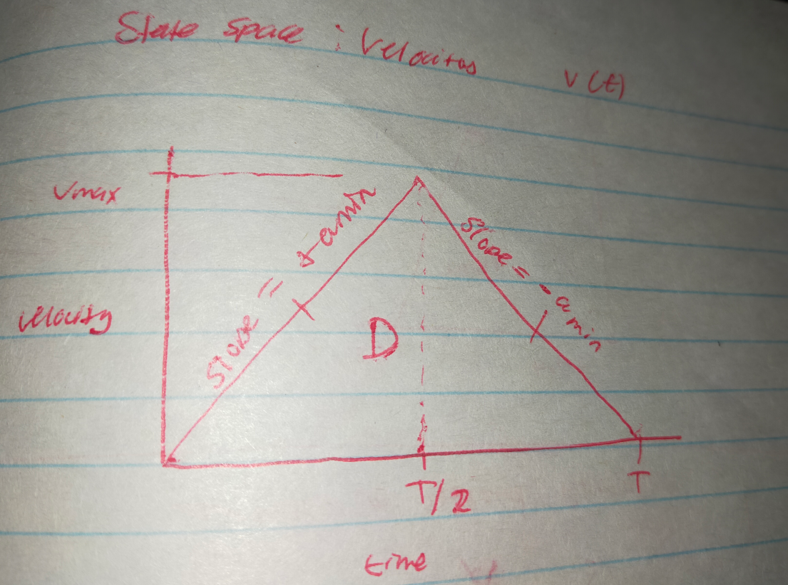
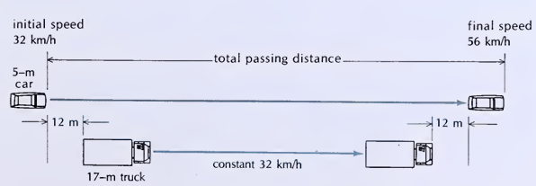

### **Problem 20**

The equation of the worldline of a particle is given by $X = A\cos(bt)$, where $A$ and $b$ are constants. Assume that $A = 2.0\text{ m}$ and $b = 1.0\text{ rad/s}$.

(a) Roughly plot the worldline of this particle for the time interval $0\text{ s} \le t \le 7.0\text{ s}$.

**Solution:**

The worldline is defined by:

$$x = A \cos(bt) \quad \text{①}$$

where $A$ and $b$ are constants.

Assume $A = 2.0\text{ m}$ and $b = 1.0\text{ rad/s}$.

**a) Plot of worldline for this particle for time interval $0\text{ s} \le t \le 7.0\text{ s}$**

$\text{Amplitude} = A = 2.0\text{ m}$
$\text{frequency} = b = 1.0\text{ rad/s}$

Thus, the period $T$ is given by:

$$\text{Period} = T = 2\pi / b = \frac{2\pi\text{ rad}}{1.0\text{ rad/s}}$$

$$T = 2\pi\text{ s} \approx 6.3\text{ s}$$

**(b) At what time does the particle pass the origin ($x=0$)? What are its velocity and acceleration at this instant?**

Time $t$ when $x = 0$

If $x = 0$, then from $\text{①}$:

$$A \cos(bt) = 0$$

Therefore,

$$\therefore bt = \cos^{-1}(0)$$

Solving for $t$:

$$t = \frac{\cos^{-1}(0)}{b} = \frac{\cos^{-1}(0)\text{ rad}}{1.0\text{ rad/s}}$$

$$t \approx 1.6\text{ s} \quad \text{when } x = 0$$

and also all time factors of $1.6\text{ s}$.

**(c) At what time does the particle reach maximum distance from the origin? What are its velocity and acceleration at this instant?**

The first time particle is at max distance from origin $x=0$ is when $t=0\text{ s}$

And for the sequence $0\text{ s}, \pi\text{ s}, 2\pi\text{ s}, 3\pi\text{ s}, \dots$, the particle is at max distance from the origin.

**Velocity $v$ at $t=0\text{ s}$**

Taking the first derivative of $\text{①}$:

$$v = x' = -Ab \sin(bt)$$

Substituting the known values:

$$v = -2.0\text{ m}(1.0\text{ rad/s}) \sin(0) \quad \text{at } t=0\text{ s}$$

Thus,

$$v = 0\text{ m/s} \quad \text{at } t=0\text{ s}$$

$\therefore$ for all $v = 0\text{ m/s}$, $t$ is max dist from origin.
$\therefore$ follows the conclusion: Velocity $v$ at $t = \pi\text{ s}$.

**Acceleration $a$ at this instant**

Taking the second derivative of $\text{①}$:

$$a = x'' = -A b^2 \cos(bt)$$

Substituting the known values:

$$a = -2.0\text{ m} \cdot (1.0\text{ rad}^2/\text{s}^2)(\cos(0))$$

Thus,

$$a = \pm 2.0\text{ m/s}^2 \quad \text{for all cases when } t \text{ is at max dist from origin}$$

$\blacksquare$

---

### **Problem 30**

In a “drag” race a car starts at rest and attempts to cover $440\text{ yd}$ in the shortest possible time.
The world record for a piston-engined car is $5.637\text{ s}$; while setting this record, the car reached a final speed of $250.69\text{ mi/h}$ at the $440\text{-yd}$ mark.

(a) What was the average acceleration for the run?
(b) Prove that the car did not move with constant acceleration.
(c) What would have been the final speed if the car had moved with constant acceleration so as to reach $440\text{ yd}$ in $5.637\text{ s}$?

**Solution:**

**a) Acceleration $\bar{a}\text{ m/s}^2$ for the run**

$$v_1 = 250\text{ mi/hr} \approx 111.75\text{ m/s}$$

Then, the average acceleration is:

$$\therefore \bar{a} \approx \frac{111.75\text{ m/s}}{5.637\text{ s}}$$

$$\bar{a} \approx 19.83\text{ m/s}^2$$

**b) Proof that car did not move with constant acceleration.**

Assume constant acceleration $a = \bar{a}$.

If the object moved with constant acceleration $a$, then:

$$a = \bar{a} = \frac{v_1 - v_0}{t_1 - t_0} = 19.83\text{ m/s}^2$$

Using the kinematic equation:

$$x - x_0 = v_0 t + \frac{1}{2} a t^2 \quad \text{①}$$

Assume $x - x_0$ is unknown.
We know $v_0 = 0\text{ m}$.

$$a = 19.83\text{ m/s}^2$$

$$t = 5.637\text{ s}$$

Substituting these into $\text{①}$ yields:

$$\therefore x - x_0 = \frac{1}{2}(19.83\text{ m/s}^2) \cdot (5.637\text{ s})^2$$

$$x = 315.06\text{ m}$$

But $x_{\text{real}} = 440\text{ yd} \approx 402.34\text{ m}$.
Thus, since $x \neq x_{\text{real}}$
$\Rightarrow$ Acceleration was not constant ($a \neq \bar{a}$).

**c) Final speed under constant acceleration to reach $440\text{ yd}$ in $5.637\text{ s}$.**

$$x - x_0 = 440\text{ yd} \approx 402.34\text{ m}$$

$$v_0 = 0\text{ m/s}$$

$$t = 5.637\text{ s}$$

Using $\text{①}$ again:

$$x - x_0 = v_0 t + \frac{1}{2} a t^2$$

$$\therefore 402.34\text{ m} = \frac{1}{2}(5.637\text{ s})^2 a$$

Solving for $a$:

$$a = \frac{2(402.34\text{ m})}{(5.637\text{ s})^2}$$

$$a \approx 25.32\text{ m/s}^2$$

From these knowns, we can use the velocity equation:

$$v - v_0 = at \quad \text{②}$$

Substituting the values into $\text{②}$:

$$v = (25.32\text{ m/s}^2) \cdot (5.637\text{ s})$$

$$v \approx 142.73\text{ m/s}$$

$\therefore$ Final speed would be $142.73\text{ m/s}$ which is $\approx 3.98$ times the world record.

$\blacksquare$

---

### **Problem 32**

(a) At the World Trade Center in New York City, the elevator takes $55\text{ s}$ to descend from the 107th floor to ground level, a distance of $400\text{ m}$.
What is the average speed of the elevator for this trip?

(b) The elevator is at rest at the beginning and at the end of the trip.
If you wanted to program the elevator so that it completes the trip in the specified time with a minimum acceleration and a minimum deceleration, how would you have to accelerate and decelerate the elevator? What would be these minimum values of the acceleration and deceleration? What would be the maximum speed during the trip?

**Solution:**

**1. Avg Speed =** $\left| \frac{x_1 - x_0}{t_1 - t_0} \right|$

$$x_0 = 400\text{ m}$$

$$x_1 = 0\text{ m}$$

$$t_1 = 55\text{ s}$$

Then,

$$\therefore \text{Avg}_{\text{speed}} = \left| \frac{-400\text{ m}}{55\text{ s}} \right|$$

$$\text{Avg}_{\text{speed}} \approx 7.27\text{ m/s}$$

**State space: Velocities $v(t)$**

Let the area under the curve be $D$:

$$D = \text{area} = 400\text{ m} \quad \text{①}$$

$$T = 55\text{ s}$$

From the geometry of the velocity triangle:

$$D = \frac{1}{2} T v_{\text{max}} \quad \text{②}$$

Rearranging $\text{②}$ for $v_{\text{max}}$:

$$v_{\text{max}} = 2D / T$$

Substituting the known values from $\text{①}$:

$$v_{\text{max}} = 2 \cdot 400\text{ m} / 55\text{ s}$$

$$v_{\text{max}} = 14.55\text{ m/s}$$

$a_{\text{min}}$ happens in the interval $0 \le t \le T/2$.
We know the definition of acceleration:

$$a = \frac{\Delta v}{\Delta t}$$

Therefore,

$$\therefore a_{\text{min}} = \frac{v_{\text{max}}}{T/2} = \frac{2v_{\text{max}}}{T}$$

Substituting $v_{\text{max}}$:

$$a_{\text{min}} = \frac{2 \cdot 14.55\text{ m/s}}{55\text{ s}}$$

Thus,

$$a_{\text{min}} = 0.53\text{ m/s}^2$$

$$-a_{\text{min}} = -0.53\text{ m/s}^2$$

**Final System State**

1. Accelerate constantly at $+0.53\text{ m/s}^2$ for the first $27.5\text{ s}$.
2. Reach a maximum speed of $14.55\text{ m/s}$ precisely at the midpoint $(t = 27.5\text{ s})$.
3. Decelerate constantly at $-0.53\text{ m/s}^2$ for the remaining $27.5\text{ s}$.

$\blacksquare$

---

### **Problem 34**

An automobile is traveling at $90\text{ km/h}$ on a country road when the driver suddenly notices a cow in the road $30\text{ m}$ ahead.
The driver attempts to brake the automobile, but the distance is too short. With what velocity does the automobile hit the cow? Assume that the reaction time of the driver is $0.75\text{ s}$ and that the deceleration of the automobile is $0.80g$ when the brakes are applied.

**Solution:**

Let the two states be:

State 1: Delay Phase

State 2: Deceleration Phase.

We assume velocity was not being acted upon by another force.

$\text{Velocity} = 90\text{ km/h} = 25\text{ m/s}$.

Delay distance $= \Delta x_1 = 0.75\text{ s} \cdot 25\text{ m/s}$

Thus,

$$\Delta x_1 = 18.75\text{ m} \quad \text{①}$$

**State 2**
Initial position condition at the start of state 2:

$$\Delta x_2 = 30\text{ m} - \Delta x_1$$

Substituting $\text{①}$:

$$\Delta x_2 = 11.25\text{ m}$$

$$v_0 = 25\text{ m/s}$$

$$a = -0.50g, \quad g \approx 9.81\text{ m/s}^2$$

From the standard kinematic equations:

$$x - x_0 = v_0 t + \frac{1}{2} a t^2 \quad \text{②}$$

and

$$t = \frac{v - v_0}{a} \quad \text{③}$$

Substituting $\text{③}$ into $\text{②}$ yields:

$$x - x_0 = v_0 \left(\frac{v - v_0}{a}\right) + \frac{1}{2} a \left(\frac{v - v_0}{a}\right)^2$$

Simplifying:

$$\therefore a(x - x_0) = \frac{1}{2} (v^2 - v_0^2)$$

$$v^2 = 2a(x - x_0) + v_0^2 \quad \text{④}$$

Using $\text{④}$ for our specific system parameters:

$$V^2 = 2(-0.80g)(\Delta x_2) + (25\text{ m/s})^2$$

$$V^2 = 2(-0.80g)(11.25\text{ m}) + (25\text{ m/s})^2$$

$$V^2 = -22.50\text{ m}(0.80g) + (25\text{ m/s})^2$$

Given $g \approx 9.8\text{ m/s}^2$, then:

$$V^2 = 448.4\text{ m}^2\text{/s}^2$$

$$V = \pm 21.18\text{ m/s}$$

Therefore,

$$\therefore V = 21.18\text{ m/s} \quad \text{when cow is hit.}$$

It is not $-21.18\text{ m/s}$ because the cow would not have gotten hit.

What is the minimum distance away the cow should be for a final velocity of impact $V = 0\text{ m/s}$?

Let the new final state be:

$$V = 0\text{ m/s}, \quad a = -0.8g$$

$$V_0 = 25\text{ m/s}$$

Rearranging $\text{④}$ for the required stopping distance:

$$x - x_0 = \frac{V^2 - V_0^2}{2a} = \frac{-(25\text{ m/s})^2}{2(-0.8g)}$$

$$\Delta x_2 = x - x_0 = 39.82\text{ m}$$

The total stopping distance is:

$$\Delta x = \Delta x_1 + \Delta x_2$$

$$\Delta x = 18.75\text{ m} + 39.82\text{ m}$$

Thus,

$$\Delta x = 58.57\text{ m}$$

$\blacksquare$

---

### **Problem 36**

Figure 2.13 (copied from the operation manual of an automobile) describes the passing ability of the automobile at low speed. From the data supplied in this figure, calculate the acceleration of the automobile during the pass and the time required for the pass. Assume constant acceleration.

**Solution:**

Truck constant velocity $= 32\text{ km/h} = 8.89\text{ m/s}$

Total passing distance is the sum of the components:

$$12\text{ m} + 17\text{ m} + x_m + 17\text{ m} + 12\text{ m} + 5\text{ m}$$

$$D = 63\text{ m} + x_m$$

$$D_1 = Y + 5\text{ m}$$

Equating the distances:

$$63\text{ m} + x_m = Y + 5\text{ m}$$

Then,

$$63\text{ m} + x_m = Y$$

Define the front bumper of the $17\text{ m}$ truck to be the origin:

$$\therefore X=0, t=0$$

Let the front of the car be $X_{\text{start}}$.

$$X_{\text{start}} = X - 29\text{ m}, \quad t = t_0$$

Let the front of the car after passing be $X_{\text{end}}$.

$$X_{\text{end}} = X_0 + 17\text{ m}$$

Thus, the car's absolute displacement is:

$$\Delta x_{\text{car}} = X_{\text{end}} - X_{\text{start}} = X + 46\text{ m}$$

Let the displacement relative to the truck bumper be $\Delta x_{\text{rel}}$.

$$\therefore \Delta x_{\text{rel}} = 46\text{ m}$$

The relative position function is:

$$x_{\text{rel}}(t) = x_{\text{car}}(t) - x_{\text{truck}}(t) \quad \text{①}$$

Let $v$ represent velocity:

$$v_{\text{car}} = 15.56\text{ m/s}$$

$$v_{\text{truck}} = 8.89\text{ m/s}$$

Relative to the $17\text{ m}$ truck bumper:

$$v_{\text{car}} = v_{\text{truck}} + 6.67\text{ m/s}$$

$$\Delta v_{\text{rel}} = 6.67\text{ m/s}$$

The relative velocity function is:

$$v_{\text{rel}}(t) = v_{\text{car}}(t) - v_{\text{truck}}(t)$$

$$v_{\text{rel}}(t) = v_{\text{car}}(t) - 8.89\text{ m/s} \quad \text{②}$$

We know the general position equation:

$$\Delta x = v_0 t + \frac{1}{2} a t^2$$

We also know the acceleration definition:

$$a = \frac{v - v_0}{t}$$

Substituting $a$ into the position equation:

$$\Delta x = v_0 t + \frac{1}{2} \left( \frac{v - v_0}{t} \right) t^2$$

Factoring out $t$:

$$\Delta x = \left( v_0 + \frac{1}{2}(v - v_0) \right) t$$

$$\Delta x = \left( \frac{1}{2}v_0 + \frac{1}{2}v \right) t$$

Yielding the average velocity form:

$$\Delta x = \left( \frac{v_0 + v}{2} \right) t \quad \text{③}$$

From $a = \frac{v - v_0}{t}$, we solve for $t$:

$$t = \frac{v - v_0}{a}$$

Substituting this $t$ into $\text{③}$:

$$\Delta x = \left( \frac{v_0 + v}{2} \right) \left( \frac{v - v_0}{a} \right)$$

$$\Delta x = \frac{(v + v_0)(v - v_0)}{2a}$$

Which simplifies to the timeless equation:

$$\Delta x = \frac{v^2 - v_0^2}{2a} \quad \text{④}$$

From $\text{②}$, we know $v_{\text{rel}}(t) = v_{\text{car}}(t) - v_{\text{truck}}(t)$.
Evaluating at the boundaries:

$$\therefore v_0 = v_{\text{rel}}(0) = 0\text{ m/s}$$

$$v = v_{\text{rel}}(\text{final}) = 15.56\text{ m/s} - 8.89\text{ m/s}$$

$$\therefore v = 6.67\text{ m/s}$$

Using the relative displacement and acceleration variables:

$$\Delta x = \Delta x_{\text{rel}} = 46\text{ m}$$

$$a = a_{\text{rel}}$$

Substituting these parameters into $\text{④}$:

$$\therefore 46\text{ m} = \frac{(6.67\text{ m/s})^2 - (0\text{ m/s})^2}{2 a_{\text{rel}}}$$

Solving for $a_{\text{rel}}$:

$$a_{\text{rel}} = \frac{(6.67\text{ m/s})^2}{2 \cdot 46\text{ m}}$$

$$\therefore a_{\text{rel}} = 0.48\text{ m/s}^2 \quad \text{⑤}$$

Using the time relation again:

$$a = \frac{v - v_0}{t}$$

$$t = \frac{v - v_0}{a}$$

Substituting the known relative values:

$$\therefore t = \frac{6.67\text{ m/s}}{0.48\text{ m/s}^2}$$

$$\therefore t = 13.90\text{ s} \quad \text{⑥}$$

Because the truck is moving at constant velocity:
$a_{\text{truck}} = 0\text{ m/s}^2$

Therefore, the acceleration of the car relative to the road is:

$$\therefore a_{\text{car}} = 0.48\text{ m/s}^2$$

$\therefore$ The car accelerates at $0.48\text{ m/s}^2$ for $13.90\text{ s}$.

$\blacksquare$