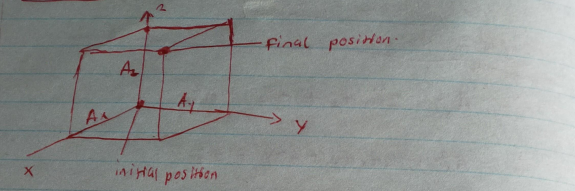
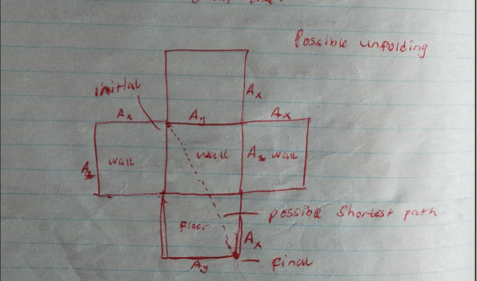
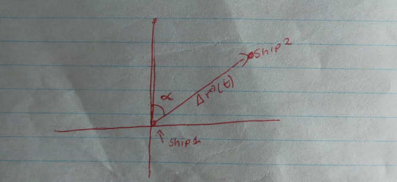

> **Problem 33:**
> Suppose that $\mathbf{A} = \hat{\mathbf{x}} \cos \omega t + \hat{\mathbf{y}} \sin \omega t$ where $\omega$ is a constant. Find $d\mathbf{A}/dt$ (note that $\hat{\mathbf{x}}$ and $\hat{\mathbf{y}}$ behave as constants in differentiation). Show that $d\mathbf{A}/dt$ is perpendicular to $\mathbf{A}$.

**Solution:**

Let the vector $\vec{A}$ be defined as:

$$
\vec{A} = \hat{x} \cos \omega t + \hat{y} \sin \omega t
$$

where $\omega$ is a constant. 

**Part 1: Find the derivative $d\vec{A}/dt$**

Differentiating with respect to time $t$, and treating the unit vectors $\hat{x}$ and $\hat{y}$ as constants, we apply the chain rule:

$$
\begin{aligned}
\frac{d}{dt} (\hat{x} \cos \omega t) &= -\hat{x} \omega \sin \omega t \\
\frac{d}{dt} (\hat{y} \sin \omega t) &= \hat{y} \omega \cos \omega t
\end{aligned}
$$

Thus, the time derivative of $\vec{A}$ is:

$$
\vec{A}' = -\hat{x}(\omega \sin \omega t) + \hat{y}(\omega \cos \omega t)
$$

**Part 2: Prove that $\vec{A}'$ is perpendicular to $\vec{A}$**

Recall that two non-zero vectors are perpendicular if and only if their dot product vanishes.

This follows from the geometric definition $\vec{A} \cdot \vec{B} = |\vec{A}||\vec{B}| \cos \theta$, where $\cos(\pi/2) = 0$. 

Therefore, we must demonstrate that $\vec{A} \cdot \vec{A}' = 0$. 

Using the algebraic definition of the dot product $\vec{A} \cdot \vec{B} = A_x B_x + A_y B_y + A_z B_z$, we extract the components:

* For $\vec{A}$: $A_x = \cos \omega t, \quad A_y = \sin \omega t$
* For $\vec{A}'$: $A'_x = -\omega \sin \omega t, \quad A'_y = \omega \cos \omega t$

Evaluating the dot product:

$$
\vec{A} \cdot \vec{A}' = (\cos \omega t)(-\omega \sin \omega t) + (\sin \omega t)(\omega \cos \omega t)
$$

$$
\vec{A} \cdot \vec{A}' = -\omega \cos \omega t \sin \omega t + \omega \cos \omega t \sin \omega t
$$

$$
\therefore \vec{A} \cdot \vec{A}' = 0
$$

Since the dot product is exactly zero, $\vec{A}'$ and $\vec{A}$ are perpendicular. $\blacksquare$

***

> **Problem 14:**
> A room measures $4 \text{ m}$ in the $x$ direction, $5 \text{ m}$ in the $y$ direction, and $3 \text{ m}$ in the $z$ direction. A lizard crawls along the walls from one corner of the room to the diametrically opposite corner. If the starting point is the origin of coordinates, what is the displacement vector? What is the length of the displacement vector? If the lizard chooses the shortest path along the walls, what is the length of its path?

**Solution:**

Let the starting coordinate of the lizard be the origin, $(0,0,0)$. 

The diametrically opposite corner represents the coordinate furthest from the origin.

Let $\vec{r}_i$ and $\vec{r}_f$ be the initial and final position vectors, respectively.

$$
\begin{aligned}
\vec{r}_i &= 0\hat{x} + 0\hat{y} + 0\hat{z} \\
\vec{r}_f &= 4\hat{x} + 5\hat{y} + 3\hat{z}
\end{aligned}
$$

**a) Displacement Vector and its Length**

The displacement vector $\Delta \vec{r}$ is simply $\vec{r}_f - \vec{r}_i$:

$$
\Delta \vec{r} = 4\hat{x} + 5\hat{y} + 3\hat{z} \text{ (meters)}
$$

The length (magnitude) of the displacement vector is calculated using the 3D distance formula:

$$
\begin{aligned}
|\Delta\vec{r}| &= \sqrt{r_x^2 + r_y^2 + r_z^2} \\
|\Delta\vec{r}| &= \sqrt{4^2 + 5^2 + 3^2} \\
|\Delta\vec{r}| &= \sqrt{16 + 25 + 9} = \sqrt{50} \approx 7.07 \text{ m}
\end{aligned}
$$

**b) Shortest Path Along the Walls**

  

To find the shortest surface path, we must map the 3D environment onto a 2D plane by "unfolding" the room like a cardboard box.

This transforms the problem into finding the hypotenuse of a 2D right triangle, $d^2 = a^2 + b^2$.

  

Depending on which walls the lizard traverses, there are three possible planar unfoldings, yielding three potential path lengths ($d_A, d_B, d_C$):

$$
\begin{aligned}
d_A^2 &= (A_x + A_z)^2 + A_y^2 \\
d_B^2 &= (A_x + A_y)^2 + A_z^2 \\
d_C^2 &= (A_y + A_z)^2 + A_x^2 
\end{aligned}
$$

Expanding these expressions reveals their underlying structure:

$$
\begin{aligned}
d_A^2 &= A_x^2 + A_y^2 + A_z^2 + 2A_x A_z \\
d_B^2 &= A_x^2 + A_y^2 + A_z^2 + 2A_x A_y \\
d_C^2 &= A_x^2 + A_y^2 + A_z^2 + 2A_y A_z
\end{aligned}
$$

Notice that the sum of the squares ($A_x^2 + A_y^2 + A_z^2$) is constant for all paths.

Therefore, the shortest path is entirely dictated by minimizing the cross term. 

Assume without loss of generality that the dimensions are ordered from smallest to largest: $A_z \le A_x \le A_y$.

It logically follows that the product of the two smallest dimensions will yield the smallest cross term:

$$
A_x A_z \le A_y A_z \le A_x A_y \implies d_A \le d_C \le d_B
$$

Given our room's dimensions: $A_z = 3\text{m}, A_x = 4\text{m}, A_y = 5\text{m}$, the condition $A_z < A_x < A_y$ holds true.

The shortest possible path $d$ minimizes the unfolded dimensions by pairing the $3\text{m}$ and $4\text{m}$ sides:

$$
d = \sqrt{(A_x + A_z)^2 + A_y^2}
$$

$$
d = \sqrt{(4+3)^2 + 5^2} = \sqrt{49 + 25} = \sqrt{74} \approx 8.60 \text{ m} \blacksquare
$$

***

> **Problem 15:**
> Suppose that two ships proceeding at constant speeds are on converging straight tracks. Prove that the ships will collide if and only if the bearing of each remains constant as seen from the other. This constant-bearing rule is routinely used by mariners to check whether there is danger of collision. (Hint: A convenient method of proof is to draw the displacement vector from one ship to the other at several successive times.)

**Solution:**

To analyze the kinematics of the system, we define Ship 1 as a fixed origin.

Let $\Delta\vec{r}(t) = \Delta\vec{r}_0 + \Delta\vec{v}t$ denote the relative position vector of Ship 2 with respect to Ship 1.

  

**Part 1: Forward Implication (Collision $\implies$ Constant Bearing)**

Assume a collision occurs at some future time $t_c > 0$.

We must prove that the bearing $\alpha$ (the angle of the relative position vector) remains constant for all $0 \le t \le t_c$.

At the exact moment of collision, the relative position between the ships is zero:

$$
\Delta\vec{r}(t_c) = \vec{0}
$$

Substituting this into our kinematic equation yields the relative velocity required for a collision:

$$
\Delta\vec{r}_0 + \Delta\vec{v}t_c = \vec{0} \implies \Delta\vec{v} = -\frac{\Delta\vec{r}_0}{t_c}
$$

Substitute this $\Delta\vec{v}$ back into the general position equation:

$$
\begin{aligned}
\Delta\vec{r}(t) &= \Delta\vec{r}_0 + \left(-\frac{\Delta\vec{r}_0}{t_c}\right)t \\
\Delta\vec{r}(t) &= \left(1 - \frac{t}{t_c}\right)\Delta\vec{r}_0
\end{aligned}
$$

Because $\Delta\vec{r}(t)$ is strictly a scalar multiple of the initial relative position $\Delta\vec{r}_0$, its direction $\alpha$ remains identical to the initial bearing for all $t < t_c$. This proves that a collision guarantees a constant bearing.

**Part 2: Reverse Implication (Constant Bearing $\implies$ Collision)**

Assume the bearing $\alpha$ is constant for all $t$.

We must show that a valid future collision is mathematically guaranteed.

A constant bearing implies that the relative position vector $\Delta\vec{r}(t)$ is always parallel to its initial state $\Delta\vec{r}_0$.

We can formalize this by defining the position vector as a time-dependent scalar multiple $c(t)$ of the initial position:

$$
\Delta\vec{r}(t) = c(t)\Delta\vec{r}_0 \quad (1)
$$

Equating this to the kinematic equation:

$$
c(t)\Delta\vec{r}_0 = \Delta\vec{r}_0 + \Delta\vec{v}t \implies \Delta\vec{v} = \left(\frac{c(t)-1}{t}\right) \Delta\vec{r}_0
$$

Because $\Delta\vec{v}$ and $\Delta\vec{r}_0$ are constant vectors, the scalar term must also be a constant. Let $k = \frac{c(t)-1}{t}$, which gives:

$$
\Delta\vec{v} = k \Delta\vec{r}_0 \quad (2)
$$

For a collision to occur at time $t_c$, we require $c(t_c) = 0$. Using our definition of $k$:

$$
k t_c = -1 \implies t_c = -\frac{1}{k}
$$

To ensure this represents a valid *future* collision ($t_c > 0$), we must prove that the constant $k$ is strictly negative ($k < 0$).

We do this by evaluating the change in the relative distance. 

The distance squared is $|\Delta\vec{r}(t)|^2 = \Delta\vec{r}(t) \cdot \Delta\vec{r}(t)$.

If the ships are approaching one another, this value must be decreasing over time:

$$
\frac{d}{dt} [\Delta\vec{r}(t) \cdot \Delta\vec{r}(t)] < 0
$$

Applying the product rule for dot products:

$$
2 \Delta\vec{r}'(t) \cdot \Delta\vec{r}(t) < 0
$$

Since $\Delta\vec{r}'(t) = \Delta\vec{v}$, this simplifies to:

$$
\Delta\vec{v} \cdot \Delta\vec{r}(t) < 0
$$

Evaluating this condition at $t=0$ where $\Delta\vec{r}(0) = \Delta\vec{r}_0$, and substituting $\Delta\vec{v} = k\Delta\vec{r}_0$ from equation (2):

$$
\begin{aligned}
(k\Delta\vec{r}_0) \cdot \Delta\vec{r}_0 &< 0 \\
k |\Delta\vec{r}_0|^2 &< 0
\end{aligned}
$$

Since the ships do not start at the same location, $|\Delta\vec{r}_0| > 0$, meaning $|\Delta\vec{r}_0|^2$ is strictly positive.

Therefore, it mathematically follows that $k < 0$.

Because $k$ is negative, the time of collision $t_c = -1/k$ is strictly positive.

A valid future collision is guaranteed. $\blacksquare$

***

> **Problem 45:**
> Show that the magnitude of $\mathbf{A} \cdot (\mathbf{B} \times \mathbf{C})$ is the volume of the parallelepiped determined by $\mathbf{A}$, $\mathbf{B}$, and $\mathbf{C}$.

**Solution:**

> **Note:** For clarity in notation, $|x|$ denotes the absolute value of a scalar, whereas $|\vec{v}|$ denotes the magnitude of a vector.

From solid geometry, the volume $V$ of a parallelepiped is the product of its base area and its perpendicular height:

$$
V = \text{Area}_{\text{base}} \times h \quad (1)
$$

Using vector properties, if two vectors $\vec{B}$ and $\vec{C}$ form the adjacent sides of a parallelogram base, the area of that base is exactly the magnitude of their cross product:

$$
\text{Area}_{\text{base}} = |\vec{B} \times \vec{C}|
$$

Let $\vec{N} = \vec{B} \times \vec{C}$ be the normal vector that is perpendicular to the base. 

The height $h$ of the parallelepiped is the scalar projection of the third vector $\vec{A}$ onto this normal vector $\vec{N}$.

Since geometric height must be strictly non-negative, we take the absolute value of the projection:

$$
h = \frac{|\vec{A} \cdot \vec{N}|}{|\vec{N}|} 
$$

Substituting these components back into the volume equation (1):

$$
V = |\vec{B} \times \vec{C}| \cdot \frac{|\vec{A} \cdot \vec{N}|}{|\vec{N}|}
$$

Because the magnitude of our normal vector is $|\vec{N}| = |\vec{B} \times \vec{C}|$, the terms cleanly cancel out:

$$
V = |\vec{B} \times \vec{C}| \cdot \frac{|\vec{A} \cdot (\vec{B} \times \vec{C})|}{|\vec{B} \times \vec{C}|}
$$

$$
\therefore V = |\vec{A} \cdot (\vec{B} \times \vec{C})|
$$

This completes the derivation, proving that the scalar triple product represents the volume of the defined parallelepiped. $\blacksquare$

***

> **Problem 54:**
> Suppose that the coordinates $x', y', z'$ are related to the coordinates $x, y, z$ by a rotation through an angle $\theta$ about the $z$ axis [as in Eqs. (40) and (41)]. Suppose that the coordinates $x'', y'', z''$ are related to $x', y', z'$ by a rotation through an angle $\phi$ about the $x'$ axis.
> (a) What is the equation that relates the $x'', y'', z''$ coordinates to the $x', y', z'$ coordinates?
> (b) What is the equation that relates the $x'', y'', z''$ coordinates to the $x, y, z$ coordinates?

**Solution:**

**a) Intermediate Rotation Equations**

We are given that the initial rotation by angle $\theta$ about the $z$-axis transforms the coordinates as follows:

$$
\begin{aligned}
x' &= x \cos \theta + y \sin \theta \quad &[40] \\
y' &= -x \sin \theta + y \cos \theta \quad &[41]
\end{aligned}
$$

By symmetry, a subsequent rotation by angle $\phi$ transforms the primed coordinates into double-primed coordinates utilizing the exact same operational structure:

$$
\begin{aligned}
x'' &= x' \cos \phi + y' \sin \phi \\
y'' &= -x' \sin \phi + y' \cos \phi
\end{aligned}
$$

**b) Composite Rotation Equations**

To relate the double-primed coordinates directly to the original coordinates, we substitute equations [40] and [41] into our intermediate equations.

Starting with $x''$:

$$
x'' = (x \cos \theta + y \sin \theta) \cos \phi + (-x \sin \theta + y \cos \theta) \sin \phi
$$

Expanding the terms:

$$
x'' = x \cos \theta \cos \phi + y \sin \theta \cos \phi - x \sin \theta \sin \phi + y \cos \theta \sin \phi
$$

Factoring by $x$ and $y$ to group the trigonometric coefficients:

$$
x'' = x(\cos \theta \cos \phi - \sin \theta \sin \phi) + y(\sin \theta \cos \phi + \cos \theta \sin \phi)
$$

Applying the standard trigonometric angle addition identities for cosine and sine, this simplifies beautifully to:

$$
x'' = x \cos(\theta + \phi) + y \sin(\theta + \phi) \blacksquare
$$

Following the exact same algebraic process for $y''$:

$$
y'' = -(x \cos \theta + y \sin \theta) \sin \phi + (-x \sin \theta + y \cos \theta) \cos \phi
$$

$$
y'' = -x \cos \theta \sin \phi - y \sin \theta \sin \phi - x \sin \theta \cos \phi + y \cos \theta \cos \phi
$$

Factoring by $-x$ and $y$:

$$
y'' = -x(\cos \theta \sin \phi + \sin \theta \cos \phi) + y(\cos \theta \cos \phi - \sin \theta \sin \phi)
$$

Applying the angle addition identities once more, we obtain the final relation:

$$
y'' = -x \sin(\theta + \phi) + y \cos(\theta + \phi) \blacksquare
$$
